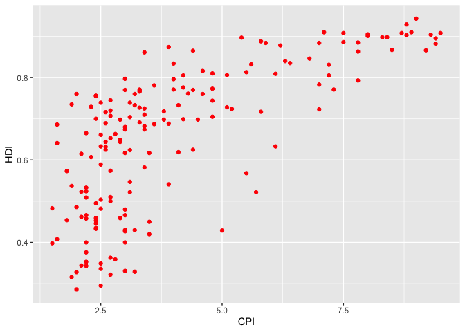
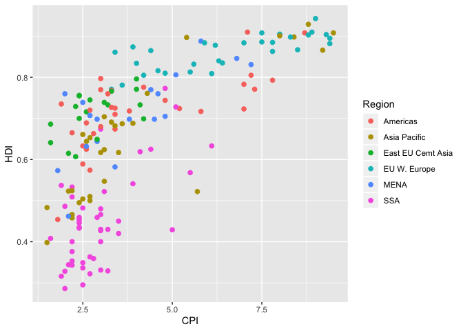
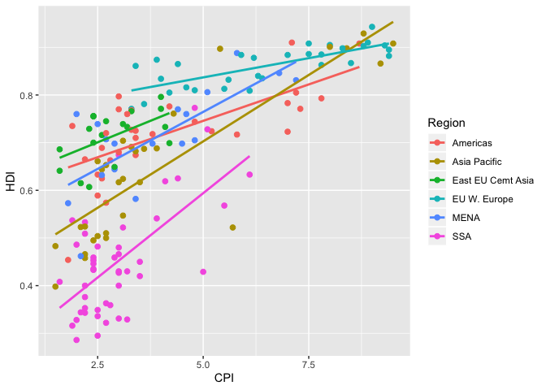
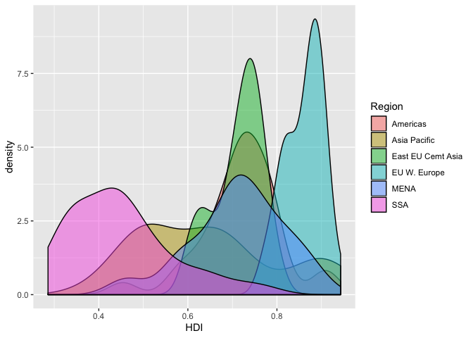
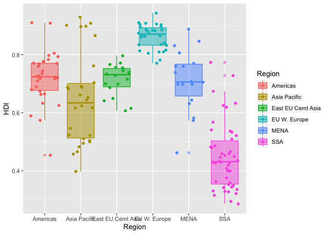
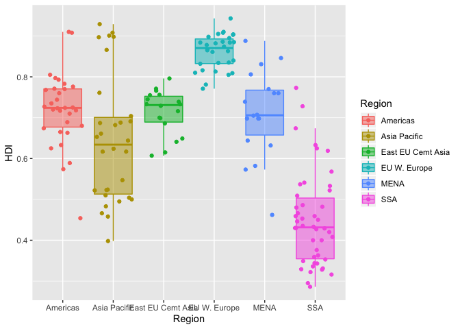
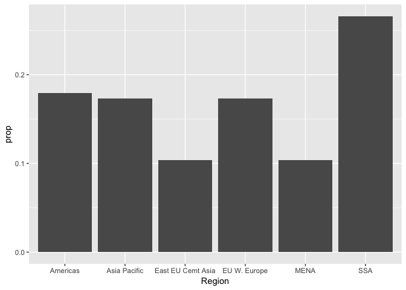
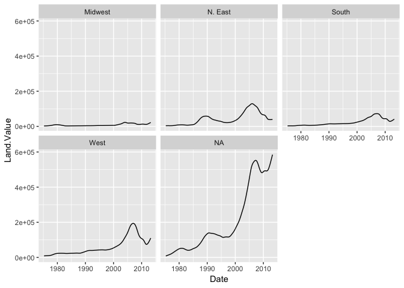

Assignment 2: Data visualization with ggplot
================

Instructions: Please read through this before you begin
-------------------------------------------------------

-   This assignment is due by **10pm on Wednesday 04/08/20**. Please upload it using your personal GitHub repository for this class.

-   For this assignment, please **reproduce this markdown file** using R markdown.

-   Please name your R markdown file `assignment_2.Rmd` and the knitted markdown file `assignment_2.md`.

-   Pay attention to all the formating in this file, including bullet points, bolded characters, inserted code chunks, headings, text colors, blank lines, and etc. You will need to reproduce all of these.

-   Have all your code embeded within the R markdown file, and show both of your **code** and **plots** in the knitted markdown file.

-   When a verbal response is needed, answer by replacing the parts that say "Write your response here" .

-   Use R Markdown functionalities to **hide messages and warnings when needed**. (Suggestion: messages and warnings can often be informative and important, so please examine them carefully and only turn them off when you finish the exercise).

-   You can start by making a copy of the R markdown template that you created as last week's assignment and work from there.

-   First, load all the required packages with the following code. Install them if they are not installed yet.

``` r
library(tidyverse)
library(knitr)
```

<br>

Exercise 1. Corruption and human development
--------------------------------------------

This exercise explores a dataset containing the human development index (`HDI`) and corruption perception index (`CPI`) of 173 countries across 6 different regions around the world: Americas, Asia Pacific, Eastern Europe and Central Asia (`East EU Cemt`), Western Europe (`EU W. Europe`), Middle East and North Africa and Noth Africa (`MENA`), and Sub-Saharan Africa (`SSA`). (Note: the larger `CPI` is, the less corrupted the country is perceived to be.)

<br>

First, we load the data using the following code.

``` r
economist_data <- read_csv("https://raw.githubusercontent.com/nt246/NTRES6940-data-science/master/datasets/EconomistData.csv")
```

<br>

#### 1.1 Show the first few rows of `economist_data`.

|   X1| Country     |  HDI.Rank|    HDI|  CPI| Region            |
|----:|:------------|---------:|------:|----:|:------------------|
|    1| Afghanistan |       172|  0.398|  1.5| Asia Pacific      |
|    2| Albania     |        70|  0.739|  3.1| East EU Cemt Asia |
|    3| Algeria     |        96|  0.698|  2.9| MENA              |
|    4| Angola      |       148|  0.486|  2.0| SSA               |
|    5| Argentina   |        45|  0.797|  3.0| Americas          |
|    6| Armenia     |        86|  0.716|  2.6| East EU Cemt Asia |

<br>

#### 1.2 Expore the relationship between human development index (`HDI`) and corruption perception index (`CPI`) with a scatter plot as the following.


<br>

#### 1.3 Make of color of all points in the previous plot red.



<br>

#### 1.4 Color the points in the previous plot according to the `Region` variable, and set the size of points to 2.



<br>

#### 1.5 Set the size of the points proportional to `HDI.Rank`


<br>

#### 1.6 Fit a **smoothing line** to **all** the data points in the scatter plot from Excercise 1.4


<br>

#### 1.7 Fit a separate **straight line** for **each region** instead, and turn off the confidence interval.



<br>

#### 1.8 Building on top of the previous plot, show each `Region` in a different facet.



<br>

#### 1.9 Show the distribution of `HDI` in each region using density plot. Set the transparency to 0.5


<br>

#### 1.10 Show the distribution of `HDI` in each region using histogram and facetting.



<br>

#### 1.11 Show the distribution of `HDI` in each region using a box plot. Set the transparency of these boxes to 0.5 and do not show outlier points with the box plot. Instead, show all data points for each country in the same plot. (Hint: `geom_jitter()` or `position_jitter()` might be useful.)



<br>

#### 1.12 Show the count of countries in each region using a bar plot.



<br>

#### 1.13 You have now created a variety of different plots of the same dataset. Which of your plots do you think are the most informative? Describe briefly the major trends that you see in the data.

Answer: Write your response here.

<br>

Exercise 2. Unemployment in the US 1967-2015
--------------------------------------------

This excercise uses the dataset `economics` from the ggplot2 package. It was produced from US economic time series data available from <http://research.stlouisfed.org/fred2>. It descibes the number of unemployed persons (`unemploy`), among other variables, in the US from 1967 to 2015.

``` r
head(economics) %>% kable()
```

| date       |    pce|     pop|  psavert|  uempmed|  unemploy|
|:-----------|------:|-------:|--------:|--------:|---------:|
| 1967-07-01 |  506.7|  198712|     12.6|      4.5|      2944|
| 1967-08-01 |  509.8|  198911|     12.6|      4.7|      2945|
| 1967-09-01 |  515.6|  199113|     11.9|      4.6|      2958|
| 1967-10-01 |  512.2|  199311|     12.9|      4.9|      3143|
| 1967-11-01 |  517.4|  199498|     12.8|      4.7|      3066|
| 1967-12-01 |  525.1|  199657|     11.8|      4.8|      3018|

<br>

#### 2.1 Plot the trend in number of unemployed persons (`unemploy`) though time using the economics dataset shown above. And for this question only, **hide your code and only show the plot**.


<br>

#### 2.2 Edit the plot title and axis labels of the previous plot appropriately. Make y axis start from 0. Change the background theme to what is shown below. (Hint: search for help online if needed)



<br>
