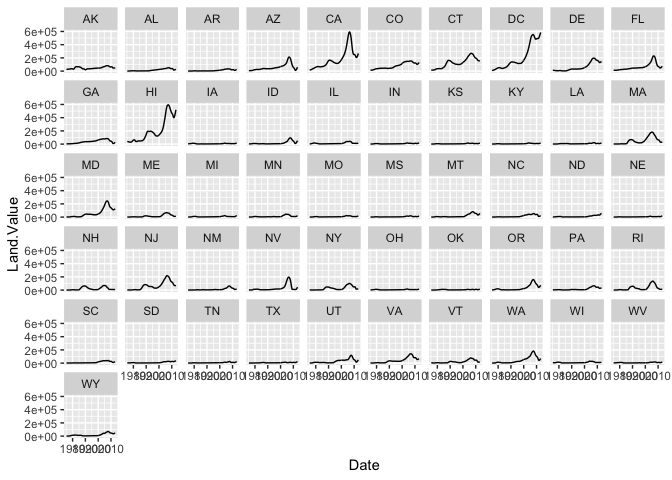

Assignment 2: Data visualization with ggplot
================

Instructions: Please read through this before you begin
-------------------------------------------------------

This homework is due by **4pm on Monday 9/10/18**. Please upload it through Blackboard.

**Reproduce the plots exactly as shown** in this html file.

Use the R markdown template given to you to generate your own markdown output, and have all your code embeded within the file. Please only show your **code** and **plots** in the html file, and **use R Markdown functionalities to hide messages and warnings when needed**. (Suggestion: messages and warnings can often be informative and important, so please examine them carefully and only turn them off when you finish the exercise).

When a verbal response is needed, answer by editing the part in the R markdown template where it says <span style="color:blue"> "Write your response here" </span> .

To start, first load all the required package with the following code. Install them if they are not installed yet.

``` r
library(tidyverse)
```

<br>

1. Corruption and human development
-----------------------------------

This exercise explores a dataset containing the human development index (`HDI`) and corruption perception index (`CPI`) of 173 countries across 6 different regions around the world: Americas, Asia Pacific, Eastern Europe and Central Asia (`East EU Cemt`), Western Europe (`EU W. Europe`), Middle East and North Africa and Noth Africa (`MENA`), and Sub-Saharan Africa (`SSA`). (Note: the larger `CPI` is, the less corruption the country is perceived to be. )

<br>

#### 1.1 Load data and show its first few rows

``` r
dat <- read_csv("../datasets/EconomistData.csv") 
head(dat)
```

    ## # A tibble: 6 x 6
    ##      X1 Country     HDI.Rank   HDI   CPI Region           
    ##   <dbl> <chr>          <dbl> <dbl> <dbl> <chr>            
    ## 1     1 Afghanistan      172 0.398   1.5 Asia Pacific     
    ## 2     2 Albania           70 0.739   3.1 East EU Cemt Asia
    ## 3     3 Algeria           96 0.698   2.9 MENA             
    ## 4     4 Angola           148 0.486   2   SSA              
    ## 5     5 Argentina         45 0.797   3   Americas         
    ## 6     6 Armenia           86 0.716   2.6 East EU Cemt Asia

<br>

#### 1.2 Expore the relationship between human development index (`HDI`) and corruption perception index (`CPI`) with a scatter plot as the following.


<br>

#### 1.3 Make of color of all points in the previous plot red.


<br>

#### 1.4 Color the points in the previous plot according to the Region variable, and set the size of points to 2.


<br>

#### 1.5 Set the size of the points proportional to `HDI.Rank`


<br>

#### 1.6 Fit a **smoothing line** to **all** the data points in the scatter plot from Excercise 1.4


<br>

#### 1.7 Fit a separate **straight line** for **each region** instead, and turn off the confidence interval.


<br>

#### 1.8 Building on top of the previous plot, show each region in a different facet.


<br>

#### 1.9 Show the distribution of `HDI` in each region using density plot. Set the transparency to 0.5


<br>

#### 1.10 Show the distribution of `HDI` in each region using histogram and facetting.


<br>

#### 1.11 Show the distribution of `HDI` in each region using box plot. Set transparecy to 0.5. Also show data points for each country using in the same plot using position adjustment. (Hint: `geom_jitter()` or `position_jitter()` might be useful.)


<br>

#### 1.12 Show the count of countries in each region using a bar plot.


<br>

#### 1.13 You have now created a variety of different plots of the same dataset. Which of your plots do you think are the most informative? Describe briefly the major trends that you see in the data.

Answer: <span style="color:blue"> Write your response here. </span>

<br>

2. Unemployment in the US 1967-2015
-----------------------------------

This excercise uses the dataset `economics` from the ggplot2 package. It was produced from US economic time series data available from <http://research.stlouisfed.org/fred2>. It descibes the number of unemployed persons (`unemploy`), among other variables, in the US from 1967 to 2015.

``` r
head(economics)
```

    ## # A tibble: 6 x 6
    ##   date         pce    pop psavert uempmed unemploy
    ##   <date>     <dbl>  <dbl>   <dbl>   <dbl>    <dbl>
    ## 1 1967-07-01  507. 198712    12.6     4.5     2944
    ## 2 1967-08-01  510. 198911    12.6     4.7     2945
    ## 3 1967-09-01  516. 199113    11.9     4.6     2958
    ## 4 1967-10-01  512. 199311    12.9     4.9     3143
    ## 5 1967-11-01  517. 199498    12.8     4.7     3066
    ## 6 1967-12-01  525. 199657    11.8     4.8     3018

<br>

#### 2.1 Plot the trend in number of unemployed persons (`unemploy`) though time using the economics dataset shown above. And for this question only, **hide your code and only show the plot**.


<br>

#### 2.2 Edit the plot title and axis labels of the previous plot appropriately. Make y axis start from 0. Change the background theme to what is shown below. (Hint: search for help online if needed)


<br>

In class excercise: trend in land value
---------------------------------------

This excercise uses a dataset that describes the trend of land value (`Land.Value`), among other variables, in different states in the US 1975-2013. The states are grouped into four different regions, under the variable `region`.

<br>

#### 1. First, load data. Also, **hide the `head(economics)` output but keep the code**.

``` r
housing <- read_csv("../datasets/landdata_states.csv") ## Edit this
head(economics) ## Hide the output of this
```

<br>

#### 2. Plot the trend of land values in all states in the same plot and assign a different color to each state.


<br>

#### 3. Use facetting to plot each state in a different plot, as the following.



<br>

#### 4. When should we use aesthetic mapping, and when should we use facetting? Please answer this question in the context of this exercise. *(6 pts)*

Answer: <span style="color:blue"> Write your response here. </span>
