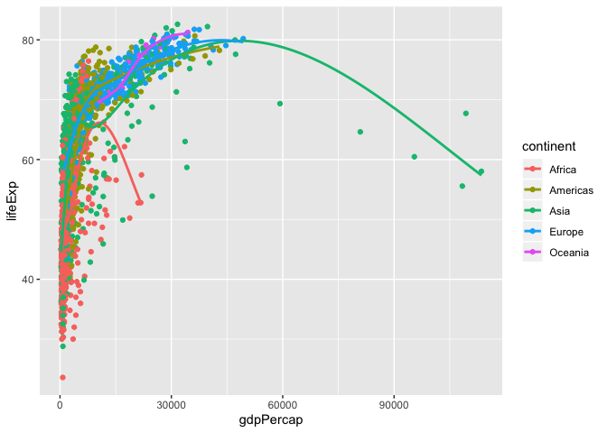
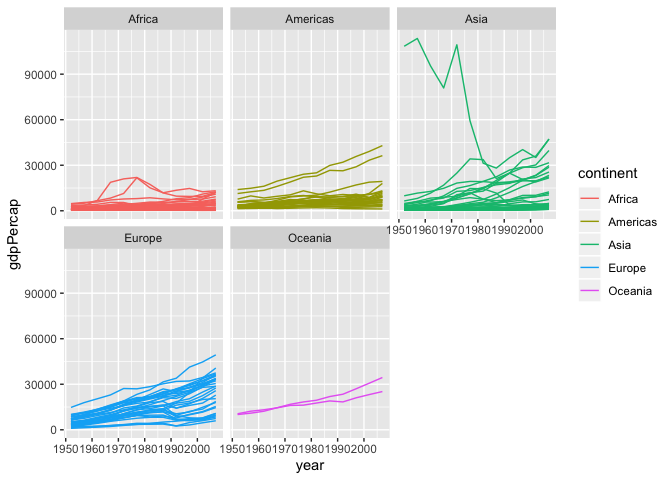

Assignment 3: Data transformation with dplyr
================

Instructions: Please read through this before you begin
-------------------------------------------------------

-   This assignment is due by **10pm on Wednesday 04/15/20**.

-   For this assignment, please **reproduce this markdown file** using R markdown. This includes the followings:

    -   **Reproduce this markdown template**. Pay attention to all the formating in this file, including bullet points, bolded characters, inserted code chunks, headings, text colors, blank lines, and etc.

    -   **Transform the data as instructed**. Show the **first 6 lines** of the transformed data in a table through RMarkdown **using the kable() function**, as shown in this markdown file.

    -   **Reproduce the plots exactly as shown in this html file**. In two cases where the plot is not shown (Excercises 3.7 and 3.9), generate plots that you think can best answer the question.

    -   Have all your code embeded within the R markdown file, and show both of your **code** and **plots** in the knitted markdown file.

    -   When a verbal response is needed, answer by editing the part in the R markdown template where it says <span style="color:blue"> "Write your response here" </span> .

    -   Use R Markdown functionalities to **hide messages and warnings when needed**. (Suggestion: messages and warnings can often be informative and important, so please examine them carefully and only turn them off when you finish the exercise).

-   Please name your R markdown file `assignment_3.Rmd` and the knitted markdown file `assignment_3.md`. Please upload both files using your personal GitHub repository for this class.

-   First, load all the required packages with the following code. Install them if they are not installed yet.

``` r
library(tidyverse)
library(knitr)
library(gapminder)
```

<br>

Exercise 1. Theophylline experiment
-----------------------------------

This exercise uses the `Theoph` data frame, which has 132 rows and 5 columns of data from an experiment on the pharmacokinetics of theophylline.

``` r
kable(head(Theoph))
```

| Subject |    Wt|  Dose|  Time|   conc|
|:--------|-----:|-----:|-----:|------:|
| 1       |  79.6|  4.02|  0.00|   0.74|
| 1       |  79.6|  4.02|  0.25|   2.84|
| 1       |  79.6|  4.02|  0.57|   6.57|
| 1       |  79.6|  4.02|  1.12|  10.50|
| 1       |  79.6|  4.02|  2.02|   9.66|
| 1       |  79.6|  4.02|  3.82|   8.58|

<br>

#### 1.1 Select columns that contain a lower case "t" in the `Theoph` dataset. Do not manually list all the columns to include.

| Subject |    Wt|
|:--------|-----:|
| 1       |  79.6|
| 1       |  79.6|
| 1       |  79.6|
| 1       |  79.6|
| 1       |  79.6|
| 1       |  79.6|

<br>

#### 1.2 Rename the `Wt` column to `Weight` and `conc` column to `Concentration` in the `Theoph` dataset.

| Subject |  Weight|  Dose|  Time|  Concentration|
|:--------|-------:|-----:|-----:|--------------:|
| 1       |    79.6|  4.02|  0.00|           0.74|
| 1       |    79.6|  4.02|  0.25|           2.84|
| 1       |    79.6|  4.02|  0.57|           6.57|
| 1       |    79.6|  4.02|  1.12|          10.50|
| 1       |    79.6|  4.02|  2.02|           9.66|
| 1       |    79.6|  4.02|  3.82|           8.58|

<br>

#### 1.3 Extract the `Dose` greater than 4.5 and `Time` greater than the mean `Time`.

| Subject |    Wt|  Dose|   Time|  conc|
|:--------|-----:|-----:|------:|-----:|
| 3       |  70.5|  4.53|   7.07|  5.30|
| 3       |  70.5|  4.53|   9.00|  4.90|
| 3       |  70.5|  4.53|  12.15|  3.70|
| 3       |  70.5|  4.53|  24.17|  1.05|
| 5       |  54.6|  5.86|   7.02|  7.09|
| 5       |  54.6|  5.86|   9.10|  5.90|

<br>

#### 1.4 Sort the `Theoph` dataset by `Wt` from smallest to largest and secondarily by Time from largest to smallest.

| Subject |    Wt|  Dose|   Time|  conc|
|:--------|-----:|-----:|------:|-----:|
| 5       |  54.6|  5.86|  24.35|  1.57|
| 5       |  54.6|  5.86|  12.00|  4.37|
| 5       |  54.6|  5.86|   9.10|  5.90|
| 5       |  54.6|  5.86|   7.02|  7.09|
| 5       |  54.6|  5.86|   5.02|  7.56|
| 5       |  54.6|  5.86|   3.50|  8.74|

<br>

#### 1.5 Create a new column called `Quantity` that equals to `Wt` x `Dose` in the `Theoph` dataset. This will tell you the absolute quantity of drug administered to the subject (in mg). Replace the `Dose` variable with `Quantity`.

| Subject |    Wt|  Quantity|  Time|   conc|
|:--------|-----:|---------:|-----:|------:|
| 1       |  79.6|   319.992|  0.00|   0.74|
| 1       |  79.6|   319.992|  0.25|   2.84|
| 1       |  79.6|   319.992|  0.57|   6.57|
| 1       |  79.6|   319.992|  1.12|  10.50|
| 1       |  79.6|   319.992|  2.02|   9.66|
| 1       |  79.6|   319.992|  3.82|   8.58|

<br>

#### 1.6 Group the `Theoph` dataset by `Subject` and find the mean `conc` and sum of `Dose` received by each test subject. Show the 6 lines with the smallest sum of `Dose` as below. **Do not define new variables for this exercise and only use pipes. **

| Subject |  mean(conc)|  sum(Dose)|
|:--------|-----------:|----------:|
| 9       |    4.893636|      34.10|
| 6       |    3.525454|      44.00|
| 1       |    6.439091|      44.22|
| 2       |    4.823636|      48.40|
| 4       |    4.940000|      48.40|
| 8       |    4.271818|      49.83|

<br>

Exercise 2. Trend in land value
-------------------------------

This excercise uses a dataset that describes the trend of land value (`Land.Value`), among other variables, in different states in the US 1975-2013. The states are grouped into four different regions, under the variable `region`. This dataset was obtained from the Data Science Services of Harvard University.

``` r
housing <- read_csv("https://raw.githubusercontent.com/nt246/NTRES6940-data-science/master/datasets/landdata_states.csv")
kable(head(housing)) 
```

| State | region |     Date|  Home.Value|  Structure.Cost|  Land.Value|  Land.Share..Pct.|  Home.Price.Index|  Land.Price.Index|  Year|  Qrtr|
|:------|:-------|--------:|-----------:|---------------:|-----------:|-----------------:|-----------------:|-----------------:|-----:|-----:|
| AK    | West   |  2010.25|      224952|          160599|       64352|              28.6|             1.481|             1.552|  2010|     1|
| AK    | West   |  2010.50|      225511|          160252|       65259|              28.9|             1.484|             1.576|  2010|     2|
| AK    | West   |  2009.75|      225820|          163791|       62029|              27.5|             1.486|             1.494|  2009|     3|
| AK    | West   |  2010.00|      224994|          161787|       63207|              28.1|             1.481|             1.524|  2009|     4|
| AK    | West   |  2008.00|      234590|          155400|       79190|              33.8|             1.544|             1.885|  2007|     4|
| AK    | West   |  2008.25|      233714|          157458|       76256|              32.6|             1.538|             1.817|  2008|     1|

<br>

#### 2.1 Washington DC was not assigned to a region in this dataset. According to the United States Census Bureau, however, DC is part of the South region. Here:

-   #### Change the region of DC to "South" (Hint: there are multiple ways to do this, but `mutate()` and `ifelse()` might be helpful)

-   #### Save this updated `region` variable together with `State`, `Date` and `Land.Value` into a new data frame.

-   #### Select the records from DC in this new data frame. How many records are there from DC? Show its first 6 lines.

| region | State |  Land.Value|     Date|
|:-------|:------|-----------:|--------:|
| South  | DC    |      290522|  2003.00|
| South  | DC    |      305673|  2003.25|
| South  | DC    |      323078|  2003.50|
| South  | DC    |      342010|  2003.75|
| South  | DC    |      361999|  2004.00|
| South  | DC    |      382792|  2004.25|

Answer: <span style="color:blue"> Write your response here. </span>

<br>

#### 2.2 Generate a dataframe that summarizes the mean land value of each region at each time point.

| region  |     Date|  mean\_land\_value|
|:--------|--------:|------------------:|
| Midwest |  1975.25|           2452.167|
| Midwest |  1975.50|           2498.917|
| Midwest |  1975.75|           2608.167|
| Midwest |  1976.00|           2780.000|
| Midwest |  1976.25|           2967.333|
| Midwest |  1976.50|           3212.833|

<br>

#### 2.3 Using the dataframe above, plot the trend in mean land value of each region through time.


<br>

Exercise 3. Life expectancy and GDP per capita 1952-2007
--------------------------------------------------------

This exercise uses the `gapminder` dataset from the `gapminder` package. It describes the life expectancy (`lifeExp`), GDP per capita (`gdpPercap`), and population (`pop`) of 142 countries from 1952 to 2007. These countries can be grouped into 5 continents. As a reminder, **reproduce the following plots exactly as shown**.

``` r
kable(head(gapminder))
```

| country     | continent |  year|  lifeExp|       pop|  gdpPercap|
|:------------|:----------|-----:|--------:|---------:|----------:|
| Afghanistan | Asia      |  1952|   28.801|   8425333|   779.4453|
| Afghanistan | Asia      |  1957|   30.332|   9240934|   820.8530|
| Afghanistan | Asia      |  1962|   31.997|  10267083|   853.1007|
| Afghanistan | Asia      |  1967|   34.020|  11537966|   836.1971|
| Afghanistan | Asia      |  1972|   36.088|  13079460|   739.9811|
| Afghanistan | Asia      |  1977|   38.438|  14880372|   786.1134|

<br>

#### 3.1 Use a scatterplot to explore the relationship between per capita GDP (`gdpPercap`) and life expectancy (`lifeExp`).


<br>

#### 3.2 Add a smoothing line to the previous plot.


<br>

#### 3.3 Show each continent in a different color, and fit a separate smoothing line to each continent to identify differences in this relationship between continents. Turn off the confidence intervals.



<br>

#### 3.4 Use faceting to solve the same problem. Show the confidence intervals in this plot


<br>

#### 3.5 Explore the trend in life expectancy through time in each continent. Color by continent.


<br>

#### 3.6 From the previous plot, we see some abnormal trends in Asia and Africa, where the the life expectancy in some countries sharply dropped at certain time periods. Here, we look into what happened in Asia in more detail. First, create a new dataset by filtering only the Asian countries. Show the first 6 lines of this filtered dataset.

| country     | continent |  year|  lifeExp|       pop|  gdpPercap|
|:------------|:----------|-----:|--------:|---------:|----------:|
| Afghanistan | Asia      |  1952|   28.801|   8425333|   779.4453|
| Afghanistan | Asia      |  1957|   30.332|   9240934|   820.8530|
| Afghanistan | Asia      |  1962|   31.997|  10267083|   853.1007|
| Afghanistan | Asia      |  1967|   34.020|  11537966|   836.1971|
| Afghanistan | Asia      |  1972|   36.088|  13079460|   739.9811|
| Afghanistan | Asia      |  1977|   38.438|  14880372|   786.1134|

<br>

#### 3.7 Using the filtered dataset, identify the countries that had abnormal trends in life expectancy **by plotting**, and discuss historical events possibly explaining these trends. (Hint: facet by country)

Answer: <span style="color:blue"> Write your response here. </span>

<br>

#### 3.8 Explore the trend in per capita GDP through time in each continent.



<br>

#### 3.9 There is one Asian country that had a very sharp decline in per capita GDP. With the previously filtered dataset, **use a plot** to identify this country and speculate on the historical event underlying this pattern.

<br>

Answer: <span style="color:blue"> Write your response here. </span>

<br>
