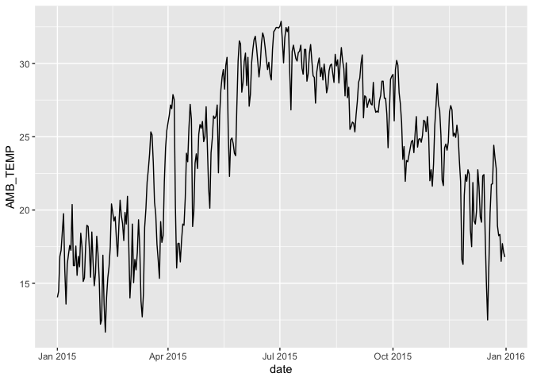
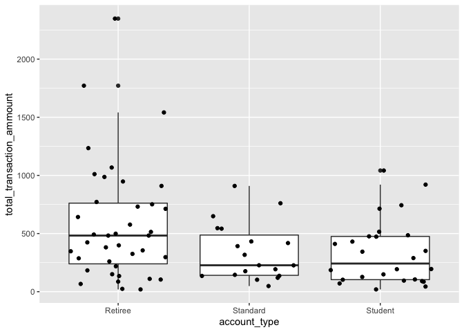

Assignment 5: Data import (readr), tidy data (tidyr) and relational data (dplyr)
================

Instructions: Please read through this before you begin
-------------------------------------------------------

-   This homework is due by **10pm on Wednesday 04/29/20**.

-   Please **reproduce this markdown template**. Pay attention to all the formating in this file, including bullet points, bolded characters, inserted code chunks, headings, text colors, blank lines, and etc.

-   For the first three exercises in this assignment, **import** data files into R and **parse** them properly as instructed. **Tidy** and/or **transform** the data frames when appropriate.

    -   We have not extensively covered parsing data in lecture, but you can find more information about it [here](https://r4ds.had.co.nz/data-import.html#parsing-a-vector).

    -   Briefly, you can choose to use the `col_types` argument in a `read_*()` function to parse the data during import.

    -   In many cases, you can also choose to parse the data using one of the `parse_*()` functions nested within a `mutate()` function after importing the data.

-   Please note that **exercise 3 is optional**. It is a good exercise for practicing your data tidying and exploration skills though, so we encourage you to give it a try if time allows.

-   For exercise 4, use the appropriate `join` function to **join** some relational datasets, and use the resulting datasets to answer some questions.

-   Please **reproduce the tables and plots exactly as shown in this html file**.

-   When a verbal response is needed, answer by editing the part in the R markdown template where it says <span style="color:blue"> "Write your response here" </span>.

-   Have all your code embedded within the R markdown file, and show both of your **code** and **plots** in the knitted markdown file.

-   Use R Markdown functionalities to **hide messages and warnings when needed**. (Suggestion: messages and warnings can often be informative and important, so please examine them carefully and only turn them off when you finish the exercise).

-   Please name your R markdown file `assignment_5.Rmd` and the knitted markdown file `assignment_5.md`. Please upload both files using your personal GitHub repository for this class.

-   To start, first load all the required packages with the following code. Install them if they are not installed yet.

``` r
library(tidyverse)
library(knitr)
```

<br>

Exercise 1. Tibble and Data Import
----------------------------------

Import data frames listed below into R and [parse](https://r4ds.had.co.nz/data-import.html#parsing-a-vector) the columns appropriately when needed. Watch out for the formating oddities of each dataset. Print the results with `kable()`.

<br>

#### 1.1 Create the following tibble manually, first using `tribble()` and then using `tibble()`. Print both results.

`tribble()`:

|    a|    b| c       |
|----:|----:|:--------|
|    1|  2.1| apple   |
|    2|  3.2| orrange |

`tibble()`:

|    a|    b| c       |
|----:|----:|:--------|
|    1|  2.1| apple   |
|    2|  3.2| orrange |

<br>

#### 1.2 Import `https://raw.githubusercontent.com/nt246/NTRES6940-data-science/master/datasets/dataset2.txt` into R. Change the column names into "Name", "Weight", "Price".

| Name   |  Weight|  Price|
|:-------|-------:|------:|
| apple  |       1|    2.9|
| orange |       2|    4.9|
| durian |      10|   19.9|

<br>

#### 1.3 Import `https://raw.githubusercontent.com/nt246/NTRES6940-data-science/master/datasets/dataset3.txt` into R. Watch out for the first few lines, missing values, separators, quotation marks, and deliminaters.

| Name   |  Weight|  Price|
|:-------|-------:|------:|
| apple  |       1|    2.9|
| orange |       2|     NA|
| durian |      NA|   19.9|

<br>

#### 1.4 Import `https://raw.githubusercontent.com/nt246/NTRES6940-data-science/master/datasets/dataset4.txt` into R. Watch out for comments, units, and decimal marks (which are `,` in this case).

| Name   |  Weight|  Price|
|:-------|-------:|------:|
| apple  |       1|    2.9|
| orange |       2|    4.9|
| durian |      10|   19.9|

<br>

#### 1.5 Import `https://raw.githubusercontent.com/nt246/NTRES6940-data-science/master/datasets/dataset5.txt` into R. Parse the columns properly. Write this imported and parsed data frame into a new csv file named `dataset5_new.csv` in your `problem_sets` folder.

| Name   | Expiration Date | Time     |
|:-------|:----------------|:---------|
| apple  | 2018-09-26      | 01:00:00 |
| orange | 2018-10-02      | 13:00:00 |
| durian | 2018-10-21      | 11:00:00 |

<br>

Exercise 2. Weather station
---------------------------

This dataset contains the weather and air quality data collected by a weather station in Taiwan. It was obtained from the Environmental Protection Administration, Executive Yuan, R.O.C. (Taiwan).

<br>

#### 2.1 The text file `https://raw.githubusercontent.com/nt246/NTRES6940-data-science/master/datasets/2015y_Weather_Station_notes.txt` contains desciptions of different variables collected by the station. Import it into R and print it in a table as shown below.

| Item        | Unit    | Description                                               |
|:------------|:--------|:----------------------------------------------------------|
| AMB\_TEMP   | Celsius | Ambient air temperature                                   |
| CO          | ppm     | Carbon monoxide                                           |
| NO          | ppb     | Nitric oxide                                              |
| NO2         | ppb     | Nitrogen dioxide                                          |
| NOx         | ppb     | Nitrogen oxides                                           |
| O3          | ppb     | Ozone                                                     |
| PM10        | μg/m3   | Particulate matter with a diameter between 2.5 and 10 μm  |
| PM2.5       | μg/m3   | Particulate matter with a diameter of 2.5 μm or less      |
| RAINFALL    | mm      | Rainfall                                                  |
| RH          | %       | Relative humidity                                         |
| SO2         | ppb     | Sulfur dioxide                                            |
| WD\_HR      | degress | Wind direction (The average of hour)                      |
| WIND\_DIREC | degress | Wind direction (The average of last ten minutes per hour) |
| WIND\_SPEED | m/sec   | Wind speed (The average of last ten minutes per hour)     |
| WS\_HR      | m/sec   | Wind speed (The average of hour)                          |

`#` indicates invalid value by equipment inspection
`*` indicates invalid value by program inspection
`x` indicates invalid value by human inspection
`NR` indicates no rainfall
blank indicates no data

<br>

#### 2.2 Import `https://raw.githubusercontent.com/nt246/NTRES6940-data-science/master/datasets/2015y_Weather_Station.csv` into R. As you can see, this dataset is a classic example of untidy data: values of a variable (i.e. hour of the day) are stored as column names; variable names are stored in the `item` column. Clean this dataset up by turning it into a tidy format. Also, parse the `date` variable into date format and parse `hour` into time. Turn all invalid values into `NA` and turn `NR` in rainfall into `0`. Parse all values into numbers. Show the first 6 rows and 15 columns of this cleaned dataset, as shown below. (Hint: you don't have to do these tasks in the given order.)

<br>

Before cleaning:

| date       | station | item      | 00   | 01  | 02   | 03   | 04   | 05   | 06   | 07  | 08   | 09   | 10   | 11   |
|:-----------|:--------|:----------|:-----|:----|:-----|:-----|:-----|:-----|:-----|:----|:-----|:-----|:-----|:-----|
| 2015-01-01 | Cailiao | AMB\_TEMP | 16   | 16  | 15   | 15   | 15   | 14   | 14   | 14  | 14   | 15   | 14   | 15   |
| 2015-01-01 | Cailiao | CO        | 0.74 | 0.7 | 0.66 | 0.61 | 0.51 | 0.51 | 0.51 | 0.6 | 0.62 | 0.58 | 0.53 | 0.49 |
| 2015-01-01 | Cailiao | NO        | 1    | 0.8 | 1.1  | 1.7  | 2    | 1.7  | 1.9  | 2.4 | 3.4  | 3.7  | 3.5  | 3.4  |
| 2015-01-01 | Cailiao | NO2       | 15   | 13  | 13   | 12   | 11   | 13   | 13   | 16  | 16   | 14   | 12   | 11   |
| 2015-01-01 | Cailiao | NOx       | 16   | 14  | 14   | 13   | 13   | 15   | 15   | 18  | 19   | 18   | 15   | 15   |
| 2015-01-01 | Cailiao | O3        | 35   | 36  | 35   | 34   | 34   | 32   | 30   | 26  | 26   | 29   | 33   | 38   |

<br>

After cleaning:

| date       | station | hour     |  AMB\_TEMP|    CO|   NO|  NO2|  NOx|   O3|  PM10|  PM2.5|  RAINFALL|   RH|  SO2|  WD\_HR|
|:-----------|:--------|:---------|----------:|-----:|----:|----:|----:|----:|-----:|------:|---------:|----:|----:|-------:|
| 2015-01-01 | Cailiao | 00:00:00 |         16|  0.74|  1.0|   15|   16|   35|   171|     76|         0|   57|  9.2|      74|
| 2015-01-01 | Cailiao | 01:00:00 |         16|  0.70|  0.8|   13|   14|   36|   174|     78|         0|   57|  7.7|      72|
| 2015-01-01 | Cailiao | 02:00:00 |         15|  0.66|  1.1|   13|   14|   35|   160|     69|         0|   58|  6.6|      74|
| 2015-01-01 | Cailiao | 03:00:00 |         15|  0.61|  1.7|   12|   13|   34|   142|     60|         0|   59|  5.4|      71|
| 2015-01-01 | Cailiao | 04:00:00 |         15|  0.51|  2.0|   11|   13|   34|   123|     52|         0|   59|  4.8|      67|
| 2015-01-01 | Cailiao | 05:00:00 |         14|  0.51|  1.7|   13|   15|   32|   110|     44|         0|   57|  5.0|      63|

<br>

#### 2.3 Using this cleaned dataset, plot the daily variation in ambient temperature on September 25, 2015, as shown below.


<br>

#### 2.4 Plot the daily average ambient temperature throughout the year with a **continuous line**, as shown below.



<br>

#### 2.5 Plot the total rainfall per month in a bar chart, as shown below. (Hint: seperating date into three columns might be helpful.)


<br>

#### 2.6 Plot the per hour variation in PM2.5 in the first week of September with a **continuous line**, as shown below. (Hint: uniting the date and hour and parsing the new variable might be helpful.)


<br>

Exercise 3. Camera data (Optional)
----------------------------------

This dataset contains information on 1038 camera models. It was obtained from the following website: <https://perso.telecom-paristech.fr/eagan/class/igr204/>

<br>

#### 3.1 Import `https://raw.githubusercontent.com/nt246/NTRES6940-data-science/master/datasets/camera.csv` to R. You will see that the `Model` columns contains both the brand names and model names of cameras. Split this column into two, one with brand name, and the other with model name, as shown below. Print the first 6 rows of the new data frame. (Hint: check the merge argument in `separate()`)

| Brand | Model             |  Release date|  Max resolution|  Low resolution|  Effective pixels|  Zoom wide (W)|  Zoom tele (T)|  Normal focus range|  Macro focus range|  Storage included|  Weight (inc. batteries)|  Dimensions|  Price|
|:------|:------------------|-------------:|---------------:|---------------:|-----------------:|--------------:|--------------:|-------------------:|------------------:|-----------------:|------------------------:|-----------:|------:|
| Agfa  | ePhoto 1280       |          1997|            1024|             640|                 0|             38|            114|                  70|                 40|                 4|                      420|          95|    179|
| Agfa  | ePhoto 1680       |          1998|            1280|             640|                 1|             38|            114|                  50|                  0|                 4|                      420|         158|    179|
| Agfa  | ePhoto CL18       |          2000|             640|               0|                 0|             45|             45|                   0|                  0|                 2|                        0|           0|    179|
| Agfa  | ePhoto CL30       |          1999|            1152|             640|                 0|             35|             35|                   0|                  0|                 4|                        0|           0|    269|
| Agfa  | ePhoto CL30 Clik! |          1999|            1152|             640|                 0|             43|             43|                  50|                  0|                40|                      300|         128|   1299|
| Agfa  | ePhoto CL45       |          2001|            1600|             640|                 1|             51|             51|                  50|                 20|                 8|                      270|         119|    179|

<br>

#### 3.2 Many model names start with a name for the product line, which is then followed by a name for the particular model. Select all Canon cameras, and further split the model names into product line names (in this case, they are either "Powershot" or "EOS") and model names. Show the first 6 lines of this new data frame. (Hint: notice that there are more than one possible separators)

| Brand | Line      | Model |  Release date|  Max resolution|  Low resolution|  Effective pixels|  Zoom wide (W)|  Zoom tele (T)|  Normal focus range|  Macro focus range|  Storage included|  Weight (inc. batteries)|  Dimensions|  Price|
|:------|:----------|:------|-------------:|---------------:|---------------:|-----------------:|--------------:|--------------:|-------------------:|------------------:|-----------------:|------------------------:|-----------:|------:|
| Canon | PowerShot | 350   |          1997|             640|               0|                 0|             42|             42|                  70|                  3|                 2|                      320|          93|    149|
| Canon | PowerShot | 600   |          1996|             832|             640|                 0|             50|             50|                  40|                 10|                 1|                      460|         160|    139|
| Canon | PowerShot | A10   |          2001|            1280|            1024|                 1|             35|            105|                  76|                 16|                 8|                      375|         110|    139|
| Canon | PowerShot | A100  |          2002|            1280|            1024|                 1|             39|             39|                  20|                  5|                 8|                      225|         110|    139|
| Canon | PowerShot | A20   |          2001|            1600|            1024|                 1|             35|            105|                  76|                 16|                 8|                      375|         110|    139|
| Canon | PowerShot | A200  |          2002|            1600|            1024|                 1|             39|             39|                  20|                  5|                 8|                      225|         110|    139|

<br>

#### 3.3 Explore the full dataset (and some subsetted ones if you are interested) on your own using **a variety of the skills** that you have learned in this class so far (i.e. data visualization, transformation, and exploration). Come up with **at least 3 interesting findings or potential hypotheses**.

<br>

###### 3.3.1

``` r
## Write your code here
```

<span style="color:blue"> Write your response here </span>

<br>

###### 3.3.2

``` r
## Write your code here
```

<span style="color:blue"> Write your response here </span>

<br>

###### 3.3.3

``` r
## Write your code here
```

<span style="color:blue"> Write your response here </span>

<br>

###### Don't hesitate to continue writing if you have more than 3 interesting findings.

<br>

Excercise 4: Join functions
---------------------------

<br>

#### Read in some relational datasets from GitHub

``` r
## for 4.1
toy1 <- read_csv('https://raw.githubusercontent.com/idc9/stor390/master/data/joins/toy_one.csv')
toy2 <- read_csv('https://raw.githubusercontent.com/idc9/stor390/master/data/joins/toy_two.csv')
## for 4.2
play1 <- read_csv('https://raw.githubusercontent.com/idc9/stor390/master/data/joins/play_one.csv')
play2 <- read_csv('https://raw.githubusercontent.com/idc9/stor390/master/data/joins/play_two.csv')
## for 4.3
banking_account_types <- read_csv('https://raw.githubusercontent.com/idc9/stor390/master/data/joins/banking_account_types.csv')
banking_transactions <- read_csv('https://raw.githubusercontent.com/idc9/stor390/master/data/joins/banking_transactions.csv')
## for 4.4
crime_arrests <- read_csv('https://raw.githubusercontent.com/idc9/stor390/master/data/joins/crime_arrests.csv')
crime_wealth <- read_csv('https://raw.githubusercontent.com/idc9/stor390/master/data/joins/crime_wealth.csv')
## for 4.5
titanic_outcomes <- read_csv('https://raw.githubusercontent.com/idc9/stor390/master/data/joins/titanic_outcomes.csv')
titanic_person_features <- read_csv('https://raw.githubusercontent.com/idc9/stor390/master/data/joins/titanic_person_features.csv')
```

<br>

#### 4.1 Join the `toy` datasets. Only keep rows that have matches in the other dataset. Show the resulting dataset using `kable()`.

| key | value | animal   |
|:----|:------|:---------|
| aaa | this  | cat      |
| aaa | this  | tiger    |
| bbb | that  | dog      |
| bbb | that  | hampster |
| ddd | thing | horse    |
| ddd | one   | horse    |

<br>

#### 4.2 Join the `play` datasets by `key` and `label`. Keep all rows from both datasets. Show the resulting dataset using `kable()`.

| key | label |  value|  othervalue|
|:----|:------|------:|-----------:|
| aaa | rrr   |      1|         111|
| aaa | rrr   |      1|         444|
| rrr | aaa   |      2|          NA|
| ttt | xxx   |      3|         222|
| vvv | uuu   |      4|         333|
| vvv | uuu   |      4|         555|
| rrr | aaa   |      6|          NA|
| ttt | xxx   |      7|         222|
| vvv | uuu   |      8|         333|
| vvv | uuu   |      8|         555|

<br>

#### 4.3 Plot the distribution of total transaction amount per account grouped by different account types with a boxplot shown below, using the `banking` datasets.



<br>

#### 4.4 Which state is in the `crime_wealth` dataset but not the `crime_arrest` dataset? Use a join function to answer this question.

<br>

#### 4.5 Plot the number of passenger who did and did not survive, grouped by their classes, using the `titanic` data sets.


