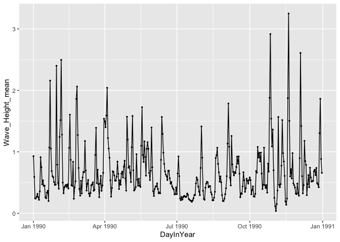
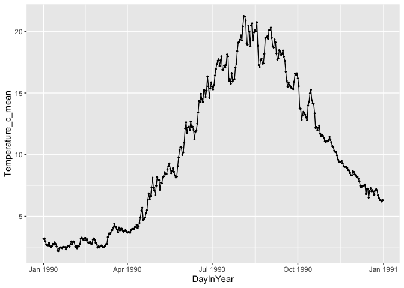
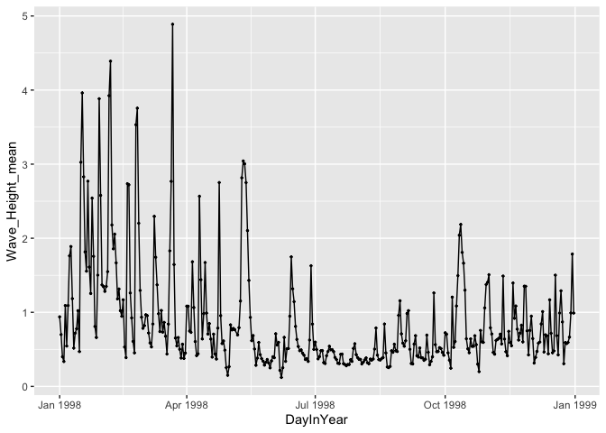
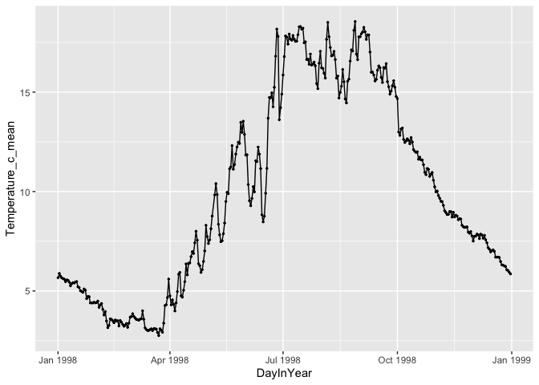
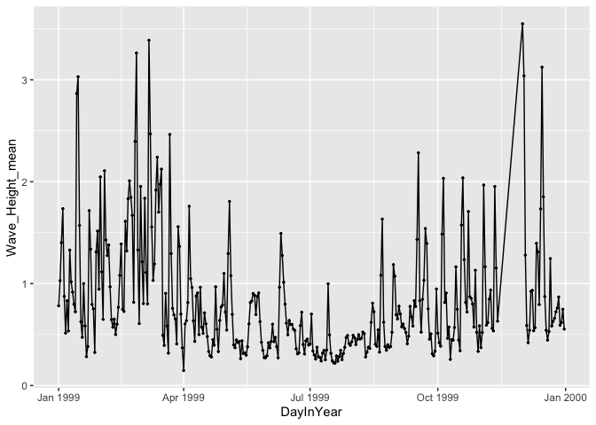
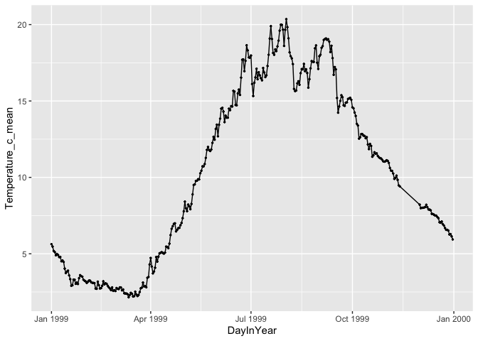
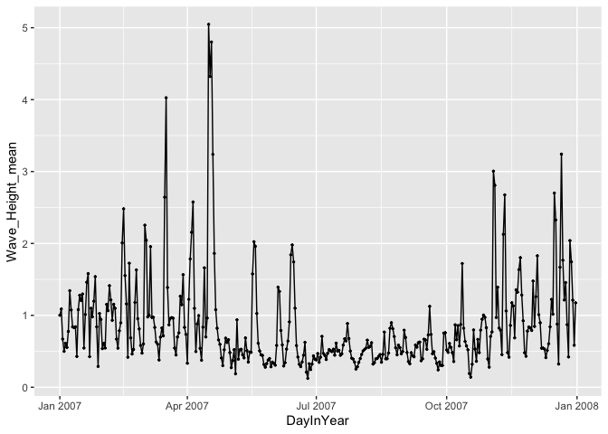
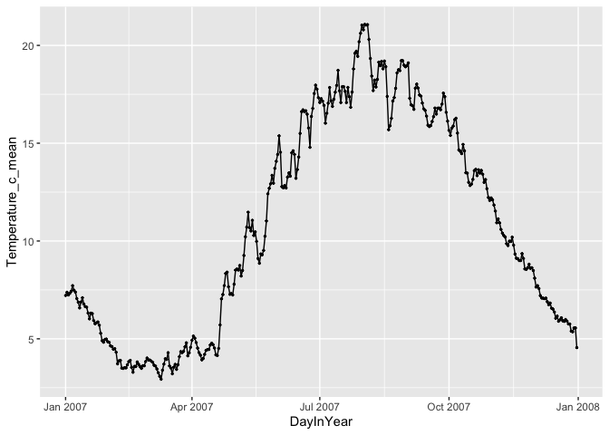

Assignment 6: Writing custom functions in R
================

<br>

This homework is due **Monday 10/22/18 at 4pm**.

The goal of this homework is to **review and practice the basic programming skills** that we have recently learned. All exercises were modified (with permission) from Iain Carmichael's [STOR 390 course](https://idc9.github.io/stor390/course_info/syllabus.html) and from Jarrett Byrnes's [BIOL 355/356 course](https://biol355.github.io/). Please follow the directions specified in each exercise.

In many of these exercises, examples are given in order to demonstrate how your functions should work (e.g. Question 2). In your Rmd template, these examples are also included with the setting `eval=FALSE`. When you work on this assignment, define your functions first, and then **use these examples to test if your function would return the correct results**. When you knit your html output, please delete the `eval=FALSE` setting so that you can show that your functions work properly in these examples.

**To get extra credits up to 10 points**, write your code in a clean and consistent style, and add proper documentation to your functions so that they can easily be understood by other people and the future you (see the lecture slides on Tuesday 10/16/28).

Use the R markdown template given to you to generate your own html output, and have all your code embedded within the file. Please only show your **code** and **plots** in the html file, and **use R Markdown functionalities to hide messages and warnings when needed**. (Suggestion: messages and warnings can often be informative and important, so please examine them carefully and only turn them off when you finish the exercise).

Remember to submit a knitted html file rather than the .Rmd version. Please **rename your knitted html file** in the format of "Homework7\_YourName.html" and upload it through Blackboard.

<br>

First, load the required packages and **set the working directory** (you have to edit this)

``` r
library(tidyverse)
```

<br>

Question 1
==========

<br>

**1.1 Write a function that can convert Farenheit to Celsius**, based on the following fomula: `C = (F - 32) * 5 / 9`

Take your function for a spin, does it return the correct values?

32 F = 0 C

50 F = 10 C

212 F = 100 C

<br>

**1.2** A student came from 'tropical Canada'. She doesn't like the cold but she really didn't like it when it's hot. Although she wanted to know what the temperature is in Celsius when the US weather channel reported it t in Farenheit, there are certain points at which it was just too cold or too hot for to to care about the exact value. **Modify the f\_to\_c function below to print the following**, and check if your function works properly using the input of **-10 F, 60 F, and 90 F**.

-   If the temperature is less than -20 C, print "Don't bother going out."

-   If the temperature is greater than 30 C, print "I'm moving back to Canada."

<br>

Question 2
==========

The R function setdiff(x,y) returns the elements of a vector x that are not in y. **Sometimes you want a function to return the elements that are in x or y but not both.**

For example, say x is a list of singers who can reach very high registers, and y is a list of musicians who died in 2016. This returns a list of singers with high voices who did not die in 2016.

``` r
x <- c("prince", "mj", "sam cook", "whitney", "dolly")
y <- c("sharon jones", "prince", "bowie", "leonard cohen", "phife dawg")
setdiff(x,y)
```

    ## [1] "mj"       "sam cook" "whitney"  "dolly"

**You will write a function that returns names of those who either have high voices, but did not die in 2016, OR who died in 2016 but do not have high voices.**

Your function will need to work for any vectors, not just the ones in this example. The output should be a single vector, not two vectors.

Hint: you will need R’s set operation (<https://stat.ethz.ch/R-manual/R-devel/library/base/html/sets.html>).

The following is how it should work:

``` r
#Example output
unique_element(x,y)
```

    ## [1] "mj"            "sam cook"      "whitney"       "dolly"        
    ## [5] "sharon jones"  "bowie"         "leonard cohen" "phife dawg"

<br>

Question 3
==========

Rounding appears to be a very simple arithmetic operation. However, **things get a little bit complicated when it comes to the number 5**, which is at the exact mid-point between rounding up and rounding down.

The `round` function in base R is weird. It is supposed to use a **round half to even rule** when rounding off a **5** (see <https://en.wikipedia.org/wiki/Rounding#Round_half_to_even>). However, this is dependent on your operation system, and therefore this rule is sometimes inconsistent. For example:

``` r
# This is how a "round half to even" rule should work
round(0.5, digits=0)
```

    ## [1] 0

``` r
round(1.5, digits=0)
```

    ## [1] 2

``` r
round(-0.5, digits=0)
```

    ## [1] 0

``` r
round(-1.5, digits=0)
```

    ## [1] -2

``` r
# Things get weird sometimes though
round(0.15, digits=1) # This is what we would expect
```

    ## [1] 0.2

``` r
round(1.15, digits=1) # Under a "round half to even" rule, we are expecting it to reture 1.2. However, here it returns 1.1 on my operating system (might be different for yours)
```

    ## [1] 1.1

<br>

**3.1** To correct this inconsistency issue, **write a custom function** that consistently applies a **round half away from zero rule** when rounding off a **5** (round up when it's positive, and down when it is negative; or see <https://en.wikipedia.org/wiki/Rounding#Round_half_away_from_zero>), and that takes a "digits" argument exactly as in the original R function.

The following is how it should work:

``` r
#Example output
round_away(0.5, digits=0)
```

    ## [1] 1

``` r
round_away(1.5, digits=0)
```

    ## [1] 2

``` r
round_away(-0.5, digits=0)
```

    ## [1] -1

``` r
round_away(-1.5, digits=0)
```

    ## [1] -2

``` r
round_away(0.15, digits=1)
```

    ## [1] 0.2

``` r
round_away(1.15, digits=1) 
```

    ## [1] 1.2

``` r
round_away(-0.15, digits=1)
```

    ## [1] -0.2

``` r
round_away(-1.15, digits=1) 
```

    ## [1] -1.2

``` r
round_away(0.49, digits=0)
```

    ## [1] 0

``` r
round_away(-1.49, digits=0)
```

    ## [1] -1

``` r
round_away(0.51, digits=0)
```

    ## [1] 1

``` r
round_away(-1.51, digits=0)
```

    ## [1] -2

<br>

**3.2** Now, building up on the previous question, **write a custom function** that consistently applies a **round half to even** rule when rounding off a **5**. (Hint: you will need the modular arithmatic operator `%%`.)

The following is how this function should work:

``` r
#Example output
round_even(0.5, digits=0)
```

    ## [1] 0

``` r
round_even(1.5, digits=0)
```

    ## [1] 2

``` r
round_even(-0.5, digits=0)
```

    ## [1] 0

``` r
round_even(-1.5, digits=0)
```

    ## [1] -2

``` r
round_even(0.15, digits=1)
```

    ## [1] 0.2

``` r
round_even(1.15, digits=1) 
```

    ## [1] 1.2

``` r
round_even(-0.15, digits=1)
```

    ## [1] -0.2

``` r
round_even(-1.15, digits=1) 
```

    ## [1] -1.2

``` r
round_even(0.49, digits=0)
```

    ## [1] 0

``` r
round_even(-1.49, digits=0)
```

    ## [1] -1

``` r
round_even(0.51, digits=0)
```

    ## [1] 1

``` r
round_even(-1.51, digits=0)
```

    ## [1] -2

<br>

Question 4
==========

<br>

In this exercise you will use functions to automate the cleaning up process of a group of datasets with similar names and formats in the `buoydata` folder.

**4.1** Given the following code chunk for reading buoy data files in for each year, describe the following:

-   What parts of your code are consistent across every line/code chunk?
-   What parts are different?
-   What is the output that you want your function to return?

``` r
buoy_1987 <- read_csv('../datasets/buoydata/44013_1987.csv', na = c("99", "999", "99.00", "999.0"))
buoy_1988 <- read_csv('../datasets/buoydata/44013_1988.csv', na = c("99", "999", "99.00", "999.0"))
buoy_1989 <- read_csv('../datasets/buoydata/44013_1989.csv', na = c("99", "999", "99.00", "999.0"))
buoy_1990 <- read_csv('../datasets/buoydata/44013_1990.csv', na = c("99", "999", "99.00", "999.0"))
```

Answer: <span style="color:blue"> Write your response here. </span>

<br>

**4.2** Use the `str_c()` function to write a function that creates the filename for each year.

Here is how it should work:

``` r
#Example output
create_name(year=1986)
```

    ## [1] "./buoydata/44013_1986.csv"

<br>

**4.3** Complete the skeleton of this function based on the work that you have done up to now. Describe, in words, what is happening in every step using comments.

``` r
read_buoy <- function(_________){
  
  filename <- ___________________________
  
  a_buoy <- read_csv(________________, na=("99", "999", "99.00", "999.0"))
  
  return(___________)

}
```

Here is how it should work:

``` r
#Example output
read_buoy(1987)
```

    ## # A tibble: 7,602 x 16
    ##       YY    MM    DD    hh    WD  WSPD   GST  WVHT   DPD   APD MWD     BAR  ATMP
    ##    <dbl> <dbl> <dbl> <dbl> <dbl> <dbl> <dbl> <dbl> <dbl> <dbl> <lgl> <dbl> <dbl>
    ##  1    87     1     1     0   290     8    10   2.7  11.1   8.6 NA    1024.   2.8
    ##  2    87     1     1     1   290     7     8   2.4  10     8   NA    1024.   2  
    ##  3    87     1     1     2   290     6     8   2.5  11.1   8.3 NA    1024.   1.6
    ##  4    87     1     1     3   300     6     7   2.6  11.1   8.6 NA    1024.   1.3
    ##  5    87     1     1     4   290     5     6   2.7  12.5   8.7 NA    1025.   1  
    ##  6    87     1     1     5   340     6     7   2.4  14.3   8.4 NA    1025    0.7
    ##  7    87     1     1     6    10     5     6   2.4  12.5   8.8 NA    1026.   0.7
    ##  8    87     1     1     7    10     4     6   2.6  12.5   9.5 NA    1027.   0.5
    ##  9    87     1     1     8    20     7     8   2.5  12.5   9.2 NA    1026.   0.4
    ## 10    87     1     1     9    20     5     6   2.5  12.5   9.1 NA    1027.   0.4
    ## # … with 7,592 more rows, and 3 more variables: WTMP <dbl>, DEWP <lgl>,
    ## #   VIS <lgl>

<br>

**4.4** Amend the process\_buoy function to allow for a variable buoy number (currently we are using data from buoy 44013, but there are many other numbers/names that could be used!), directory location of the file, and year.

Here is how it should work:

``` r
#Example output
read_buoy(path="../datasets/buoydata/", buoy=44013, year=1987)
```

    ## # A tibble: 7,602 x 16
    ##       YY    MM    DD    hh    WD  WSPD   GST  WVHT   DPD   APD MWD     BAR  ATMP
    ##    <dbl> <dbl> <dbl> <dbl> <dbl> <dbl> <dbl> <dbl> <dbl> <dbl> <lgl> <dbl> <dbl>
    ##  1    87     1     1     0   290     8    10   2.7  11.1   8.6 NA    1024.   2.8
    ##  2    87     1     1     1   290     7     8   2.4  10     8   NA    1024.   2  
    ##  3    87     1     1     2   290     6     8   2.5  11.1   8.3 NA    1024.   1.6
    ##  4    87     1     1     3   300     6     7   2.6  11.1   8.6 NA    1024.   1.3
    ##  5    87     1     1     4   290     5     6   2.7  12.5   8.7 NA    1025.   1  
    ##  6    87     1     1     5   340     6     7   2.4  14.3   8.4 NA    1025    0.7
    ##  7    87     1     1     6    10     5     6   2.4  12.5   8.8 NA    1026.   0.7
    ##  8    87     1     1     7    10     4     6   2.6  12.5   9.5 NA    1027.   0.5
    ##  9    87     1     1     8    20     7     8   2.5  12.5   9.2 NA    1026.   0.4
    ## 10    87     1     1     9    20     5     6   2.5  12.5   9.1 NA    1027.   0.4
    ## # … with 7,592 more rows, and 3 more variables: WTMP <dbl>, DEWP <lgl>,
    ## #   VIS <lgl>

<br>

**4.5** Building on the workflow that you used in 4.1 - 4.4, create a function to clean up and summarize the buoy data from **any year between 1987 and 1998** using a dplyr workflow. **Select** only the columns YY, MM, DD, WVHT (wave heights), WTMP (temperatures) and **rename** these columns to something understandable. Have it **a) return a tibble of daily averaged wave heights and temperatures** and **b) print plots showing their variations throughout the year.** You can begin by writing a workflow for one dataset, and then generalize it.

If you are not sure of some of these things, remember to run the code chunks bit by bit, putting in test values (e.g., one year of data) to ensure that you know what you are working with, what each line is doing, and what the final returned value is.

**Note**: Don't worry about parsing failures in columns other than the ones that you will use for this excercise.

Here is how the generalized function should work:

``` r
#Example output
summarize_buoy("../datasets/buoydata/", 44013, 1990)
```



    ## # A tibble: 365 x 6
    ##     Year Month   Day Wave_Height_mean Temperature_c_mean DayInYear 
    ##    <dbl> <dbl> <dbl>            <dbl>              <dbl> <date>    
    ##  1    90     1     1            0.929               3.18 1990-01-01
    ##  2    90     1     2            0.592               3.21 1990-01-02
    ##  3    90     1     3            0.242               2.96 1990-01-03
    ##  4    90     1     4            0.242               2.72 1990-01-04
    ##  5    90     1     5            0.271               2.65 1990-01-05
    ##  6    90     1     6            0.317               2.65 1990-01-06
    ##  7    90     1     7            0.262               2.85 1990-01-07
    ##  8    90     1     8            0.221               2.59 1990-01-08
    ##  9    90     1     9            0.357               2.52 1990-01-09
    ## 10    90     1    10            0.912               2.58 1990-01-10
    ## # … with 355 more rows

<br>

**4.6** Now, further generalize your `summarize_buoy` function so that it works for any year **between 1987 and 2013**. **Here are a few things that you should pay attention to:**

-   The name and format of the year column is not consistent among years.
-   In certain years there is a useless first row.
-   You are not supposed to modify the original data using Excel for this exercise.

Here is how the generalized function should work (Note that **default values for the year\_format and skip\_second\_line arguments should be defined** in the function, so you only need to specify them when they are different from the default):

``` r
#Example output
summarize_buoy("../datasets/buoydata/", 44013, 1998)
```



    ## # A tibble: 364 x 6
    ##     Year Month   Day Wave_Height_mean Temperature_c_mean DayInYear 
    ##    <dbl> <dbl> <dbl>            <dbl>              <dbl> <date>    
    ##  1    98     1     1            0.939               5.67 1998-01-01
    ##  2    98     1     2            0.700               5.88 1998-01-02
    ##  3    98     1     3            0.4                 5.75 1998-01-03
    ##  4    98     1     4            0.336               5.65 1998-01-04
    ##  5    98     1     5            1.09                5.63 1998-01-05
    ##  6    98     1     6            0.545               5.59 1998-01-06
    ##  7    98     1     7            1.09                5.47 1998-01-07
    ##  8    98     1     8            1.76                5.55 1998-01-08
    ##  9    98     1     9            1.89                5.54 1998-01-09
    ## 10    98     1    10            1.18                5.45 1998-01-10
    ## # … with 354 more rows

``` r
summarize_buoy("../datasets/buoydata/", 44013, 1999, year_format = "Y")
```



    ## # A tibble: 348 x 6
    ##     Year Month   Day Wave_Height_mean Temperature_c_mean DayInYear 
    ##    <dbl> <dbl> <dbl>            <dbl>              <dbl> <date>    
    ##  1  1999     1     1            0.782               5.63 1999-01-01
    ##  2  1999     1     2            1.03                5.47 1999-01-02
    ##  3  1999     1     3            1.40                5.19 1999-01-03
    ##  4  1999     1     4            1.74                5.11 1999-01-04
    ##  5  1999     1     5            0.875               4.90 1999-01-05
    ##  6  1999     1     6            0.515               4.98 1999-01-06
    ##  7  1999     1     7            0.832               4.92 1999-01-07
    ##  8  1999     1     8            0.536               4.78 1999-01-08
    ##  9  1999     1     9            1.33                4.79 1999-01-09
    ## 10  1999     1    10            1.02                4.51 1999-01-10
    ## # … with 338 more rows

``` r
summarize_buoy("../datasets/buoydata/", 44013, 2007, year_format = "Y", skip_second_line = T)
```



    ## # A tibble: 365 x 6
    ##     Year Month Day   Wave_Height_mean Temperature_c_mean DayInYear 
    ##    <dbl> <chr> <chr>            <dbl>              <dbl> <date>    
    ##  1  2007 01    01               1.00                7.22 2007-01-01
    ##  2  2007 01    02               1.09                7.38 2007-01-02
    ##  3  2007 01    03               0.671               7.24 2007-01-03
    ##  4  2007 01    04               0.500               7.33 2007-01-04
    ##  5  2007 01    05               0.612               7.43 2007-01-05
    ##  6  2007 01    06               0.554               7.72 2007-01-06
    ##  7  2007 01    07               0.777               7.48 2007-01-07
    ##  8  2007 01    08               1.34                7.39 2007-01-08
    ##  9  2007 01    09               1.07                7.05 2007-01-09
    ## 10  2007 01    10               0.840               6.88 2007-01-10
    ## # … with 355 more rows
