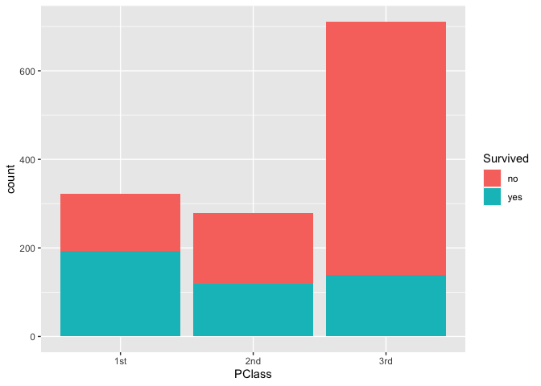
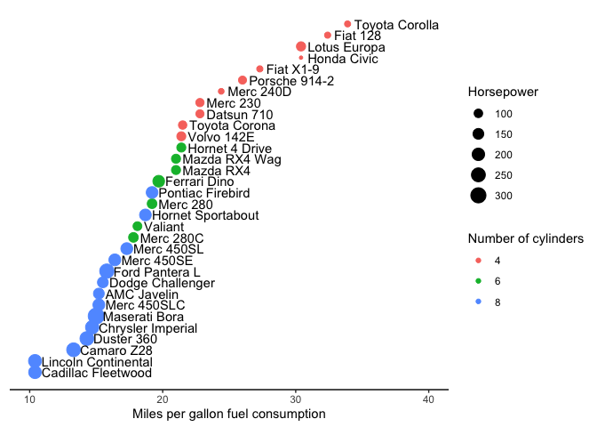

Assignment 6: Relational data plus revisiting data wrangling and
visualization
================

## Instructions: Please read through this before you begin

  - This assignment is due by **10pm on Monday 11/02/20**.

  - Please **reproduce this markdown template**. Pay attention to all
    the formating in this file, including bullet points, bolded
    characters, inserted code chunks, headings, text colors, blank
    lines, and etc.

  - For exercise 1, use the appropriate `join` function to **join** some
    relational datasets, and use the resulting datasets to answer some
    questions.

  - For the second exercise in this assignment, you will use the data
    wrangling and visualization skills that you have learned in this
    class to reproduce a figure exactly as it is shown.

  - Have all your code embedded within the R markdown file, and show
    both of your **code** and **plots** in the knitted markdown file.

  - Use R Markdown functionalities to **hide messages and warnings when
    needed**. (Suggestion: messages and warnings can often be
    informative and important, so please examine them carefully and only
    turn them off when you finish the exercise).

  - Please name your R markdown file `assignment_6.Rmd` and the knitted
    markdown file `assignment_6.md`. Please upload both files using your
    personal GitHub repository for this class.

  - First, load all the required packages with the following code.
    Install them if they are not installed yet.

<!-- end list -->

``` r
library(tidyverse)
library(knitr)
```

<br>

## Excercise 1: Join functions

**Acknowledgements:** The datasets and some of the questions for this
exercise has been borrowed (with permission) from Iain Carmichael’s
course [STOR 390: Introduction to Data
Science](https://idc9.github.io/stor390/#course_material).

<br>

#### Read in some relational datasets from GitHub

``` r
## for 4.1
toy1 <- read_csv('https://raw.githubusercontent.com/idc9/stor390/master/data/joins/toy_one.csv')
toy2 <- read_csv('https://raw.githubusercontent.com/idc9/stor390/master/data/joins/toy_two.csv')

## for 4.2
play1 <- read_csv('https://raw.githubusercontent.com/idc9/stor390/master/data/joins/play_one.csv')
play2 <- read_csv('https://raw.githubusercontent.com/idc9/stor390/master/data/joins/play_two.csv')

## for 4.3
banking_account_types <- read_csv('https://raw.githubusercontent.com/idc9/stor390/master/data/joins/banking_account_types.csv')
banking_transactions <- read_csv('https://raw.githubusercontent.com/idc9/stor390/master/data/joins/banking_transactions.csv')

## for 4.4
crime_arrests <- read_csv('https://raw.githubusercontent.com/idc9/stor390/master/data/joins/crime_arrests.csv')
crime_wealth <- read_csv('https://raw.githubusercontent.com/idc9/stor390/master/data/joins/crime_wealth.csv')

## for 4.5
titanic_outcomes <- read_csv('https://raw.githubusercontent.com/idc9/stor390/master/data/joins/titanic_outcomes.csv')
titanic_person_features <- read_csv('https://raw.githubusercontent.com/idc9/stor390/master/data/joins/titanic_person_features.csv')
```

<br>

#### 1.1 Join the `toy` datasets. Only keep rows that have matches in the other dataset. Show the resulting dataset using `kable()`.

| key | value | animal   |
| :-- | :---- | :------- |
| aaa | this  | cat      |
| aaa | this  | tiger    |
| bbb | that  | dog      |
| bbb | that  | hampster |
| ddd | thing | horse    |
| ddd | one   | horse    |

<br>

#### 1.2 Join the `play` datasets by `key` and `label`. Keep all rows from both datasets. Show the resulting dataset using `kable()`.

| key | label | value | othervalue |
| :-- | :---- | ----: | ---------: |
| aaa | rrr   |     1 |        111 |
| aaa | rrr   |     1 |        444 |
| rrr | aaa   |     2 |         NA |
| ttt | xxx   |     3 |        222 |
| vvv | uuu   |     4 |        333 |
| vvv | uuu   |     4 |        555 |
| rrr | aaa   |     6 |         NA |
| ttt | xxx   |     7 |        222 |
| vvv | uuu   |     8 |        333 |
| vvv | uuu   |     8 |        555 |

<br>

#### 1.3 Plot the distribution of total transaction amount per account ID grouped by different account types with a boxplot shown below, using the `banking` datasets.

    ## `summarise()` regrouping output by 'id' (override with `.groups` argument)

<!-- -->

<br>

#### 1.4 Which state is in the `crime_wealth` dataset but not the `crime_arrests` dataset? Use a join function to answer this question.

<br>

#### 1.5 OPTIONAL: Plot the number of passenger who did and did not survive, grouped by their classes, using the `titanic` data sets.

<!-- -->

<br> <br>

## Exercise 2: Fuel Efficiency of Car Models

This exercise uses the `mtcars` dataset. It was extracted from the 1974
Motor Trend US magazine, and comprises fuel consumption and 10 aspects
of automobile design and performance for 32 automobiles (1973–74
models).

``` r
kable(head(mtcars))
```

|                   |  mpg | cyl | disp |  hp | drat |    wt |  qsec | vs | am | gear | carb |
| :---------------- | ---: | --: | ---: | --: | ---: | ----: | ----: | -: | -: | ---: | ---: |
| Mazda RX4         | 21.0 |   6 |  160 | 110 | 3.90 | 2.620 | 16.46 |  0 |  1 |    4 |    4 |
| Mazda RX4 Wag     | 21.0 |   6 |  160 | 110 | 3.90 | 2.875 | 17.02 |  0 |  1 |    4 |    4 |
| Datsun 710        | 22.8 |   4 |  108 |  93 | 3.85 | 2.320 | 18.61 |  1 |  1 |    4 |    1 |
| Hornet 4 Drive    | 21.4 |   6 |  258 | 110 | 3.08 | 3.215 | 19.44 |  1 |  0 |    3 |    1 |
| Hornet Sportabout | 18.7 |   8 |  360 | 175 | 3.15 | 3.440 | 17.02 |  0 |  0 |    3 |    2 |
| Valiant           | 18.1 |   6 |  225 | 105 | 2.76 | 3.460 | 20.22 |  1 |  0 |    3 |    1 |

<br>

#### 2.1 Reproduce the following plot, which shows the miles per gallon (`mpg`) of car models on the x axis (see hints below). Different models are ordered on the y axis according to their `mpg` and their names are shown next to the data points. Also, the size of each data point maps to its horse power (`hp`), and the color maps to number of cylinders (`cyl`).

<!-- -->

<br>

##### Hint 1: Start by transforming the data frame into the following format.

  - Convert rownames to a column. (`rownames_to_column()` might be
    helpful)
  - Create a new variable which shows the order of car models based on
    their mpg. (`row_number()` might be helpful)

The first few rows of this new data frame might look like the following.

| rowname           |  mpg | mpg\_order | cyl |  hp |
| :---------------- | ---: | ---------: | --: | --: |
| Mazda RX4         | 21.0 |         19 |   6 | 110 |
| Mazda RX4 Wag     | 21.0 |         20 |   6 | 110 |
| Datsun 710        | 22.8 |         24 |   4 |  93 |
| Hornet 4 Drive    | 21.4 |         21 |   6 | 110 |
| Hornet Sportabout | 18.7 |         15 |   8 | 175 |
| Valiant           | 18.1 |         14 |   6 | 105 |

<br>

##### Hint 2: When making the plot, pay attention to the following elements of the plot that need to be specified.

  - Horizontal adjustment of the text labels (“`hjust`” option in
    `geom_text()`)
  - The range of the x-axis (`xlim()`)
  - x-axis label and legend titles (`labs()`)
  - The plot area background
  - The removal of the y-axis (`theme()`)
