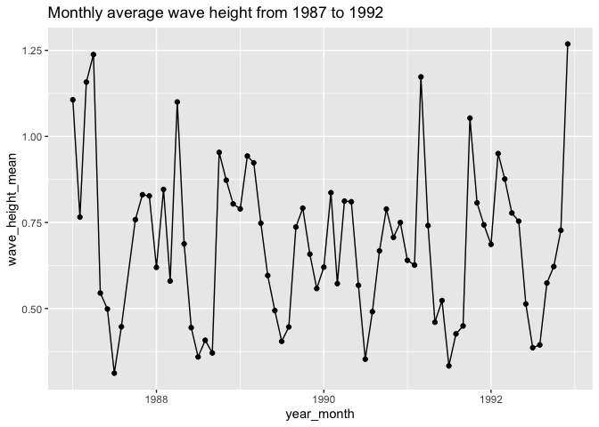
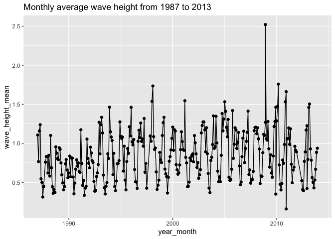

Assignment 7: Iteration (for loops) and functions
================

<br>

Instructions: Please read through this before you begin
-------------------------------------------------------

-   This homework is due by **10pm on Monday 11/09/20**.

-   Please **reproduce this markdown template**. Pay attention to all
    the formatting in this file, including bullet points, bolded
    characters, inserted code chunks, headings, text colors, blank
    lines, and etc.

-   When a verbal response is needed, answer by editing the part in the
    R markdown template where it says <span style="color:blue"> “Write
    your response here” </span>.

-   Have all of your code embedded within the R markdown file, and show
    both of your **code** and **plots** in the knitted markdown file.

-   Use R Markdown functionalities to **hide messages and warnings when
    needed**. (Suggestion: messages and warnings can often be
    informative and important, so please examine them carefully and only
    turn them off when you finish the exercise).

-   Please name your R markdown file `assignment_7.Rmd` and the knitted
    markdown file `assignment_7.md`. Please upload both files using your
    personal GitHub repository for this class.

**Acknowledgements:** Exercise 1 has been adapted (with permission) from
the [Data Carpentry for Biologists semester
course](https://datacarpentry.org/semester-biology/exercises/Functions-use-and-modify-Python/)
and exercises 2 and 3 are adapted (with permission) from Iain
Carmichael’s course [STOR 390: Introduction to Data
Science](https://idc9.github.io/stor390/#course_material).

<br>

To start, first load all the required packages with the following code.
Install them if they are not installed yet.

``` r
library(tidyverse)
```

<br>

Exercise 1: Body mass estimation using vectorization vs. for loop
-----------------------------------------------------------------

There are two major types of approaches to perform multiple operations
in R:
[vectorization](https://swcarpentry.github.io/r-novice-gapminder/09-vectorization/)
and for loops. As a simple example, to calculate the sum of two vectors,
`x` and `y`, the syntax for vectorization is simply `z <- x + y`. With
this, the computer will be able to perform the same operation to each
element of x and y vector **simultaneously**.

The for loop approach to achieve the same task (create a new vector z
that is the sum of vectors x and y), on the other hand, takes the
following form:

``` r
z[i] <- NULL
for (i in 1:length(x)){
  z[i] <- x[i] + y[i]
}
```

In this case, the computer loops through each element of x and y and
performs the operation **sequentially**, resulting in a significantly
longer runtime. Let’s now try to quantify this difference in runtime in
this exercise.

<br>

#### 1.1

The length of an organism is typically strongly correlated with its body
mass. This is useful because it allows us to estimate the mass of an
organism even if we only know its length. This relationship generally
takes the form: `mass = a * length ^ b`, where the parameters `a` and
`b` vary among groups. This allometric approach is regularly used to
estimate the mass of dinosaurs since we cannot weigh something that is
only preserved as bones.

*Spinosaurus* is a predator that is bigger, and therefore, by
definition, cooler, than that stupid *Tyrannosaurus* that everyone likes
so much. It has an estimated `a` of `0.73` and `b` of `3.63`. What is
the estimated mass of a *Spinosaurus* that is `16` m long based on its
reassembled skeleton?

    ## [1] 17150.56

<br>

#### 1.2

The following vectors contain the `length`s of 40 dinosaurs and their
respective `a` and `b` values. Estimate their `mass` first using a
vectorization approach and then using a for loop approach.

``` r
dinosaur_lengths <- c(17.8013631070471, 20.3764452071665, 14.0743486294308, 25.65782386974, 26.0952008049675, 20.3111541103134, 17.5663244372533, 11.2563431277577, 20.081903202614, 18.6071626441984, 18.0991894513166, 23.0659685685892, 20.5798853467837, 25.6179254233558, 24.3714331573996, 26.2847248252537, 25.4753783544473, 20.4642089867304, 16.0738256364701, 20.3494171706583, 19.854399305869, 17.7889814608919, 14.8016421998303, 19.6840911485379, 19.4685885050906, 24.4807784966691, 13.3359960054899, 21.5065994598917, 18.4640304608411, 19.5861532398676, 27.084751999756, 18.9609366301798, 22.4829168046521, 11.7325716149514, 18.3758846100456, 15.537504851634, 13.4848751773738, 7.68561192214935, 25.5963348603783, 16.588285389794)

a_values <- c(0.759, 0.751, 0.74, 0.746, 0.759, 0.751, 0.749, 0.751, 0.738, 0.768, 0.736, 0.749, 0.746, 0.744, 0.749, 0.751, 0.744, 0.754, 0.774, 0.751, 0.763, 0.749, 0.741, 0.754, 0.746, 0.755, 0.764, 0.758, 0.76, 0.748, 0.745, 0.756, 0.739, 0.733, 0.757, 0.747, 0.741, 0.752, 0.752, 0.748)

b_values <- c(3.627, 3.633, 3.626, 3.633, 3.627, 3.629, 3.632, 3.628, 3.633, 3.627, 3.621, 3.63, 3.631, 3.632, 3.628, 3.626, 3.639, 3.626, 3.635, 3.629, 3.642, 3.632, 3.633, 3.629, 3.62, 3.619, 3.638, 3.627, 3.621, 3.628, 3.628, 3.635, 3.624, 3.621, 3.621, 3.632, 3.627, 3.624, 3.634, 3.621)
```

<br>

-   with vectorization:

<!-- -->

    ##  [1]  26039.686  42825.603  10800.224  98273.049 104257.481  41822.386
    ##  [7]  24840.644   4899.022  39915.948  30937.922  26354.908  66384.865
    ## [13]  43837.944  97141.451  80553.856 105556.405  97374.660  42760.136
    ## [19]  18749.274  42109.012  40674.182  26003.425  13229.824  37472.789
    ## [25]  34684.033  80187.272   9460.977  51630.571  29253.772  36399.306
    ## [31] 117511.962  33384.288  58581.226   5462.316  28637.745  15864.172
    ## [37]   9284.810   1218.755  98522.609  19534.524

Hint: If you are unsure about how vectorized operations work, check out
the results that the following lines return.

``` r
c(1, 2, 3) + c(4, 5, 6)
c(1, 2, 3) * c(4, 5, 6)
```

<br>

-   with a for loop:

<!-- -->

    ##  [1]  26039.686  42825.603  10800.224  98273.049 104257.481  41822.386
    ##  [7]  24840.644   4899.022  39915.948  30937.922  26354.908  66384.865
    ## [13]  43837.944  97141.451  80553.856 105556.405  97374.660  42760.136
    ## [19]  18749.274  42109.012  40674.182  26003.425  13229.824  37472.789
    ## [25]  34684.033  80187.272   9460.977  51630.571  29253.772  36399.306
    ## [31] 117511.962  33384.288  58581.226   5462.316  28637.745  15864.172
    ## [37]   9284.810   1218.755  98522.609  19534.524

<br>

#### 1.3

The function `system.time()` can be used to record the runtime of an
operation. For example, `system.time(rnorm(100000))` can give you the
time to draw 100000 samples from a normal distribution. Here, use
`system.time()` to record the runtime of the vectorization approach and
the for loop approach in the previous question.

-   vectorization:

<!-- -->

    ##    user  system elapsed 
    ##       0       0       0

-   for loop:

<!-- -->

    ##    user  system elapsed 
    ##   0.003   0.000   0.003

<br>

Although the for loop in this exercise can be run very quickly, it is
noticeably slower than the vectorization approach. With more complicated
operations, vectorization can often shorten the runtime of a for loop
from days to minutes.

<br>

Exercise 2: Data inputting and wrangling in batch
-------------------------------------------------

Another instance where loops are useful is data input / output in batch.
We’ve learned how to make plots and output them in batch in class, so in
this exercise, you will use for loops to automate the inputting and
wrangling process of a group of datasets with similar names and formats
in the
<https://github.com/nt246/NTRES6940-data-science/tree/master/datasets/buoydata>.

#### 2.1 Given the following code chunk for reading buoy data files from buoy 44013 for each year, describe the following:

-   What parts of your code are consistent across every line/code chunk?
-   What parts are different?

``` r
buoy_1987 <- read_csv('https://raw.githubusercontent.com/nt246/NTRES6940-data-science/master/datasets/buoydata/44013_1987.csv', na = c("99", "999", "99.00", "999.0"))
buoy_1988 <- read_csv('https://raw.githubusercontent.com/nt246/NTRES6940-data-science/master/datasets/buoydata/44013_1988.csv', na = c("99", "999", "99.00", "999.0"))
buoy_1989 <- read_csv('https://raw.githubusercontent.com/nt246/NTRES6940-data-science/master/datasets/buoydata/44013_1989.csv', na = c("99", "999", "99.00", "999.0"))
buoy_1990 <- read_csv('https://raw.githubusercontent.com/nt246/NTRES6940-data-science/master/datasets/buoydata/44013_1990.csv', na = c("99", "999", "99.00", "999.0"))
```

Answer: <span style="color:blue"> Write your response here. </span>

<br>

#### 2.2 Complete the skeleton of the for loop below, which uses the `str_c()` function to print out the path to the buoy 44013 data file from year `start` to `end`

``` r
start <- 1987
end <- 1992
for (year in start:end){
  path <- str_c(__________________________________________________________________)
  print(path)
}
```

Here is how it should work with `start = 1987` and `end = 1992`:

    ## [1] "https://raw.githubusercontent.com/nt246/NTRES6940-data-science/master/datasets/buoydata/44013_1987.csv"
    ## [1] "https://raw.githubusercontent.com/nt246/NTRES6940-data-science/master/datasets/buoydata/44013_1988.csv"
    ## [1] "https://raw.githubusercontent.com/nt246/NTRES6940-data-science/master/datasets/buoydata/44013_1989.csv"
    ## [1] "https://raw.githubusercontent.com/nt246/NTRES6940-data-science/master/datasets/buoydata/44013_1990.csv"
    ## [1] "https://raw.githubusercontent.com/nt246/NTRES6940-data-science/master/datasets/buoydata/44013_1991.csv"
    ## [1] "https://raw.githubusercontent.com/nt246/NTRES6940-data-science/master/datasets/buoydata/44013_1992.csv"

<br>

#### 2.3 Complete the skeleton of the for loop below, which reads the buoy 44013 data file from year `start` to `end` and combine them together

``` r
start <- 1987
end <- 1992
for (year in start:end){
  path <- str_c(__________________________________________________________________)
  df <- read_csv(__________________________________________________________________)
  if (year == start){
    df_combined <- __
  } else {
    df_combined <- _________________
  }
}
dim(df_combined)
```

Here is the dimension of the combined data frame with `start = 1987` and
`end = 1992`:

    ## [1] 49775    16

<br>

#### 2.4 Building on the workflow that you used in 2.1 - 2.3, use a for loop to read in, clean up, and summarize the buoy data from all years from 1987 to 1992 using a dplyr workflow.

**Select** only the columns `YY` (year), `MM` (month), `WVHT` (wave
heights), `WTMP` (temperatures) and **rename** these columns to
something understandable. **Summarize** monthly averaged wave heights
and temperatures throughout the years in a tibble, and **plot the
variation of these monthly averaged values through time** as shown
below.

There are multiple ways to do this, and for this exercise, you may well
combine all the raw data in a for loop and clean it up after the loop.
In the next (**optional**) exercise, however, you will need to clean up
the data in the loop before you can combine them.

<!-- --><!-- -->

<br>

#### 2.5 (Optional) Now, further generalize your loop so that it works for any year **between 1987 and 2013**. **Here are a few things that you should pay attention to:**

-   The first three column have consistently contained information on
    year, month, and date (and in that order), but they have had
    different names throughout the years.

-   The first column (year) followed a two-digit format from 1987 to
    1998, but has (understantably) switched to a four-digit format
    since 1999.

-   Starting from 2007, a second row appears after the header to show
    the unit for each column, and it needs to be filtered out.

**Hints**:

-   use conditional execution to deal with the inconsistencies above

-   don’t worry about parsing failures in columns other than the ones
    that you will use for this excercise

-   there is a lot of missing temperature data during the mid 90s,
    resulting in a gap in the time series. The wave height data,
    however, appears to be continuous

<!-- --><!-- -->

<br>

Exercise 3: Writing a custom function
-------------------------------------

<br>

**3.1 Write a function that can convert Farenheit to Celsius**, based on
the following fomula: `C = (F - 32) * 5 / 9`

Take your function for a spin, does it return the correct values?

32 F = 0 C

50 F = 10 C

212 F = 100 C

<br>

**3.2** A student came from ‘tropical Canada’. She doesn’t like the cold
but she really didn’t like it when it’s hot. Although she wanted to know
what the temperature is in Celsius when the US weather channel reported
it in Farenheit, there are certain points at which it was just too cold
or too hot for her to care about the exact value. **Modify the f\_to\_c
function below to print the following**, and check if your function
works properly using the input of **-10 F, 60 F, and 90 F**.

-   If the temperature is less than -20 C, print “Don’t bother going
    out” instead of the temperature in Celcius

-   If the temperature is greater than 30 C, print “I’m moving back to
    Canada” instead of the temperature in Celcius

<br>
