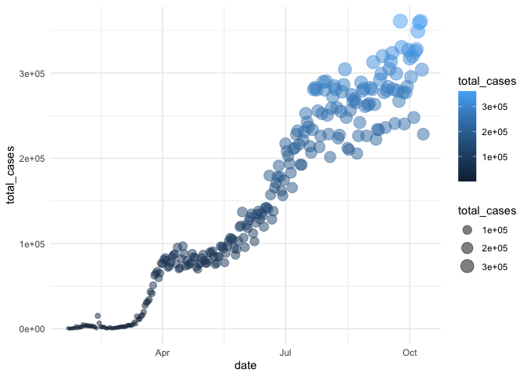

Untitled
================

<br>

## Exercises to work on as we’re going over today’s lecture

First, let’s load our packages and read in our Coronavirus dataset

``` r
suppressPackageStartupMessages(library(tidyverse))
suppressPackageStartupMessages(library(knitr))

coronavirus <- read_csv('https://raw.githubusercontent.com/RamiKrispin/coronavirus/master/csv/coronavirus.csv', col_types = cols(province = col_character()))


# Has it been updated? Check the latest date?
max(coronavirus$date)
```

    ## [1] "2020-10-11"

<br>

Summarize the total number of cases by type as of the most recent date
covered in the dataset.

<br>

Plot the history of the daily counts of new confirmed cases worldwide

Pick a theme that you like to style this plot

``` r
gg_base <- coronavirus %>%  
  filter(type == "confirmed") %>% 
  group_by(date) %>% 
  summarize(total_cases = sum(cases)) %>% 
  ggplot(mapping = aes(x = date, y = total_cases)) 
```

    ## `summarise()` ungrouping output (override with `.groups` argument)

``` r
gg_base + 
  geom_point(
    aes(size = total_cases,
        color = total_cases),
    alpha = 0.5
  ) +
  theme_minimal()  # replace `minimal` with the name of your theme of choice
```

<!-- -->

<br>

Generate a plot with a separate line showing the daily reports of new
confirmed cases in each country
