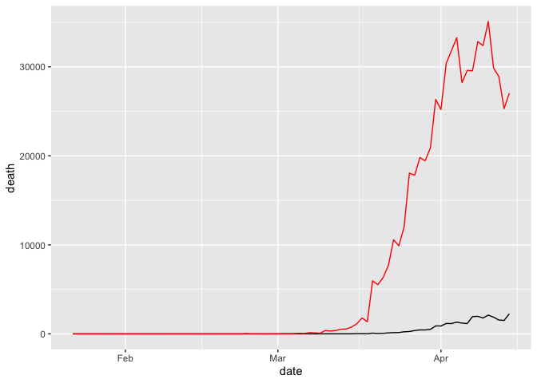

Untitled
================
Nina
4/15/2020

``` r
library(tidyverse)
```

    ## ── Attaching packages ─────────────────────────────────────────────────── tidyverse 1.3.0 ──

    ## ✓ ggplot2 3.2.1     ✓ purrr   0.3.3
    ## ✓ tibble  3.0.0     ✓ dplyr   0.8.5
    ## ✓ tidyr   1.0.2     ✓ stringr 1.4.0
    ## ✓ readr   1.3.1     ✓ forcats 0.4.0

    ## ── Conflicts ────────────────────────────────────────────────────── tidyverse_conflicts() ──
    ## x dplyr::filter() masks stats::filter()
    ## x dplyr::lag()    masks stats::lag()

``` r
female <- read_csv("https://raw.githubusercontent.com/jennybc/lotr-tidy/master/data/Female.csv")
```

    ## Parsed with column specification:
    ## cols(
    ##   Gender = col_character(),
    ##   Film = col_character(),
    ##   Elf = col_double(),
    ##   Hobbit = col_double(),
    ##   Man = col_double()
    ## )

``` r
male <- read.csv("https://raw.githubusercontent.com/jennybc/lotr-tidy/master/data/Male.csv")

lotr_tidy <- bind_rows(female, male) %>% 
  pivot_longer(c("Elf", "Hobbit", "Man"), names_to = "Race", values_to = "Words") %>% 
  select(Film, Gender, Race, Words)
```

    ## Warning in bind_rows_(x, .id): binding character and factor vector, coercing
    ## into character vector
    
    ## Warning in bind_rows_(x, .id): binding character and factor vector, coercing
    ## into character vector

``` r
write_csv(lotr_tidy, path = "lotr_tidy.csv")

female
```

    ## # A tibble: 3 x 5
    ##   Gender Film                         Elf Hobbit   Man
    ##   <chr>  <chr>                      <dbl>  <dbl> <dbl>
    ## 1 Female The Fellowship Of The Ring  1229     14     0
    ## 2 Female The Two Towers               331      0   401
    ## 3 Female The Return Of The King       183      2   268

``` r
# The total number of words spoken by each race across the entire trilogy

#Based on untidy data
races <- c("Elf", "Hobbit", "Man")
sum <- apply(female[,races], 2, FUN = function(x) sum(x)) + apply(male[,races], 2, FUN = function(x) sum(x))

#Based on tidy data
lotr_tidy %>% 
  group_by(Race) %>% 
  summarize(total_words <- sum(Words))
```

    ## # A tibble: 3 x 2
    ##   Race   `total_words <- sum(Words)`
    ##   <chr>                        <dbl>
    ## 1 Elf                           3737
    ## 2 Hobbit                        8796
    ## 3 Man                           8712

``` r
# or
lotr_tidy %>% 
  count(Race, wt = Words)
```

    ## # A tibble: 3 x 2
    ##   Race       n
    ##   <chr>  <dbl>
    ## 1 Elf     3737
    ## 2 Hobbit  8796
    ## 3 Man     8712

``` r
# Now summarize by film

sum <- apply(female[order(female$Film),races], 1, FUN = function(x) sum(x)) + apply(male[order(female$Film),races], 1, FUN = function(x) sum(x))


lotr_tidy %>% 
  count(Film, wt = Words)
```

    ## # A tibble: 3 x 2
    ##   Film                           n
    ##   <chr>                      <dbl>
    ## 1 The Fellowship Of The Ring  7853
    ## 2 The Return Of The King      6095
    ## 3 The Two Towers              7297

# Coronavirus example

``` r
coronavirus <- read_csv('https://raw.githubusercontent.com/RamiKrispin/coronavirus-csv/master/coronavirus_dataset.csv', col_types = cols(Province.State = col_character()))

corona_wide <- coronavirus %>% 
  pivot_wider(names_from = type, values_from = cases)

corona_wide %>% 
  filter(Country.Region == "US") %>% 
  ggplot() +
  geom_line(aes(x = date, y = death)) +
  geom_line(aes(x = date, y = confirmed), col = "red")
```

<!-- -->

Unite and separate

``` r
coronavirus_sepdate <- coronavirus %>% 
  separate(date, into = c("year", "month", "day"))

coronavirus_sepdate %>% 
  unite("month-day", month, day, sep = "-")
```

    ## # A tibble: 65,352 x 8
    ##    Province.State Country.Region   Lat  Long year  `month-day` cases type     
    ##    <chr>          <chr>          <dbl> <dbl> <chr> <chr>       <dbl> <chr>    
    ##  1 <NA>           Afghanistan       33    65 2020  01-22           0 confirmed
    ##  2 <NA>           Afghanistan       33    65 2020  01-23           0 confirmed
    ##  3 <NA>           Afghanistan       33    65 2020  01-24           0 confirmed
    ##  4 <NA>           Afghanistan       33    65 2020  01-25           0 confirmed
    ##  5 <NA>           Afghanistan       33    65 2020  01-26           0 confirmed
    ##  6 <NA>           Afghanistan       33    65 2020  01-27           0 confirmed
    ##  7 <NA>           Afghanistan       33    65 2020  01-28           0 confirmed
    ##  8 <NA>           Afghanistan       33    65 2020  01-29           0 confirmed
    ##  9 <NA>           Afghanistan       33    65 2020  01-30           0 confirmed
    ## 10 <NA>           Afghanistan       33    65 2020  01-31           0 confirmed
    ## # … with 65,342 more rows
