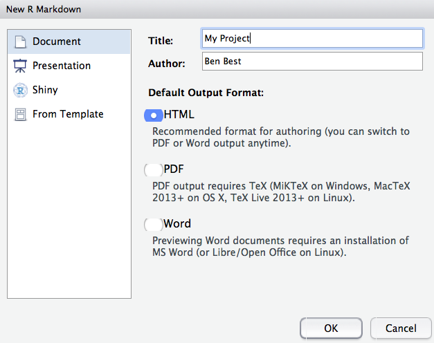
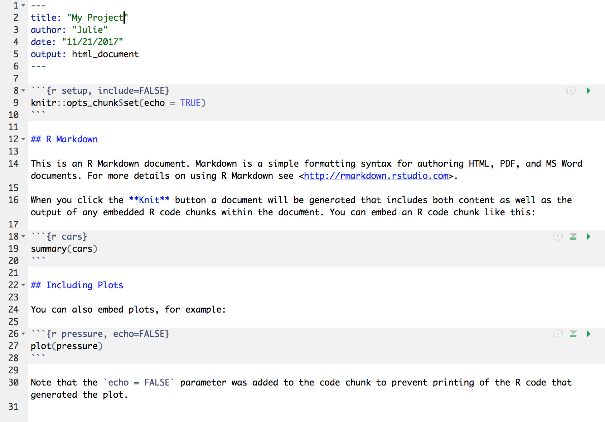

  
```{r setup, include=FALSE}
knitr::opts_chunk$set(echo = TRUE)
```
<br>

## Readings  


### RMarkdown

**Required**:  
- [Chapter 27 in Grolemund and Wickham's R for Data Science](https://r4ds.had.co.nz/r-markdown.html)  
- Have a look at the [RMarkdown website](https://rmarkdown.rstudio.com/lesson-1.html) including [this video](https://rmarkdown.rstudio.com/authoring_quick_tour.html)

**Additional resources**:  
- [RStudio's R markdown cheatsheet](http://www.rstudio.com/wp-content/uploads/2016/03/rmarkdown-cheatsheet-2.0.pdf)  
- The [Rmd website](https://rmarkdown.rstudio.com/) has a fantastic walk-through [tutorial](https://rmarkdown.rstudio.com/lesson-1.html) that gives a great overview of R Markdown  
- Yihui's [Rmd book](https://bookdown.org/yihui/rmarkdown/) for lots more on R Markdown.


<br>  

### GitHub

**Required**:  
- [Chapter 1 in Jenny Bryan's Happy Git with R](https://happygitwithr.com/big-picture.html)


**Additional resources**:  
- [Excuse me, do you have a moment to talk about version control?](https://peerj.com/preprints/3159/) by Jenny Bryan  
- [GitHub for Project Management](https://openscapes.github.io/series/github-issues.html) by Openscapes


<br>  

## Class announcements 

* Course communication will primarily be through Slack. Please make sure to join our workspace to not miss announcements about scheduling changes etc.
* Course website and readings - links posted on the [syllabus schedule](https://github.com/nt246/NTRES6940-data-science)
* [Problem set 1](https://github.com/nt246/NTRES6940-data-science/blob/master/assignments/assignment_1.md) is due next Wednesday March 11
* Remember office hours / hacky hour Friday 3-5 in Bradfield 105 **(NOTE: New location)**
* Sticky notes - get a set of green and red

<br>

## Learning objectives for today's class

By the end of today’s class, students are expected to be able to:

* Write documents in RMarkdown, and render these documents to html with RStudio.
* Understand the basic formatting used to combine text, code, tables and plots in RMarkdown documents
* Style an Rmd document by editing the YAML header
* Demonstrate at least two Rmd code chunk options
* Configure git to integrate with RStudio

<br>

**Acknowledgements**: Today's lecture is adapted (with permission) from the excellent [R for Excel users](https://rstudio-conf-2020.github.io/r-for-excel/) course by Julia Stewart Lowndes and Allison Horst.

<br>

## Introduction to RMarkdown

An RMarkdown file is a plain text file that allow us to write code and text together, and when it is "knit", the code will be evaluated and the text formatted so that it creates a reproducible report or document that is nice to read as a human.

This is really critical to reproducibility, and it also saves time. This document will recreate your figures for you in the same document where you are writing text. So no more doing analysis, saving a plot, pasting that plot into Word, redoing the analysis, re-saving, re-pasting, etc. 

This 1-minute video provides a great introduction to RMarkdown: [What is RMarkdown?](https://vimeo.com/178485416)

Now let's explore the RMarkdown format a bit ourselves to get started. 

### Create an RMarkdown file

It's super easy to get started with RMarkdown within RStudio. Let's do this together:

File -> New File -> RMarkdown... (or alternatively you can click the green plus in the top left -> RMarkdown). 

Let's title it "Testing" and write our name as author, then click OK with the recommended Default Output Format, which is HTML.

```{r, echo=FALSE, out.width="80%"}
  
```

OK, first off: by opening a file, we are seeing the 4th pane of the RStudio console, which here is a text editor. This lets us dock and organize our files within RStudio instead of having a bunch of different windows open (but there are options to pop them out if that is what you prefer).

Let's have a look at this file — it's not blank; there is some initial text is already provided for you. Let's have a high-level look through of it: 

- The top part has the Title and Author we provided, as well as today's date and the output type as an HTML document like we selected above.
- There are white and grey sections. These are the 2 main languages that make up an RMarkdown file. 
  - **Grey sections are R code**
  - **White sections are Markdown text**
- There is black and blue text (we'll ignore the green text for now).  
  
```{r, echo=FALSE, out.width="80%"}
  
```

### Knit your RMarkdown file

Let's go ahead and "Knit" by clicking the blue yarn at the top of the RMarkdown file. 
It's going to ask us to save first, I'll name mine "testing.Rmd". Note that this is by default going to save this file in your home directory `/~`. Since this is a testing document this is fine to save here; we will get more organized about where we save files very soon. Once you click Save, the knit process will be able to continue.

OK so how cool is this, we've just made an html file! This is a single webpage that we are viewing locally on our own computers. Knitting this RMarkdown document has rendered — we also say formatted — both the Markdown text (white) and the R code (grey), and the it also executed — we also say ran — the R code.  

Let's have a look at them side-by-side: 

<br>

```{r, echo=FALSE, out.width="80%"}
knitr::include_graphics("../img/rmarkdown_side_by_side.png")  
```

Let's take a deeper look at these two files. So much of learning to code is looking for patterns.

#### Activity

Introduce yourself to the person sitting next to you. Discuss what you notice with these two files. Then we will have a brief share-out with the group. (5 mins)


### Markdown text

Let's look more deeply at the Markdown text. Markdown is a formatting language for plain text, and there are only a handful of rules to know. 

#### Text formatting

Notice the syntax for:

- **headers** with `#`, `##`, ..., `#######`
- **bold** with `**text**`
- *italic* with `*text*`
- `verbatim code` with `` `text` ``
- <span style="color: red;">change text color with</span>`<span style="color: red;">text</span>`
- [link a url to your text with](https://i.pinimg.com/originals/e8/a5/cd/e8a5cd9c5dbccfabcdeea5c4a16e5e10.png) `[text](url)`
- insert a blank line with `<br>`

To see more of the rules, let's look at RStudio's built-in reference. Let's do this: Help > Markdown Quick Reference

Another good resource is the cheatsheet from RStudio, let's download it from [here](https://rstudio.com/resources/cheatsheets/) (scroll down to find it)

There are also other good markdown [cheatsheets](https://github.com/adam-p/markdown-here/wiki/Markdown-Here-Cheatsheet) available online.


### Activity
Make the following changes to your RMarkdown document:
* Add some italic text
* Make a numbered list
* Add some subheaders

You can find hints in the Markdown Quick Reference (in the menu bar: Help > Markdown Quick Reference). 

Reknit your html file to see how your formatting works out.

If you have more time, try adding a URL and a table


#### Figures and tables

To show a figure from a url use ``
To show a figure from a local file ``


To manually create a table, use the following syntax. Notice the text alignment in each column. 

```
| Right | Left | Default | Center |
|------:|:-----|---------|:------:|
| 12 | 12 | 12 | 12 |
| 123 | 123 | 123 | 123 |
| 1 | 1 | 1 | 1 | 
```

### R code

Let's look at the R code that we see executed in our knitted document. 

We see that:

- `summary(cars)` produces a table with information about cars
- `plot(pressure)` produces a plot with information about pressure

There are a couple of things going on here. 

`summary()` and `plot()` are called **functions**; they are operations and these ones come installed with R. We call functions installed with R **base R functions**. This is similar to Excel's functions and formulas. 

`cars` and `pressure` are small datasets that come installed with R. 


### Code chunks

R code is written in code chunks, which are grey. There are two things to look at: R code chunks and code chunk options.

Each of them start with 3 backticks and `{r label}` that signify there will be R code following. Anything inside the brackets (`{ }`) is instructions for RMarkdown about that code to run. For example:

- the first chunk labeled "setup" says `include=FALSE`, and we don't see it included in the HTML document. 
- the second chunk labeled "cars" has no additional instructions, and in the HTML document we see the code and the evaluation of that code (a summary table)
- the third chunk labeled "pressure" says `echo=FALSE`, and in the HTML document we do not see the code echoed, we only see the plot when the code is executed.

Chunk output can be customised with __options__, arguments supplied to chunk header. Knitr provides almost 60 options that you can use to customize your code chunks. Here we'll cover the most important chunk options that you'll use frequently. You can see the full list at <http://yihui.name/knitr/options/>. 

The most important set of options controls if your code block is executed and what results are inserted in the finished report:
  
*   `eval = FALSE` prevents code from being evaluated. (And obviously if the
    code is not run, no results will be generated). This is useful for 
    displaying example code, or for disabling a large block of code without 
    commenting each line.

*   `include = FALSE` runs the code, but doesn't show the code or results 
    in the final document. Use this for setup code that you don't want
    cluttering your report.

*   `echo = FALSE` prevents code, but not the results from appearing in the 
    finished file. Use this when writing reports aimed at people who don't
    want to see the underlying R code.
    
*   `message = FALSE` or `warning = FALSE` prevents messages or warnings 
    from appearing in the finished file.

*   `results = 'hide'` hides printed output; `fig.show = 'hide'` hides
    plots.

*   `error = TRUE` causes the render to continue even if code returns an error.
    This is rarely something you'll want to include in the final version
    of your report, but can be very useful if you need to debug exactly
    what is going on inside your `.Rmd`. It's also useful if you're teaching R
    and want to deliberately include an error. The default, `error = FALSE` causes 
    knitting to fail if there is a single error in the document.
    
The following table summarises which types of output each option supressess:

Option             | Run code | Show code | Output | Plots | Messages | Warnings 
-------------------|----------|-----------|--------|-------|----------|---------
`eval = FALSE`     | -        |           | -      | -     | -        | -
`include = FALSE`  |          | -         | -      | -     | -        | -
`echo = FALSE`     |          | -         |        |       |          |
`results = "hide"` |          |           | -      |       |          | 
`fig.show = "hide"`|          |           |        | -     |          |
`message = FALSE`  |          |           |        |       | -        |
`warning = FALSE`  |          |           |        |       |          | -


> **Aside: Code chunk labels** It is possible to label your code chunks. This is to help us navigate between them and keep them organized. In our example Rmd, our  three chunks say `r` as the language, and have a label (`setup`, `cars`, `pressure`).   
> Labels are optional, but will become powerful as you become a powerful R user. But if you label your code chunks, you must have unique labels. So while a third option for creating a new code chunk is to copy-paste-edit an existing one, you'll have to remember to relabel it something unique. We will explore this more in a moment.
Notice how the word `FALSE` is all capitals. Capitalization matters in R; `TRUE/FALSE` is something that R can interpret as a binary yes/no or 1/0. 

There are many more options available that we will discuss as we get more familiar with RMarkdown.

#### New code chunks

We can create a new chunk in your RMarkdown first in one of these ways: 

- The keyboard shortcut Cmd/Ctrl + Alt + I
- click "Insert > R" at the top of the editor pane (with the green plus and green box)
- type it by hand: 
   \```{r}
   \```

> **Aside**: doesn't have to be only R, other languages supported. 
Let's create a new code chunk at the end of our document.

Now, let's write some code in R. Let's say we want to see the summary of the `pressure` data. I'm going to press enter to to add some extra carriage returns because sometimes I find it more pleasant to look at my code, and it helps in troubleshooting, which is often about identifying typos. R lets you use as much whitespace as you would like.

```{r, eval=FALSE}
summary(pressure)
```

We can knit this and see the summary of `pressure`. This is the same data that we see with the plot just above. 

> Troubleshooting: Did trying to knit your document produce an error? Start by looking at your code again. Do you have both open `(` and close `)` parentheses? Are your code chunk fences (```) correct?


## R code in the Console
So far we have been telling R to execute our code only when we knit the document, but we can also write code in the Console to interact with the live R process.
The Console (bottom left pane of the RStudio IDE) is where you can interact with the R engine and run code directly. 
Let's type this in the Console: `summary(pressure)` and hit enter. We see the pressure summary table returned; it is the same information that we saw in our knitted html document. By default, R will display (we also say "print") the executed result in the Console 
```{r, eval=FALSE}
summary(pressure)
```
We can also do math as we can in Excel: type the following and press enter.
```{r, eval=FALSE}
8*22.3
```
### Error messages

When you code in R or any language, you will encounter errors. We will discuss troubleshooting tips more deeply later on in the course; here we will just get a little comfortable with them. 

#### R error messages

**Error messages are your friends**. 

What do they look like? I'll demo typing in the Console `summary(pressur)`

``` r
summary(pressur)
#> Error in summary(pressur): object 'pressur' not found
```

Error messages are R's way of saying that it didn't understand what you said. This is like in English when we say "What?" or "Pardon?" And like in spoken language, some error messages are more helpful than others. Like if someone says "Sorry, could you repeat that last word" rather than only "What?"

In this case, R is saying "I didn't understand `pressur`". R tracks the datasets it has available as objects, as well as any additional objects that you make. `pressur` is not among them, so it says that it is not found. 

The first step of becoming a proficient R user is to move past the exasperation of "it's not working!" and **read the error message**. Errors will be less frustrating with the mindset that **most likely the problem is your typo or misuse**, and not that R is broken or hates you. Read the error message to learn what is wrong. 

#### RMarkdown error messages

Errors can also occur in RMarkdown. I said a moment ago that you label your code chunks, they need to be unique. Let's see what happens if not. If I (re)name our `summary(pressure)` chunk to "pressure", I will see an error when you try to knit: 

```
processing file: testing.Rmd
Error in parse_block(g[-1], g[1], params.src) : duplicate label 'cars'
Calls: <Anonymous> ... process_file -> split_file -> lapply -> FUN -> parse_block
Execution halted
```

There are two things to focus on here. 

First: This error message starts out in a pretty cryptic way: I don't expect you to know what `parse_block(g[-1]...` means. But, expecting that the error message is really trying to help me, I continue scanning the message which allows me to identify the problem: `duplicate label 'cars'`. 

Second: This error is in the "R Markdown" tab on the bottom left of the RStudio IDE; it is not in the Console. That is because when RMarkdown is knitted, it actually spins up an R workspace separately from what is passed to the Console; this is one of the ways that R Markdown enables reproducibility because it is a self-contained instance of R. 

You can click back and forth between the Console and the R Markdown tab; this is something to look out for as we continue. We will work in the Console and R Markdown and will discuss strategies for where and how to work as we go. Let's click back to Console now. 

### Running RMarkdown code chunks 

So far we have written code in our RMarkdown file that is executed when we knit the file. We have also written code directly in the Console that is executed when we press enter/return. Additionally, we can write code in an RMarkdown code chunk and execute it by sending it into the Console (i.e. we can execute code without knitting the document). 

How do we do it? There are several ways. Let's do each of these with `summary(pressure)`.

**First approach: send R code to the Console.**
This approach involves selecting (highlighting) the R code only (`summary(pressure)`), not any of the backticks/fences from the code chunk. (If you see `Error: attempt to use zero-length variable name` it is because you have accidentally highlighted the backticks along with the R code. Try again (and don't forget that you can add spaces within the code chunk or make your RStudio session bigger (View > Zoom In)). 

Do this by selecting code and then: 

1. copy-pasting into the Console and press enter/return.
1. clicking 'Run' from RStudio IDE. This is available from: 
    a. the bar above the file (green arrow)
    b. the menu bar: Code > Run Selected Line(s)
    c. keyboard shortcut: command-return

**Second approach: run full code chunk.**
Since we are already grouping relevant code together in chunks, it's reasonable that we might want to run it all together at once. 

Do this by placing your curser within a code chunk and then: 

1. clicking the little black down arrow next to the Run green arrow and selecting Run Current Chunk. Notice there are also options to run all chunks, run all chunks above or below...

### Writing code in a file vs. Console

<!---TODO more --->

When should you write code in a file (.Rmd or .R script) and when should you write it in the Console? 

We write things in the file that are necessary for our analysis and that we want to preserve for reproducibility; we will be doing this throughout the workshop to give you a good sense of this. A file is also a great way for you to take notes to yourself. 

The Console is good for doing quick calculations like `8*22.3`, testing functions, for calling help pages, for installing packages. 


### Activity
Practice what you’ve learned by creating a brief CV. The title should be your name, and you should include headings for (at least) education or employment. Each of the sections should include a bulleted list of jobs/degrees. Highlight the year in bold and add a footnote.

Render to html format, and if you're comfortable, share with the class by posting it to the general channel in Slack.


### Other output formats

You can knit an RMarkdown file to other output formats, including pdf, word document, GitHub flavored markdown, and many others. We will mostly use GitHub flavored markdown throughout the rest of this class because GitHub can render it nicely on its website. To knit an RMarkdown filt to this format, you can do one of the followings. 

* When creating your RMarkdown file, click "From template", and then select "GitHub Document (Markdown)"


* At the top of an RMarkdown file, change the output of the GitHub document using the following syntax

```
---
title: "Title"
output: 
  github_document: 
    toc: true
---
```

Note: `toc: true` is optional, but it can automatically set up a table of content for you. 


<br>
<br>

## GitHub brief intro & config

Before we wrap up for today, we are going to set up Git and GitHub which we will be using along with R and RStudio for the rest of the course. 

Before we do the setup configuration, let us take a moment to talk about what Git and GitHub are. 

It can help to think of GitHub like Dropbox: you identify folders for GitHub to 'track' and it syncs them to the cloud. This is good first-and-foremost because it makes a back-up copy of your files: if your computer dies not all of your work is gone. But with GitHub, you have to be more deliberate about when syncs are made. This is because GitHub saves these as different versions, with information about who contributed when, line-by-line. This makes collaboration easier, and it allows you to roll-back to different versions or contribute to others' work.

git will track and version your files, GitHub stores this online and enables you to collaborate with others (and yourself). Although git and GitHub are two different things, distinct from each other, we can think of them as a bundle since we will always use them together. 


### Configure GitHub

This set up is a one-time thing! You will only have to do this once per computer. We'll walk through this together. In a browser, go to github.com and to your profile page as a reminder.   

**You will need to remember your GitHub username, the email address you created your GitHub account with, and your GitHub password.** 

#### Installing packages

We will be using the `use_git_config()` function from the `usethis` package. We first need to install this package. Type the following in a new script:

```{r install-usethis, eval=FALSE}
## setup packages
install.packages("usethis")
```

Once you have run it, "comment it out" by adding a hash tag (#) at the beginning of the line. It is generally considered good practice to not include active install.packages() prompts in a script so that someone else running your script on their system won't automatically install packages unknowingly. 

Now we've installed the package, but we need to tell R that we are going to use the functions within the `usethis` package. We do this by using the function `library()`.

In my mind, this is analogous to needing to wire your house for electricity: this is something you do once; this is `install.packages`. But then you need to turn on the lights each time you need them (R Session).

It's a nice convention to do this on the same line as your commented-out `install.packages()` line; this makes it easier for someone (including you in a future time or computer) to install the package easily. 

```{r install-usethis3}
## setup packages
library(usethis) # install.packages("usethis")
```

When `usethis` is successfully attached, you won't get any feedback in the Console. So unless you get an error, this worked for you.


#### Setting up git on your system

Then type the following into your Console: 

```{r usethis, eval=FALSE}
## use_git_config function with my username and email as arguments
use_git_config(user.name = "jules32", user.email = "jules32@example.org")
```

If you see `Error in use_git_config() : could not find function "use_git_config"` please run `library("usethis")`

### Ensure that Git/GitHub/RStudio are communicating

We are going to go through a few steps to ensure the Git/GitHub are communicating with RStudio

#### RStudio: New Project

Click on New Project. There are a few different ways; you could also go to File > New Project..., or click the little green + with the R box in the top left.
also in the File menu).

<br>

```{r, echo=FALSE, out.width="80%"}
knitr::include_graphics("../img/new_project_1.png")  
```


<br>


#### Select Version Control

<br>

```{r, echo=FALSE, out.width="80%"}
knitr::include_graphics("../img/new_project_2.png")  
```

<br>

#### Select Git

Since we are using git. 

<br>

```{r, echo=FALSE, out.width="80%"}
knitr::include_graphics("../img/new_project_3.png")  
```


<br>

Do you see what I see? 

<br>

```{r, echo=FALSE, out.width="80%"}
knitr::include_graphics("../img/new_project_4.png")  
```

<br>

If yes, hooray! Time to wrap up for today! You're now ready for exploring integrated GitHub/RStudio workflows next week.

If no, we will help you troubleshoot.

1. Double check that GitHub username and email are correct
1. Troubleshooting, starting with [HappyGitWithR's troubleshooting chapter](http://happygitwithr.com/troubleshooting.html)
  - `which git` (Mac, Linux, or anything running a bash shell)
  - `where git` (Windows, when not in a bash shell)
1. Potentially set up a RStudio Cloud account: <https://rstudio.cloud/>

<!--- [Allison 206/244 googledoc](https://docs.google.com/document/d/1zx2upJJqFZe94O3BQSMI56Z76s3haLXC0otKSpcZaJQ/edit)
--->

### Troubleshooting

#### Configure git from Terminal

If `usethis` fails, the following is the classic approach to configuring **git**.  Open the Git Bash program (Windows) or the Terminal (Mac) and type the following:

        # display your version of git
        git --version
        
        # replace USER with your Github user account
        git config --global user.name USER
        
        # replace NAME@EMAIL.EDU with the email you used to register with Github
        git config --global user.email NAME@EMAIL.EDU
        
        # list your config to confirm user.* variables set
        git config --list

This will configure git with global (`--global`) commands, which means it will apply 'globally' to all your future github repositories, rather than only to this one now. **Note for PCs**: We've seen PC failures correct themselves by doing the above but omitting `--global`. (Then you will need to configure GitHub for every repo you clone but that is fine for now).

#### Troubleshooting

All troubleshooting starts with reading Happy Git With R's [RStudio, Git, GitHub Hell](http://happygitwithr.com/troubleshooting.html) troubleshooting chapter. 

##### New(ish) Error on a Mac
We've also seen the following errors from RStudio: 

```
error key does not contain a section --global terminal
```
and
```
fatal: not in a git directory
```

To solve this, go to the Terminal and type:
    ```
which git
```


  
Look at the filepath that is returned. Does it say anything to do with Apple?

-> If yes, then the [Git you downloaded](https://git-scm.com/downloads) isn't installed, please redownload if necessary, and follow instructions to install.  

-> If no, (in the example image, the filepath does not say anything with Apple) then proceed below:

In RStudio, navigate to: Tools > Global Options > Git/SVN. 


<br>

Does the **“Git executable”** filepath match what the url in Terminal says? 

<br>


If not, click the browse button and navigate there.   

>*Note*: on my laptop, even though I navigated to /usr/local/bin/git, it then automatically redirect because /usr/local/bin/git was an alias on my computer. That is fine. Click OK.

<br>


### Say hello to your course repo on GitHub
We have created a GitHub Classroom organization for the class. To access you personal course repo through which you will be submitting your assignments and communicating with us, click [here](https://classroom.github.com/a/SA7QIA7g)


### END **RMarkdown/GitHub** session!


