Lesson 7: ggplot part 2
================

## Readings

**Required**:

  - Review Chapter 3.1-3.6 and read Chapter 3.7-3.10 in [Grolemund and
    Wickham’s R for Data
    Science](https://r4ds.had.co.nz/data-visualisation.html#statistical-transformations)

  - Skim the [The tidyverse style guide](https://style.tidyverse.org/)
    for inspiration - **you don’t have to read the whole guide
    carefully**

<br>

**Additional resources**:

  - [RStudio’s ggplot2 cheat
    sheet](https://github.com/rstudio/cheatsheets/blob/master/data-visualization-2.1.pdf)

  - [“Why I use ggplot2” - David Robinson Blog
    Post](http://varianceexplained.org/r/why-I-use-ggplot2/)

<br>

## Announcements

  - Thanks for the feedback on the online course format\!
  - Please post in the Slack `lecture-chat channel` if there are any
    exercises or part of the lecture you would like to go over again on
    the live Zoom call
  - Homework 3 due this Wednesday
  - Hacky hour Fridays 3-5pm

<br>

## Today’s learning objectives

The goal for today’s class is to return to `ggplot` to get more practice
with using this package for data visualization, cover a few additional
aspects of its functionality, and integrate the `dplyr` data wrangling
skills we learned last week to further customize our plots.

By the end of this class, you should be able to:

  - Use different geometric objects and aesthetics to explore various
    plot types in `ggplot`
  - Chain together steps for data wrangling (`dplyr`) and plotting
    `ggplot`

Good coding practices were also listed for this class, but we’ll cover
that on Wednesday instead.

<br>

**Acknowledgements**: Today’s lecture borrows from several excellent
resources including the [R for Excel
users](https://rstudio-conf-2020.github.io/r-for-excel/) course by Julia
Stewart Lowndes and Allison Horst and Chapter 3 of [Grolemund and
Wickham’s R for Data
Science](https://r4ds.had.co.nz/data-visualisation.html#statistical-transformations).

<br>

## Recap on the Grammar of Graphics implemented in `ggplot`

This overview is borrowed from the [STAT545 course at
UBC](https://stat545guidebook.netlify.com/intro-to-plotting-with-ggplot2-part-i.html)


You can think of the grammar of graphics as a systematic approach for
describing the components of a graph. It has seven components (the ones
in **bold** are required to be specifed explicitly in ggplot2):

  - **Data**
      - Exactly as it sounds: the data that you’re feeding into a plot.
  - **Aesthetic mappings**
      - This is a specification of how you will connect variables
        (columns) from your data to a visual dimension. These visual
        dimensions are called “aesthetics”, and can be (for example)
        horizontal positioning, vertical positioning, size, colour,
        shape, etc.
  - **Geometric objects**
      - This is a specification of what object will actually be drawn on
        the plot. This could be a point, a line, a bar, etc.
  - Scales
      - This is a specification of how a variable is mapped to its
        aesthetic. Will it be mapped linearly? On a log scale? Something
        else?
  - Statistical transformations
      - This is a specification of whether and how the data are
        combined/transformed before being plotted. For example, in a bar
        chart, data are transformed into their frequencies; in a
        box-plot, data are transformed to a five-number summary.
  - Coordinate system
      - This is a specification of how the position aesthetics (x and y)
        are depicted on the plot. For example, rectangular/cartesian, or
        polar coordinates.
  - Facet
      - This is a specification of data variables that partition the
        data into smaller “sub plots”, or panels.

These components are like parameters of statistical graphics, defining
the “space” of statistical graphics. In theory, there is a one-to-one
mapping between a plot and its grammar components, making this a useful
way to specify graphics.

<br>

# Getting started

We’ll return to exploring the Coronavirus dataset. I’ll try to focus on
typical beginner’s errors along the way so we can get used to
trouble-shooting together.

Before we start, please open the R Project associated with your personal
class GitHub repository. Then create a new RMarkdown file, select
github\_document output format, and save it to your lecture note folder.
You will use this RMarkdown file to take notes and work on exercises,
and maybe share your work with the class.

First, let’s load our packages and read in our Coronavirus dataset

``` r
suppressPackageStartupMessages(library(tidyverse))
suppressPackageStartupMessages(library(knitr))

coronavirus <- read_csv('https://raw.githubusercontent.com/RamiKrispin/coronavirus-csv/master/coronavirus_dataset.csv', col_types = cols(Province.State = col_character()))

# Has it been updated? Check the latest date?
max(coronavirus$date)
```

    ## [1] "2020-04-12"

## Combining `dplyr` and `ggplot`

Let’s start with summarizing the total number of cases by type as of
2020-04-12

``` r
total_cases <- coronavirus %>% 
  group_by(type) %>%
  summarize(cases = sum(cases))
kable(total_cases)  # Kable just provides a nice output for the table
```

| type      |   cases |
| :-------- | ------: |
| confirmed | 1846679 |
| death     |  114091 |
| recovered |  421722 |

Now, let’s plot the history of the daily counts of new confirmed cases
worldwide

``` r
# We first have to summarize the data, then plot those summary statistics
# Note that we can pipe dplyr output directly into ggplot
coronavirus %>%  
  filter(type == "confirmed") %>% 
  group_by(date) %>% 
  summarize(total_cases = sum(cases)) %>% 
  ggplot(mapping = aes(x = date, y = total_cases)) +
  geom_line()
```

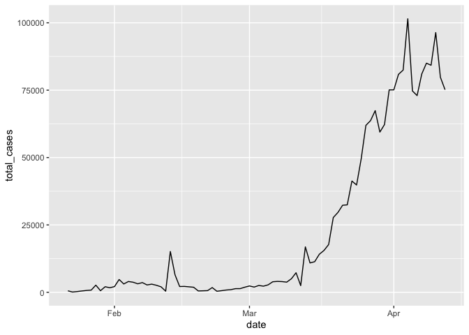<!-- -->

If we want to play around with different geoms, we can store `dplyr`
data processing steps and initiation of the `ggplot` as object `gg_base`
so that we don’t need to retype it each time

``` r
gg_base <- coronavirus %>%  
  filter(type == "confirmed") %>% 
  group_by(date) %>% 
  summarize(total_cases = sum(cases)) %>% 
  ggplot(mapping = aes(x = date, y = total_cases)) 
```

Then when we want to draw the plot, we can just call that object and
specify the geom

``` r
gg_base +
  geom_line()
```

<!-- -->
Try these

``` r
gg_base +
  geom_point()
```

<!-- -->

``` r
gg_base +
  geom_col(color="black")
```

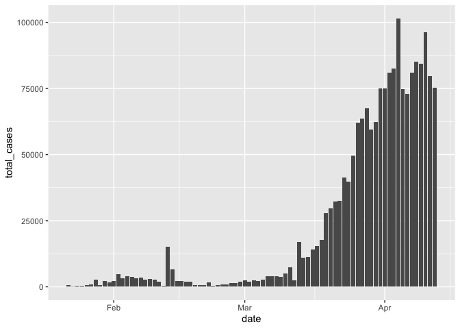<!-- -->

``` r
gg_base +
  geom_area()
```

<!-- -->
<br>

## Customizing plots

First, a quick reminder on how we can customize some aesthetics
(e.g. colors, styles, axis labels, etc.) of our graphs based on
non-variable values.

> We can change the aesthetics of elements in a ggplot graph by adding
> arguments within the layer where that element is created. Some common
> arguments we’ll use first are:

  - `color =`: update point or line colors
  - `fill =`: update fill color for objects with areas
  - `linetype =`: update the line type (dashed, long dash, etc.)
  - `pch =`: update the point style
  - `size =`: update the element size (e.g. of points or line thickness)
  - `alpha =`: update element opacity (1 = opaque, 0 = transparent)

Building on our first line graph, let’s update the line color to
“purple” and make the line type “dashed”:

``` r
gg_base +
  geom_line(
    color = "purple",
    linetype = "dashed"
  )
```

<!-- -->

How do we know which color names ggplot will recognize? If you google “R
colors ggplot2” you’ll find a lot of good resources. Here’s one: [SAPE
ggplot2 colors quick reference
guide](http://sape.inf.usi.ch/quick-reference/ggplot2/colour)

Now let’s update the point, style and size of points on our previous
scatterplot graph using `color =`, `size =`, and `pch =` (see `?pch` for
the different point styles, which can be further customized).

``` r
gg_base + 
  geom_point(color = "purple",
             pch = 17,
             size = 4,
             alpha = 0.5)
```

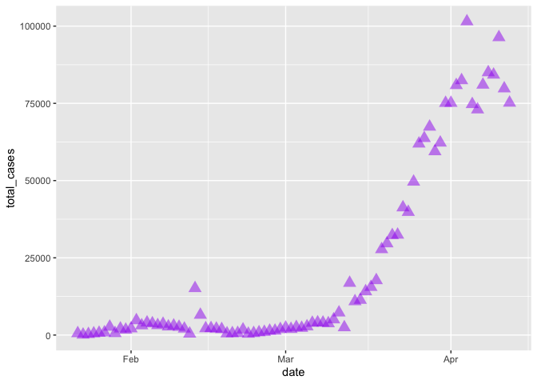<!-- -->

<br>

## Mapping variables onto aesthetics

In the examples above, we have customized aesthetics based on constants
that we input as arguments (e.g., the color / style / size isn’t
changing based on a variable characteristic or value). Often, however,
we **do** want the aesthetics of a graph to depend on a variable. To do
that, we’ll **map variables onto graph aesthetics**, meaning we’ll
change how an element on the graph looks based on a variable
characteristic (usually, character or value).

> When we want to customize a graph element based on a variable’s
> characteristic or value, add the argument within `aes()` in the
> appropriate `geom_*()` layer. In short, if updating aesthetics based
> on a variable, make sure to put that argument inside of `aes()`.

**Example:** Create a ggplot scatterplot graph where the **size** and
**color** of the points change based on the **number of cases**, and
make all points the same level of opacity (`alpha = 0.5`). Notice the
`aes()` around the `size =` and `color =` arguments.

Note: this is just for illustration of the functionality only - we are
showing the same information in redundant ways, which is typically not
helpful or necessary. Avoid excessive / overcomplicated aesthetic
mapping in data visualization.

``` r
gg_base + 
  geom_point(
    aes(size = total_cases,
        color = total_cases),
    alpha = 0.5
  )
```

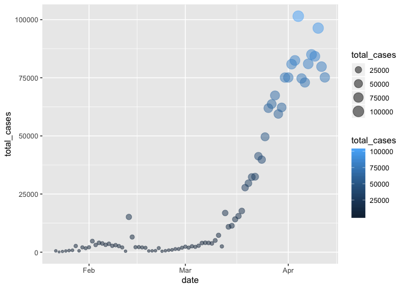<!-- -->

In the example above, notice that the two arguments that **do** depend
on variables are within `aes()`, but since `alpha = 0.5` doesn’t depend
on a variable then it is *outside the `aes()` but still within the
`geom_point()` layer*.

When we map variables to aesthetics, `ggplot2` will automatically assign
a unique level of the aesthetic (here a unique color) to each unique
value of the variable, a process known as scaling. `ggplot2` will also
add a legend that explains which levels correspond to which values.

## Your turn

Copy and run this code. Why is the line not blue?

``` r
coronavirus %>%  
  filter(type == "confirmed") %>% 
  group_by(date) %>% 
  summarize(total_cases = sum(cases)) %>% 
  ggplot(mapping = aes(x = date, y = total_cases, color = "blue")) +
  geom_line()
```

<!-- -->

<br>

## ggplot2 complete themes

While every element of a ggplot graph is manually customizable, there
are also built-in themes (`theme_*()`) that you can add to your ggplot
code to make some major headway before making smaller tweaks manually.

Here are a few to try today (but also notice all the options that appear
as we start typing `theme_` into our ggplot graph code\!):

  - `theme_light()`
  - `theme_minimal()`
  - `theme_bw()`

Here, let’s update our previous graph with `theme_minimal()`:

``` r
gg_base + 
  geom_point(
    aes(size = total_cases,
        color = total_cases),
    alpha = 0.5
  ) +
  theme_minimal()
```

<!-- -->
You can play around with other themes - see an overview
[here](https://ggplot2.tidyverse.org/reference/ggtheme.html)

<br>

## Updating axis labels and titles

Use `labs()` to update axis labels, and add a title and/or subtitle to
your ggplot graph.

``` r
gg_base +
  geom_line(linetype = "dotted") +
  theme_bw() +
  labs(
    x = "Date",
    y = "Total confirmed cases",
    title = "Daily counts of new Coronavirus cases recorded",
    subtitle = "Global sums"
  )
```

<!-- -->

**Note**: If you want to update the formatting of axis values (for
example, to convert to comma format instead of scientific format above),
you can use the `scales` package options (see more from the [R
Cookbook](http://www.cookbook-r.com/Graphs/Axes_\(ggplot2\)/)).

<br>

## Now, let’s split the case counts out by country

#### Your turn

> Take a minute to think about how you would generate a plot with a
> separate line showing the daily reports of new confirmed cases in each
> country.

Here is some code we might try. Why does that not work?

``` r
coronavirus %>%  
  filter(type == "confirmed") %>% 
  group_by(date) %>% 
  summarize(total_cases = sum(cases)) %>% 
  ggplot() +
  geom_line(mapping = aes(x = date, y = total_cases, color = Country.Region))
# We have summarized out the Country.Region details (only one total count per day)
```

We’ll have to group by both country and date. But why does this not
work?

``` r
coronavirus %>%  
  filter(type == "confirmed") %>% 
  group_by(Country.Region, date) %>% 
  summarize(total_cases = sum(cases)) %>% 
  ggplot(mapping = aes(x = date, y = total_cases)) +
  geom_line()
# Even though we have grouped the dataframe by Country.Region, that dplyr grouping does not get carried into ggplot
```

Now let’s make ggplot group the data too by mapping Country.Region onto
an aesthetic

``` r
coronavirus %>%  
  filter(type == "confirmed") %>% 
  group_by(Country.Region, date) %>% 
  summarize(total_cases = sum(cases)) %>% 
  ggplot(mapping = aes(x = date, y = total_cases, color = Country.Region)) +
  geom_line()
```

<!-- -->

It looks like this is doing what we want, but it does not display well.
There are too many countries\! We could play around with the layout
parameters to be able to see this plot. But let’s instead subset to only
show the 10 countries with the highest total counts of confirmed cases.

``` r
top10_countries <- coronavirus %>% 
  filter(type == "confirmed") %>%
  group_by(Country.Region) %>%
  summarize(total_cases = sum(cases)) %>%
  arrange(-total_cases) %>% 
  head(10) %>% 
  .$Country.Region
```

Now let’s try to plot the daily counts of new cases just for those
countries

``` r
coronavirus %>%  
  filter(type == "confirmed", Country.Region %in% top10_countries) %>% 
  group_by(Country.Region, date) %>% 
  summarize(total_cases = sum(cases)) %>%  # Need this summarize because some countries have data broken down by Province.State
  ggplot(mapping = aes(x = date, y = total_cases, color = Country.Region)) +
  geom_line()
```

<!-- -->
Much better\!

We can also make a separate panel for each country

``` r
coronavirus %>%  
  filter(type == "confirmed", Country.Region %in% top10_countries) %>% 
  group_by(Country.Region, date) %>% 
  summarize(total_cases = sum(cases)) %>% 
  ggplot(mapping = aes(x = date, y = total_cases)) +
  geom_line() +
  facet_wrap(~Country.Region)
```

<!-- -->

Now let’s plot the cumulative sum of cases for each of those countries
instead

``` r
coronavirus %>%  
  filter(type == "confirmed", Country.Region %in% top10_countries) %>%
  group_by(Country.Region) %>% 
  arrange(date) %>% 
  mutate(cum_count = cumsum(cases)) %>% 
  ggplot(mapping = aes(x = date, y = cum_count, color = Country.Region)) +
  geom_line()
```

<!-- -->

<br>

## Bar charts

Another common plot type are bar charts. There are two types of bar
charts in `ggplot`: `geom_bar()` and `geom_col()`. `geom_bar()` makes
the height of the bar proportional to the number of cases in each group
(or if the weight aesthetic is supplied, the sum of the weights). If you
want the heights of the bars to represent values in the data, use
`geom_col()` instead.

Since our dataset reports counts of cases, let’s first start with
`geom_col()` (we have already used it once today).

``` r
coronavirus %>% 
  group_by(date) %>%
  summarize(cases=sum(cases)) %>%
  ggplot() +
  geom_col(aes(x=date, y = cases), color="black")
```

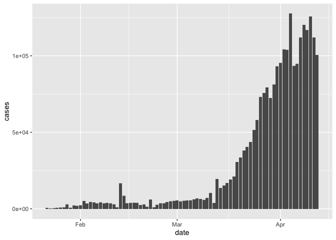<!-- -->

If we want a stacked barplot separating out the different types of
cases, we can use the fill aesthetic

``` r
coronavirus %>% 
  group_by(date, type) %>%
  summarize(cases=sum(cases)) %>%
  ggplot() +
  geom_col(aes(x=date, y = cases, fill = type), color="black", size=0.3)
```

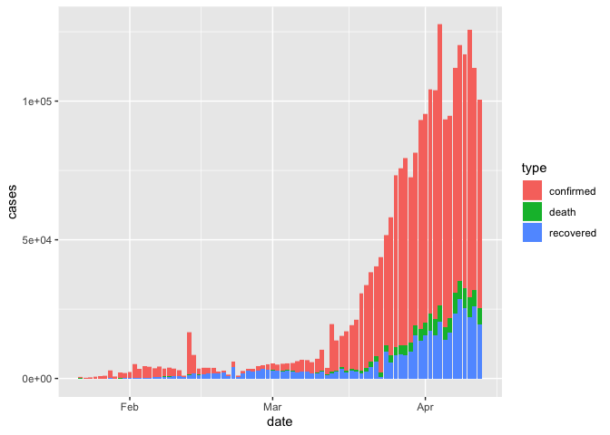<!-- -->

We may want to flip this around

``` r
coronavirus %>% 
  group_by(date, type) %>%
  summarize(cases=sum(cases)) %>%
  ggplot() +
  geom_col(aes(x=date, y = cases, fill = type), color="black", size=0.3) +
  coord_flip()
```

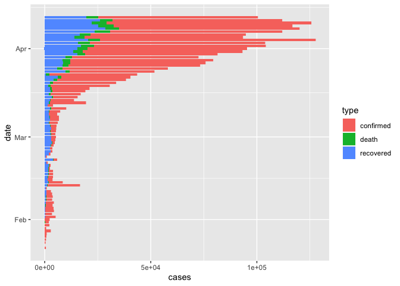<!-- -->

This is useful because it put the proportions in relation to the total
daily counts. But it can be hard to compare proportions. We can make all
bars the same height with ‘position adjustment’

``` r
coronavirus %>% 
  group_by(date, type) %>%
  summarize(cases=sum(cases)) %>%
  ggplot() +
  geom_col(aes(x=date, y = cases, fill = type), color="black", size=0.3, position = "fill")
```

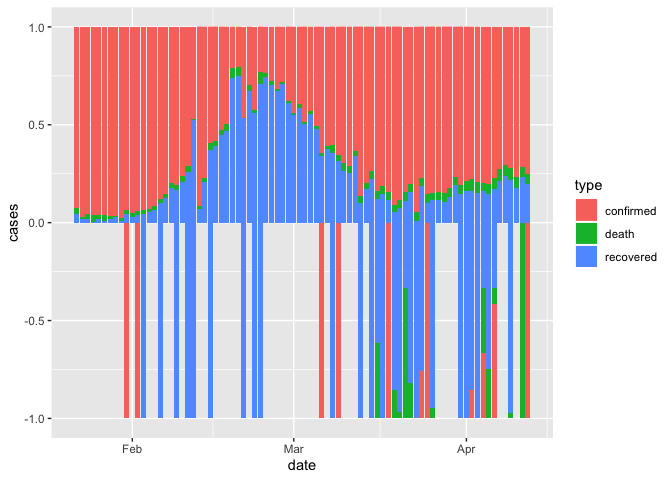<!-- -->

Let’s check if we have negative cases.

``` r
coronavirus %>% 
  filter(cases < 0)
```

    ## # A tibble: 67 x 7
    ##    Province.State     Country.Region   Lat   Long date       cases type     
    ##    <chr>              <chr>          <dbl>  <dbl> <date>     <dbl> <chr>    
    ##  1 <NA>               Guyana           5    -58.8 2020-03-24   -15 confirmed
    ##  2 <NA>               Uruguay        -32.5  -55.8 2020-04-12   -14 confirmed
    ##  3 Alberta            Canada          53.9 -117.  2020-03-25    -1 confirmed
    ##  4 Diamond Princess   Canada           0      0   2020-04-12    -1 confirmed
    ##  5 Guizhou            China           26.8  107.  2020-03-18    -1 confirmed
    ##  6 Manitoba           Canada          53.8  -98.8 2020-04-12    -1 confirmed
    ##  7 New Caledonia      France         -20.9  166.  2020-04-04    -1 confirmed
    ##  8 Northern Territory Australia      -12.5  131.  2020-03-06    -1 confirmed
    ##  9 Ontario            Canada          51.3  -85.3 2020-04-06    -7 confirmed
    ## 10 Queensland         Australia      -28.0  153.  2020-01-31    -1 confirmed
    ## # … with 57 more rows

``` r
# Let's remove those
coronavirus %>% 
  filter(cases > 0) %>% 
  group_by(date, type) %>%
  summarize(cases=sum(cases)) %>%
  ggplot() +
  geom_col(aes(x=date, y = cases, fill = type), color="black", size=0.3, position = "fill")
```

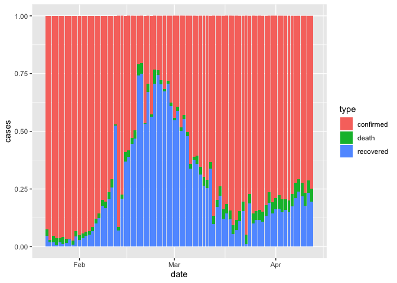<!-- -->

We can also get the bars for the different types of cases each day
stacked next to each other with another position adjustment option

``` r
coronavirus %>% 
  filter(cases > 0) %>% 
  group_by(date, type) %>%
  summarize(cases=sum(cases)) %>%
  ggplot() +
  geom_col(aes(x=date, y = cases, fill = type), position = "dodge")
```

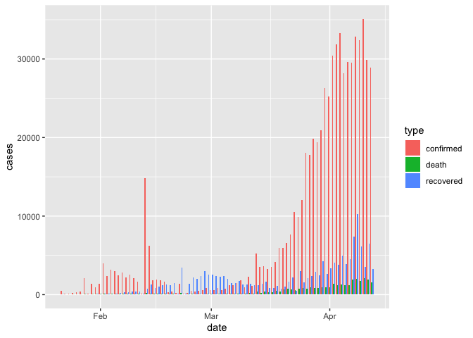<!-- -->

Now, let’s break it down by country. Let’s again subset to only the top
10 countries with the highest counts

``` r
coronavirus %>% 
  filter(cases > 0, Country.Region %in% top10_countries) %>%
  group_by(Country.Region, type, date) %>%
  summarize(cases=sum(cases)) %>%
  ggplot() +
  geom_col(aes(x=date, y = cases, fill = type), position = "fill", width = 1) +
  facet_wrap(~Country.Region)
```

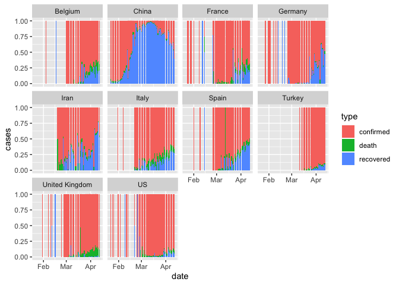<!-- -->

``` r
coronavirus %>% 
  filter(cases > 0, Country.Region %in% top10_countries) %>%
  group_by(Country.Region, type, date) %>%
  summarize(cases=sum(cases)) %>%
  ggplot() +
  geom_col(aes(x=date, y = cases, fill = type), position = "identity", width = 1) +
  facet_wrap(~Country.Region)
```

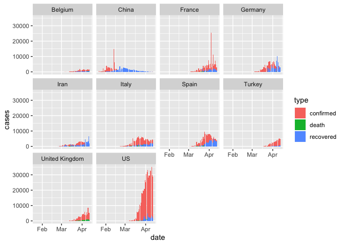<!-- -->

Now, let’s explore a different question. For each day, let’s plot how
many different countries have at least one new confirmed case. For this
we will need to count rows within grouped variables, so we’ll use the
geom\_bar()

``` r
# Just using this geom on the full dataset, we get this
ggplot(coronavirus) +
  geom_bar(mapping = aes(x = Country.Region))
```

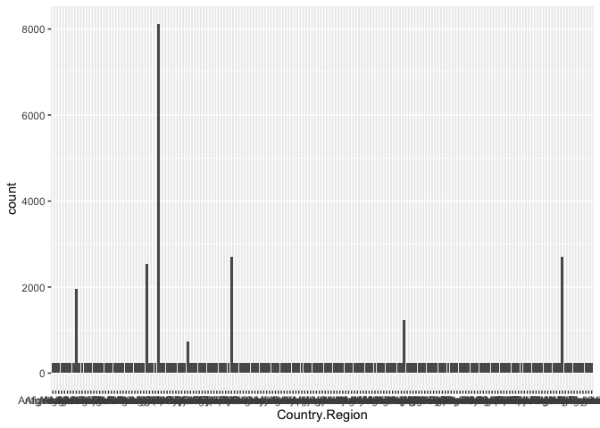<!-- -->

``` r
#How many countries have at least one confirmed case each day
coronavirus %>%
  filter(type == "confirmed") %>% 
  group_by(Country.Region, date) %>% 
  summarize(total_cases = sum(cases)) %>% 
  filter(total_cases > 0) %>% 
  ggplot() +
  geom_bar(mapping = aes(x = date), color="black")
```

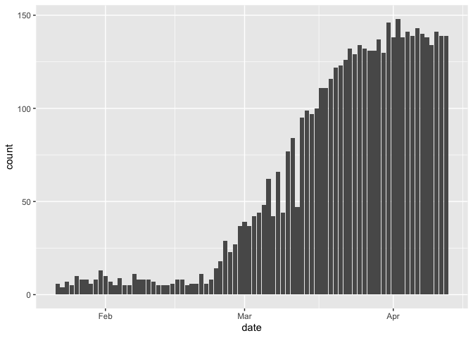<!-- -->

<br>

## Plotting with labels

Now let’s look at the relationship between confirmed cases and deaths in
each country. For this we will need our re-formatted wide data from last
class.

``` r
coronavirus_ttd <- coronavirus %>% 
  select(country = Country.Region, type, cases) %>%
  group_by(country, type) %>%
  summarize(total_cases = sum(cases)) %>%
  pivot_wider(names_from = type, values_from = total_cases) %>%
  arrange(-confirmed)

ggplot(coronavirus_ttd) +
  geom_point(mapping = aes(x = confirmed, y = death))
```

<!-- -->

That’s nice, but it would be useful to know which country is represented
by each dot. `geom_label` is our tool for that.

``` r
ggplot(coronavirus_ttd) +
  geom_label(mapping = aes(x = confirmed, y = death, label = country))
```

<!-- -->

Let’s do a few things to make this easier to read

We can remove countries with a small number of confirmed cases

``` r
ggplot(data = filter(coronavirus_ttd, confirmed>20000)) +
  geom_label(mapping = aes(x = confirmed, y = death, label = country))
```

<!-- -->

We can remove the area with low confirmed case count from the plot

``` r
ggplot(data = filter(coronavirus_ttd, confirmed>20000)) +
  geom_label(mapping = aes(x = confirmed, y = death, label = country)) +
  xlim(50000, max(coronavirus_ttd$confirmed))
```

    ## Warning: Removed 5 rows containing missing values (geom_label).

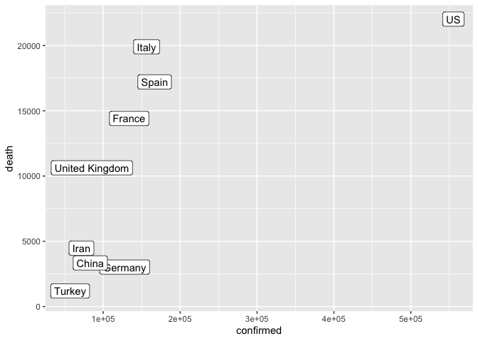<!-- -->

Or zoom in on that region

``` r
ggplot(data = filter(coronavirus_ttd)) +
  geom_label(mapping = aes(x = confirmed, y = death, label = country)) +
  xlim(0, 30000)
```

    ## Warning: Removed 9 rows containing missing values (geom_label).

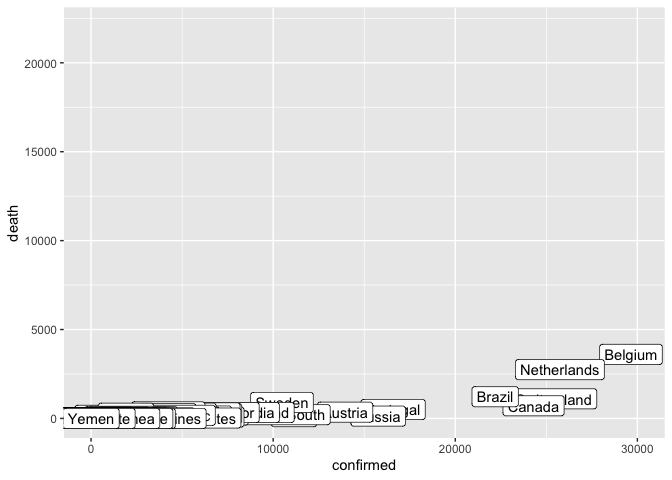<!-- -->

<br>

## Exercise

Come up with an interesting question you want to explore in the
Coronavirus dataset with a plot. Try to figure out how to plot it
(remember: google is your friend). Be prepared to share your idea with
the group during the Zoom call.

## Some examples:

#### Trend in cumulative case count

``` r
## linear scale
group_by(coronavirus, date, type) %>%
  summarise(cases = sum(cases)) %>% 
  group_by(type) %>%
  mutate(cases=cumsum(cases)) %>%
  ggplot() +
  geom_line(aes(x=date, y=cases, color=type))
```

<!-- -->

``` r
## log scale
group_by(coronavirus, date, type) %>%
  summarise(cases = sum(cases)) %>% 
  group_by(type) %>%
  mutate(cases=cumsum(cases)) %>%
  ggplot() +
  geom_line(aes(x=date, y=log(cases), color=type))
```

<!-- -->

#### Trend in cumulative case count in the 10 most infected countries

``` r
## linear scale
filter(coronavirus, Country.Region %in% top10_countries) %>%
  group_by(Country.Region, date, type) %>%
  summarise(cases = sum(cases)) %>% 
  group_by(Country.Region, type) %>%
  mutate(cases=cumsum(cases)) %>%
  ggplot() +
  geom_line(aes(x=date, y=cases/1000, color=type)) +
  ylab("cumulative count (in thousand)") +
  facet_wrap(~Country.Region, scales = "free_y")
```

<!-- -->

#### Trend in cumulative death rate

``` r
group_by(coronavirus, date, type) %>%
  summarise(cases = sum(cases)) %>% 
  group_by(type) %>%
  mutate(cases=cumsum(cases)) %>%
  pivot_wider(names_from = type, values_from = cases) %>%
  mutate(death_rate = death/(confirmed+death+recovered)) %>%
  ggplot(aes(x=date, y=death_rate)) +
  geom_line()
```

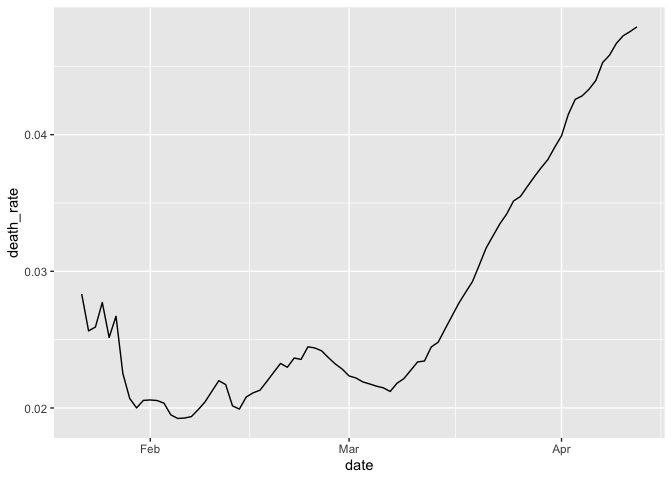<!-- -->

#### Trend in cumulative death rate in 10 most infected countries

``` r
filter(coronavirus, Country.Region %in% top10_countries) %>%
  group_by(Country.Region, date, type) %>%
  summarise(cases = sum(cases)) %>% 
  group_by(Country.Region, type) %>%
  mutate(cases=cumsum(cases)) %>%
  pivot_wider(names_from = type, values_from = cases) %>%
  mutate(death_rate = death/(confirmed+death+recovered)) %>%
  ggplot(aes(x=date, y=death_rate)) +
  geom_line() +
  facet_wrap(~Country.Region, scales = "free_y")
```

    ## Warning: Removed 13 rows containing missing values (geom_path).

<!-- -->

#### Countries that had their first reported coronavirus case in January

``` r
filter(coronavirus, type=="confirmed", cases>0) %>%
  group_by(Country.Region, date) %>%
  summarise() %>%
  group_by(Country.Region) %>%
  filter(date==min(date)) %>%
  ungroup() %>%
  arrange(date) %>%
  mutate(rank=row_number(date)) %>%
  filter(months(date)=="January") %>%
  ggplot(aes(x=date, y=rank)) +
  geom_text(aes(label=Country.Region)) +
  xlim(as.Date(c("2020-01-21", "2020-02-01"))) +
  theme_minimal()
```

<!-- -->

#### Map of newly reported cases on 04/12/2020

``` r
library("rnaturalearth") # install.packages("rnaturalearth")
library("rnaturalearthdata") # install.packages("rnaturalearthdata")
library("rgeos") #install.packages("rgeos")
```

    ## Loading required package: sp

    ## rgeos version: 0.5-2, (SVN revision 621)
    ##  GEOS runtime version: 3.7.2-CAPI-1.11.2 
    ##  Linking to sp version: 1.3-1 
    ##  Polygon checking: TRUE

``` r
world <- ne_countries(scale = "medium", returnclass = "sf")
filter(coronavirus, date=="2020-04-12", type=="confirmed", cases>0) %>%
  ggplot() +
  geom_sf(data = world) +
  geom_point(aes(x=Long, y=Lat, size=cases), color="red", fill="red", alpha=0.5, shape=21) 
```

# <!-- -->
