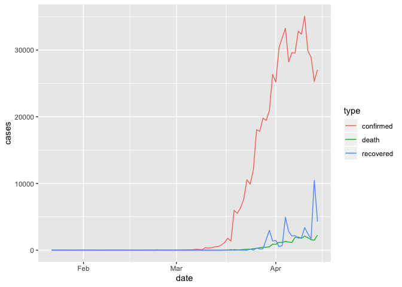
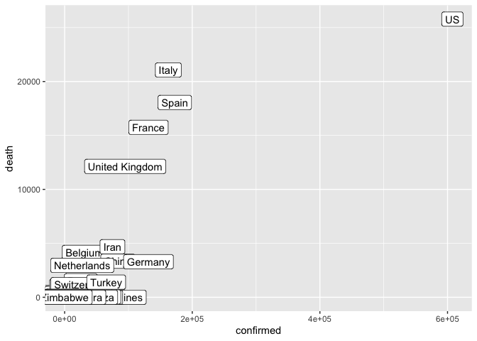

Lesson 8: tidy data
================

## Readings

**Required**:

  - [Ch. 12 *Tidy Data*, in R for Data
    Science](https://r4ds.had.co.nz/tidy-data.html) by Grolemund &
    Wickham

**Additional resources**:

  - [Jenny Bryan’s Intro to Tidy
    Data](https://github.com/jennybc/lotr-tidy/blob/master/01-intro.md)
      - the repo this links to has some useful exercises too, but uses
        the older `spread()` and `gather()` functions
  - `tidyr` \[vignette on tidy
    data\](<https://cran.r-project.org/web/packages/tidyr/vignettes/tidy-data.html>  
  - [Hadley’s paper on tidy
    data](https://vita.had.co.nz/papers/tidy-data.pdf) provides a
    thorough investigation

<br>

## Announcements

  - Homework 3 is due tonight, Homework 4 is posted under `assignments`

<br>

## Today’s learning objectives

So far, we’ve only worked with data that were already formatted for
effecient processing with tidyverse functions. In this session we’ll
learn some tools to help get data into that format - make it **tidy**
and more coder-friendly.  
By the end of today’s class, you should be able to:

  - Read different types of data into R
  - Describe the concept of tidy data
  - Determine whether a dataset is in tidy format
  - Use `tidyr::pivot_wider()` and `tidyr::pivot_longer()` to reshape
    data frames
  - Use `tidyr::unite()` and `tidyr::separate()` to merge or separate
    information from different columns
  - Use `janitor::clean_names()` to make column headers more manageable

<br>

### Acknowledgements

Todays lesson integrates material from multiple sources, including the
excellent [R for Excel
users](https://rstudio-conf-2020.github.io/r-for-excel/) course by Julia
Stewart Lowndes and Allison Horst and several other sources specified
below.

<br>

## Set-up

### Create a new R Markdown and attach packages

  - Open the R Project associated with your personal class GitHub
    repository.
  - PULL to make sure your project is up to date
  - Create a new RMarkdown file called `my_tidying.Rmd`
  - Remove all example code / text below the first code chunk and change
    the output format (in the YAML header) to “github\_document”
  - Attach the packages we’ll use here (you will have to install
    `janitor` if you don’t already have it):
      - `tidyverse`
      - `janitor`

Knit and save your new .Rmd within the project folder.

``` r
# Attach packages
library(tidyverse)
library(janitor)  ## install.packages("janitor")
```

<br>

## Part 1: Data import

So far, we’ve been working with datasets that are built into R or we
have just provided code to run to import data into R.

When working in the tidyverse, the most common import function we will
use are the `read_xx()` functions from the tidyverse package `readr`.

  - `read_csv()` reads comma delimited files, `read_csv2()` reads
    semicolon separated files (common in countries where `,` is used as
    the decimal place), `read_tsv()` reads tab delimited files, and
    `read_delim()` reads in files with any delimiter.

  - `read_fwf()` reads fixed width files. You can specify fields either
    by their widths with `fwf_widths()` or their position with
    `fwf_positions()`. `read_table()` reads a common variation of fixed
    width files where columns are separated by white space.

We can also read directly from spreadsheet formats:

  - `readxl::read_excel()` reads directly from Excel spreadsheets

  - `googlesheets::gs_read()` from the package
    [googlesheets](https://cran.r-project.org/web/packages/googlesheets/vignettes/basic-usage.html#read-all-the-data-in-one-worksheet)
    reads in data directly from Google Sheets

<br>

For all of these, we can either read in data from a file path or
directly from a URL.

So for example, for a dataset we will be working with later, I can
either load my local copy or grab it from the github site where it is
made available

``` r
lotr <- read_csv("../datasets/lotr_tidy.csv")
```

    ## Parsed with column specification:
    ## cols(
    ##   Film = col_character(),
    ##   Race = col_character(),
    ##   Gender = col_character(),
    ##   Words = col_double()
    ## )

``` r
lotr <- read_csv("https://raw.githubusercontent.com/jennybc/lotr-tidy/master/data/lotr_tidy.csv")
```

    ## Parsed with column specification:
    ## cols(
    ##   Film = col_character(),
    ##   Race = col_character(),
    ##   Gender = col_character(),
    ##   Words = col_double()
    ## )

All the `readr::read_xx()` functions has many additional options
including the ability to skip columns, skip rows, rename columns on
import, trim whitespace, and much more. They all use the same syntax, so
once you get familiar with one, you can easily apply your knowledge to
all the other functions in `readr`.

You can examine the options by looking at the documentation, e.g
`?read_csv()`. There is also a very useful overview in [Chapter 11 of
Grolemund and Wickham’s R for Data
Science](https://r4ds.had.co.nz/data-import.html)

<br>

## Part 2: Tidy data

“Tidy” might sound like a generic way to describe non-messy looking
data, but it actually refers to a specific data structure.

A data set is tidy if:

  - Each column is a variable;
  - Each row is an observation;
  - Each cell is a value.

See: [Ch. 12 in R for Data Science by Grolemund &
Wickham](https://r4ds.had.co.nz/tidy-data.html)).


An implication of this definition is that each value belongs to exactly
one variable and one observation. This also means that tidy data is
relative, as it depends on how you define your observational unit and
variables.

A key idea here is that instead of building your analyses around
whatever (likely weird) format your data are in, take deliberate steps
to make your data tidy. When your data are tidy, you can use a growing
assortment of powerful analytical and visualization tools instead of
inventing home-grown ways to accommodate your data. This will save you
time since you aren’t reinventing the wheel, and will make your work
more clear and understandable to your collaborators (most importantly,
Future You).

Note that to effectively use `ggplot()` your data must be in tidy
format.

Let’s go through some examples to get a better understanding of what
tidy data look like.

<br>

> If I had one thing to tell biologists learning bioinformatics, it
> would be “write code for humans, write data for computers”. — Vince
> Buffalo (@vsbuffalo)

<br>

### Pivoting between long and wide data formats

First, to exlore the powerful `tidyr` functions for reshaping data,
we’ll walk through [Chapter 12.3 Pivoting in Grolemund and Wickham’s
“R for Data Science”](https://r4ds.had.co.nz/tidy-data.html#pivoting).

Often, datasets will not in tidy format because they are organized to
facilitate some use other than analysis. For example, data is often
organized to make entry or reading by humans as easy as possible.

This means for most real analyses, you’ll need to do some tidying. The
first step is always to figure out what the variables and observations
are. Sometimes this is easy; other times you’ll need to consult with the
people who originally generated the data. The second step is to resolve
one of **two common problems**:

  - **One variable might be spread across multiple columns**.

  - **One observation might be scattered across multiple rows**.

Typically a dataset will only suffer from one of these problems; it’ll
only suffer from both if you’re really unlucky\! To fix these problems,
you’ll need the two most important functions in tidyr: `pivot_longer()`
and `pivot_wider()`.

Now that you’re over in “R for Data Science”, you can continue on to
also take a look at Chapter 12.4 on `separate()` and `unite()` - two
simple functions for splitting and combining information from different
columns.

<br>

### Another example to further illustrate tidy and untidy data

To explore tidy data in a different context, let’s work through a
tutorial developed by Jenny Bryan using data on the Lord of the Rings
movies. This nicely illustrates the concepts of lengtening and widening
datasets. It uses outdated functions for pivoting the dataframes,
however, so we’ll work through updated code here (i.e. only look at the
`01-intro.md` file, not the `02-gather.md` and `03-spread.md`).

First let’s read the intro (`01-intro.md`)
[here](https://github.com/jennybc/lotr-tidy/blob/master/01-intro.md)

Then let’s work through reshaping the data.

#### 1\. Import untidy Lord of the Rings data

We bring the data into data frames or tibbles, one per film, and do some
inspection.

``` r
fship <- read_csv("https://raw.githubusercontent.com/jennybc/lotr-tidy/master/data/The_Fellowship_Of_The_Ring.csv")
```

    ## Parsed with column specification:
    ## cols(
    ##   Film = col_character(),
    ##   Race = col_character(),
    ##   Female = col_double(),
    ##   Male = col_double()
    ## )

``` r
ttow <- read_csv("https://raw.githubusercontent.com/jennybc/lotr-tidy/master/data/The_Two_Towers.csv")
```

    ## Parsed with column specification:
    ## cols(
    ##   Film = col_character(),
    ##   Race = col_character(),
    ##   Female = col_double(),
    ##   Male = col_double()
    ## )

``` r
rking <- read_csv("https://raw.githubusercontent.com/jennybc/lotr-tidy/master/data/The_Return_Of_The_King.csv")
```

    ## Parsed with column specification:
    ## cols(
    ##   Film = col_character(),
    ##   Race = col_character(),
    ##   Female = col_double(),
    ##   Male = col_double()
    ## )

#### 2\. Collect untidy Lord of the Rings data into a single data frame

We now have one data frame per film, each with a common set of 4
variables. Step one in tidying this data is to glue them together into
one data frame, stacking them up row wise. This is called row binding
and we use `dplyr::bind_rows()`.

``` r
lotr_untidy <- bind_rows(fship, ttow, rking)
str(lotr_untidy)
```

    ## tibble [9 × 4] (S3: spec_tbl_df/tbl_df/tbl/data.frame)
    ##  $ Film  : chr [1:9] "The Fellowship Of The Ring" "The Fellowship Of The Ring" "The Fellowship Of The Ring" "The Two Towers" ...
    ##  $ Race  : chr [1:9] "Elf" "Hobbit" "Man" "Elf" ...
    ##  $ Female: num [1:9] 1229 14 0 331 0 ...
    ##  $ Male  : num [1:9] 971 3644 1995 513 2463 ...

``` r
lotr_untidy
```

    ## # A tibble: 9 x 4
    ##   Film                       Race   Female  Male
    ##   <chr>                      <chr>   <dbl> <dbl>
    ## 1 The Fellowship Of The Ring Elf      1229   971
    ## 2 The Fellowship Of The Ring Hobbit     14  3644
    ## 3 The Fellowship Of The Ring Man         0  1995
    ## 4 The Two Towers             Elf       331   513
    ## 5 The Two Towers             Hobbit      0  2463
    ## 6 The Two Towers             Man       401  3589
    ## 7 The Return Of The King     Elf       183   510
    ## 8 The Return Of The King     Hobbit      2  2673
    ## 9 The Return Of The King     Man       268  2459

#### 3\. Tidy the untidy Lord of the Rings data

We are still violating one of the fundamental principles of **tidy
data**. “Word count” is a fundamental variable in our dataset and it’s
currently spread out over two variables, `Female` and `Male`.
Conceptually, we need to gather up the word counts into a single
variable and create a new variable, `Gender`, to track whether each
count refers to females or males. We use the `pivot_longer()` function
from the tidyr package to do this.

``` r
lotr_tidy <-
  pivot_longer(lotr_untidy, c(Male, Female), names_to = 'Gender', values_to = 'Words')

lotr_tidy
```

    ## # A tibble: 18 x 4
    ##    Film                       Race   Gender Words
    ##    <chr>                      <chr>  <chr>  <dbl>
    ##  1 The Fellowship Of The Ring Elf    Male     971
    ##  2 The Fellowship Of The Ring Elf    Female  1229
    ##  3 The Fellowship Of The Ring Hobbit Male    3644
    ##  4 The Fellowship Of The Ring Hobbit Female    14
    ##  5 The Fellowship Of The Ring Man    Male    1995
    ##  6 The Fellowship Of The Ring Man    Female     0
    ##  7 The Two Towers             Elf    Male     513
    ##  8 The Two Towers             Elf    Female   331
    ##  9 The Two Towers             Hobbit Male    2463
    ## 10 The Two Towers             Hobbit Female     0
    ## 11 The Two Towers             Man    Male    3589
    ## 12 The Two Towers             Man    Female   401
    ## 13 The Return Of The King     Elf    Male     510
    ## 14 The Return Of The King     Elf    Female   183
    ## 15 The Return Of The King     Hobbit Male    2673
    ## 16 The Return Of The King     Hobbit Female     2
    ## 17 The Return Of The King     Man    Male    2459
    ## 18 The Return Of The King     Man    Female   268

Tidy data… mission accomplished\!

To explain our call to pivot\_longer() above, let’s read it from right
to left: we took the variables Female and Male and gathered their values
into a single new variable Words. This forced the creation of a
companion variable Gender, which tells whether a specific value of Words
came from Female or Male. All other variables, such as Film, remain
unchanged and are simply replicated as needed.

#### 4\. Write the tidy data to a delimited file

Now we write this multi-film, tidy dataset to file for use in various
downstream scripts for further analysis and visualization.

``` r
write_csv(lotr_tidy, path = "../datasets/lotr_tidy.csv")
```

<br>

### Your turn

1.  After tidying the data and completing your analysis, you may want to
    output a table that has each race in its own column. Let’s use the
    `pivot_wider()` function to make such a table and save it as
    “lotr\_wide”

2.  OPTIONAL: Use the pivot\_longer() function to transform you
    lotr\_wide back to tidy format.

<br>

#### Answer

``` r
# let's get one variable per Race
lotr_tidy %>% 
  pivot_wider(names_from = Race, values_from = Words)
```

    ## # A tibble: 6 x 5
    ##   Film                       Gender   Elf Hobbit   Man
    ##   <chr>                      <chr>  <dbl>  <dbl> <dbl>
    ## 1 The Fellowship Of The Ring Male     971   3644  1995
    ## 2 The Fellowship Of The Ring Female  1229     14     0
    ## 3 The Two Towers             Male     513   2463  3589
    ## 4 The Two Towers             Female   331      0   401
    ## 5 The Return Of The King     Male     510   2673  2459
    ## 6 The Return Of The King     Female   183      2   268

``` r
# let's get one variable per Gender
lotr_tidy %>% 
  pivot_wider(names_from = Gender, values_from = Words)
```

    ## # A tibble: 9 x 4
    ##   Film                       Race    Male Female
    ##   <chr>                      <chr>  <dbl>  <dbl>
    ## 1 The Fellowship Of The Ring Elf      971   1229
    ## 2 The Fellowship Of The Ring Hobbit  3644     14
    ## 3 The Fellowship Of The Ring Man     1995      0
    ## 4 The Two Towers             Elf      513    331
    ## 5 The Two Towers             Hobbit  2463      0
    ## 6 The Two Towers             Man     3589    401
    ## 7 The Return Of The King     Elf      510    183
    ## 8 The Return Of The King     Hobbit  2673      2
    ## 9 The Return Of The King     Man     2459    268

``` r
# let's get one variable per combo of Race and Gender
lotr_tidy %>% 
  unite(Race_Gender, Race, Gender) %>% 
  pivot_wider(names_from = Race_Gender, values_from = Words)
```

    ## # A tibble: 3 x 7
    ##   Film         Elf_Male Elf_Female Hobbit_Male Hobbit_Female Man_Male Man_Female
    ##   <chr>           <dbl>      <dbl>       <dbl>         <dbl>    <dbl>      <dbl>
    ## 1 The Fellows…      971       1229        3644            14     1995          0
    ## 2 The Two Tow…      513        331        2463             0     3589        401
    ## 3 The Return …      510        183        2673             2     2459        268

<br>

### More exercises on the LOTR data

The word count data is given in two untidy and gender-specific files
available at these
URLs:

<https://raw.githubusercontent.com/jennybc/lotr-tidy/master/data/Female.csv>  
<https://raw.githubusercontent.com/jennybc/lotr-tidy/master/data/Male.csv>

Write an R script that reads them in and writes a single tidy data frame
to file. Literally, reproduce the lotr\_tidy data frame and the
lotr\_tidy.csv data file from above.

Write R code to compute the total number of words spoken by each race
across the entire trilogy. Do it two ways:

  - Using film-specific or gender-specific, untidy data frames as the
    input data.
  - Using the lotr\_tidy data frame (that we generated above) as input.

Reflect on the process of writing this code and on the code itself.
Which is easier to write? Easier to read?

Write R code to compute the total number of words spoken in each film.
Do this by copying and modifying your own code for totalling words by
race. Which approach is easier to modify and repurpose – the one based
on multiple, untidy data frames or the tidy data?

<br>

## Applying this to our Coronavirus dataset

Let’s now return to our Coronavirus dataset. Let’s remind ourselves of
it’s
structure

``` r
coronavirus <- read_csv('https://raw.githubusercontent.com/RamiKrispin/coronavirus-csv/master/coronavirus_dataset.csv', col_types = cols(Province.State = col_character()))

coronavirus
```

    ## # A tibble: 65,352 x 7
    ##    Province.State Country.Region   Lat  Long date       cases type     
    ##    <chr>          <chr>          <dbl> <dbl> <date>     <dbl> <chr>    
    ##  1 <NA>           Afghanistan       33    65 2020-01-22     0 confirmed
    ##  2 <NA>           Afghanistan       33    65 2020-01-23     0 confirmed
    ##  3 <NA>           Afghanistan       33    65 2020-01-24     0 confirmed
    ##  4 <NA>           Afghanistan       33    65 2020-01-25     0 confirmed
    ##  5 <NA>           Afghanistan       33    65 2020-01-26     0 confirmed
    ##  6 <NA>           Afghanistan       33    65 2020-01-27     0 confirmed
    ##  7 <NA>           Afghanistan       33    65 2020-01-28     0 confirmed
    ##  8 <NA>           Afghanistan       33    65 2020-01-29     0 confirmed
    ##  9 <NA>           Afghanistan       33    65 2020-01-30     0 confirmed
    ## 10 <NA>           Afghanistan       33    65 2020-01-31     0 confirmed
    ## # … with 65,342 more rows

**QUESTION**: Is this in tidy format?

Last class, we visualized the global case counts date

``` r
coronavirus %>% 
  group_by(date, type) %>%
  summarize(cases=sum(cases)) %>%
  ggplot() +
  geom_col(aes(x=date, y = cases, fill = type))
```

<!-- -->

Let’s see how we would do that if the data had been in a wider format.

#### Your turn

Convert the coronavirus dataset to a wider format where the confirmed
cases, deaths and recovered cases are shown in separate columns.

<br>

##### Answer

``` r
corona_wide <- coronavirus %>% 
  pivot_wider(names_from = type, values_from = cases)
```

Now how do we reproduce the barchart of total cases per day broken down
by type?

And how would be plot the daily counts of different case types within a
country? With the long format this is easy:

``` r
coronavirus %>% 
  filter(Country.Region == "US") %>% 
  ggplot() +
  geom_line(aes(x = date, y = cases, color = type))
```

<!-- -->

How would we do this with the `coronavirus_wide` format? That would be
much more difficult

As mentioned above, however, there are plot types where the wide format
provides the best input. For example, in Slack, I showed the example of
plotting the total death count per country against the total count of
confirmed cases. It would be cumbersome to pull these out of the long
format because in `ggplot` we are mapping *variables* to *aesthetics*
and now we want to map different levels of a variable to different
aesthetics. So let’s make those different levels separate variables by
widening the data.

``` r
coronavirus_ttd <- coronavirus %>% 
  group_by(Country.Region, type) %>%
  summarize(total_cases = sum(cases)) %>%
  pivot_wider(names_from = type, values_from = total_cases)

# Now we can plot this easily
ggplot(coronavirus_ttd) +
  geom_label(mapping = aes(x = confirmed, y = death, label = Country.Region))
```

<!-- -->

This case highlights how the definition of what a variable and an
observation is context-dependent so different formats of the same data
can be considered tidy based on how we are thinking about the data and
we may need to switch back and forth between long and wide formats to
explore different levels of a dataset.

<br>

## Part 3. Cleaning up column names with `janitor::clean_names()`

We’ve noticed in the coronavirus dataset that the variable names have a
very inconsistent format. It’s not a problem per se for our ability to
work with this dataframe, but it’s a bit annoying to look
    at.

``` r
colnames(coronavirus)
```

    ## [1] "Province.State" "Country.Region" "Lat"            "Long"          
    ## [5] "date"           "cases"          "type"

In other cases, spaces and special characters in column names of data
you import can actually cause problems downstream, so we often may want
to clean them up.

The `janitor` package by Sam Firke is a great collection of functions
for some quick data cleaning, like:

  - `janitor::clean_names()`: update column headers to a case of your
    choosing
  - `janitor::get_dupes()`: see all rows that are duplicates within
    variables you choose
  - `janitor::remove_empty()`: remove empty rows and/or columns
  - `janitor::adorn_*()`: jazz up tables

Here, we’ll use `janitor::clean_names()` to convert all of our column
headers in our `coronavirus` data to a more convenient case - the
default is **lower\_snake\_case**, which means all spaces and symbols
are replaced with an underscore (or a word describing the symbol), all
characters are lowercase, and a few other nice adjustments.

For example, `janitor::clean_names()` would update these nightmare
column names into much nicer forms:

  - `My...RECENT-income!` becomes `my_recent_income`
  - `SAMPLE2.!test1` becomes `sample2_test1`
  - `ThisIsTheName` becomes `this_is_the_name`
  - `2015` becomes `x2015`

If we wanted to then use these columns (which we probably would, since
we created them), we could clean the names to get them into more
coder-friendly lower\_snake\_case with `janitor::clean_names()`:

``` r
coronavirus <- coronavirus %>% 
  clean_names()
```

``` r
names(coronavirus)
```

    ## [1] "province_state" "country_region" "lat"            "long"          
    ## [5] "date"           "cases"          "type"

And there are other case options in `clean_names()`, like:

  - “snake” produces snake\_case (the default)
  - “lower\_camel” or “small\_camel” produces lowerCamel
  - “upper\_camel” or “big\_camel” produces UpperCamel
  - “screaming\_snake” or “all\_caps” produces ALL\_CAPS
  - “lower\_upper” produces lowerUPPER
  - “upper\_lower” produces UPPERlower


Art by Allison Horst. Check out more
[here](https://github.com/allisonhorst/stats-illustrations)
