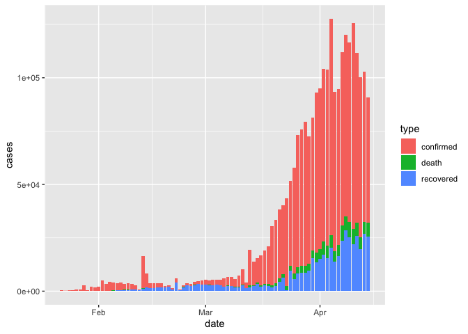

Lesson 8: tidy data
================

## Readings

**Required**:

  - [Ch. 12 *Tidy Data*, in R for Data
    Science](https://r4ds.had.co.nz/tidy-data.html) by Grolemund &
    Wickham

**Additional resources**:

  - [Jenny Bryan’s Intro to Tidy
    Data](https://github.com/jennybc/lotr-tidy/blob/master/01-intro.md)
      - the repo this links to has some useful exercises too, but uses
        the older `spread()` and `gather()` functions
  - `tidyr` \[vignette on tidy
    data\](<https://cran.r-project.org/web/packages/tidyr/vignettes/tidy-data.html>  
  - [Hadley’s paper on tidy
    data](https://vita.had.co.nz/papers/tidy-data.pdf) provides a
    thorough investigation

<br>

## Announcements

  - Will need a longer Zoom session next week
  - Homework 3 is due tonight, Homework 4 is posted under `assignments`

<br>

## Today’s learning objectives

In previous sessions, we learned to read in data, do some wrangling, and
create a graph and table. In this session we’ll learn some tools to help
make our data **tidy** and more coder-friendly. By the end of today’s
class, you should be able to:

  - Read different types of data into R
  - Describe the tibble format
  - Save plots and tables with R code
  - Describe the concept of tidy data
  - Determine whether a dataset is in tidy format
  - Use `tidyr::pivot_wider()` and `tidyr::pivot_longer()` to reshape
    data frames
  - Use `tidyr::unite()` and `tidyr::separate()` to merge or separate
    information from different columns
  - Use `janitor::clean_names()` to make column headers more manageable

## Acknowledgements

Todays lesson integrates material from multiple sources, including the
excellent [R for Excel
users](https://rstudio-conf-2020.github.io/r-for-excel/) course by Julia
Stewart Lowndes and Allison Horst and several other sources specified
below.

<br>

## Introduction

Instead of building your analyses around whatever (likely weird) format
your data are in, take deliberate steps to make your data tidy. When
your data are tidy, you can use a growing assortment of powerful
analytical and visualization tools instead of inventing home-grown ways
to accommodate your data. This will save you time since you aren’t
reinventing the wheel, and will make your work more clear and
understandable to your collaborators (most importantly, Future You).

Note that to effectively use `ggplot()` your data must be in tidy
format.

## Part 1: Data import and export

The read\_csv package has many additional options including the ability
to skip columns, skip rows, rename columns on import, trim whitespace,
and
    more…

``` r
library(tidyverse)
```

    ## ── Attaching packages ─────────────────────────────── tidyverse 1.3.0 ──

    ## ✓ ggplot2 3.2.1     ✓ purrr   0.3.3
    ## ✓ tibble  3.0.0     ✓ dplyr   0.8.5
    ## ✓ tidyr   1.0.2     ✓ stringr 1.4.0
    ## ✓ readr   1.3.1     ✓ forcats 0.4.0

    ## ── Conflicts ────────────────────────────────── tidyverse_conflicts() ──
    ## x dplyr::filter() masks stats::filter()
    ## x dplyr::lag()    masks stats::lag()

## Part 2: Tidy data

“Tidy” might sound like a generic way to describe non-messy looking
data, but it actually refers to a specific data structure.

A data set is tidy if:

  - Each row is an observation;
  - Each column is a variable;
  - Each cell is a value.

See: [Ch. 12 in R for Data Science by Grolemund &
Wickham](https://r4ds.had.co.nz/tidy-data.html)).


An implication of this definition is that each value belongs to exactly
one variable and one observation. This also means that tidy data is
relative, as it depends on how you define your observational unit and
variables.

## Pivoting

To learn powerful `tidyverse` functions for reshaping data, we’ll go
over [Chapter 12.3 Pivoting in Grolemund and Wickham’s “R for Data
Science”](https://r4ds.had.co.nz/tidy-data.html#pivoting).

## More examples about tidy and untidy data

> If I had one thing to tell biologists learning bioinformatics, it
> would be “write code for humans, write data for computers”. — Vince
> Buffalo (@vsbuffalo)

Let’s work through Jenny Bryan’s Lord of the Rings example. This nicely
lays out the concepts of lengtening and widening datasets. It uses
outdated functions for pivoting the dataframes, however, so we’ll work
through updated code here (i.e. only look at the `01-intro.md` file, not
the `02-gather.md`).

#### Import untidy Lord of the Rings data

We bring the data into data frames or tibbles, one per film, and do some
inspection.

``` r
fship <- read_csv("https://raw.githubusercontent.com/jennybc/lotr-tidy/master/data/The_Fellowship_Of_The_Ring.csv")
```

    ## Parsed with column specification:
    ## cols(
    ##   Film = col_character(),
    ##   Race = col_character(),
    ##   Female = col_double(),
    ##   Male = col_double()
    ## )

``` r
ttow <- read_csv("https://raw.githubusercontent.com/jennybc/lotr-tidy/master/data/The_Two_Towers.csv")
```

    ## Parsed with column specification:
    ## cols(
    ##   Film = col_character(),
    ##   Race = col_character(),
    ##   Female = col_double(),
    ##   Male = col_double()
    ## )

``` r
rking <- read_csv("https://raw.githubusercontent.com/jennybc/lotr-tidy/master/data/The_Return_Of_The_King.csv")
```

    ## Parsed with column specification:
    ## cols(
    ##   Film = col_character(),
    ##   Race = col_character(),
    ##   Female = col_double(),
    ##   Male = col_double()
    ## )

#### Collect untidy Lord of the Rings data into a single data frame

We now have one data frame per film, each with a common set of 4
variables. Step one in tidying this data is to glue them together into
one data frame, stacking them up row wise. This is called row binding
and we use `dplyr::bind_rows()`.

``` r
lotr_untidy <- bind_rows(fship, ttow, rking)
str(lotr_untidy)
```

    ## tibble [9 × 4] (S3: spec_tbl_df/tbl_df/tbl/data.frame)
    ##  $ Film  : chr [1:9] "The Fellowship Of The Ring" "The Fellowship Of The Ring" "The Fellowship Of The Ring" "The Two Towers" ...
    ##  $ Race  : chr [1:9] "Elf" "Hobbit" "Man" "Elf" ...
    ##  $ Female: num [1:9] 1229 14 0 331 0 ...
    ##  $ Male  : num [1:9] 971 3644 1995 513 2463 ...

``` r
lotr_untidy
```

    ## # A tibble: 9 x 4
    ##   Film                       Race   Female  Male
    ##   <chr>                      <chr>   <dbl> <dbl>
    ## 1 The Fellowship Of The Ring Elf      1229   971
    ## 2 The Fellowship Of The Ring Hobbit     14  3644
    ## 3 The Fellowship Of The Ring Man         0  1995
    ## 4 The Two Towers             Elf       331   513
    ## 5 The Two Towers             Hobbit      0  2463
    ## 6 The Two Towers             Man       401  3589
    ## 7 The Return Of The King     Elf       183   510
    ## 8 The Return Of The King     Hobbit      2  2673
    ## 9 The Return Of The King     Man       268  2459

#### Tidy the untidy Lord of the Rings data

We are still violating one of the fundamental principles of **tidy
data**. “Word count” is a fundamental variable in our dataset and it’s
currently spread out over two variables, `Female` and `Male`.
Conceptually, we need to gather up the word counts into a single
variable and create a new variable, `Gender`, to track whether each
count refers to females or males. We use the `pivot_longer()` function
from the tidyr package to do this.

``` r
lotr_tidy <-
  pivot_longer(lotr_untidy, c(Male, Female), names_to = 'Gender', values_to = 'Words')

lotr_tidy
```

    ## # A tibble: 18 x 4
    ##    Film                       Race   Gender Words
    ##    <chr>                      <chr>  <chr>  <dbl>
    ##  1 The Fellowship Of The Ring Elf    Male     971
    ##  2 The Fellowship Of The Ring Elf    Female  1229
    ##  3 The Fellowship Of The Ring Hobbit Male    3644
    ##  4 The Fellowship Of The Ring Hobbit Female    14
    ##  5 The Fellowship Of The Ring Man    Male    1995
    ##  6 The Fellowship Of The Ring Man    Female     0
    ##  7 The Two Towers             Elf    Male     513
    ##  8 The Two Towers             Elf    Female   331
    ##  9 The Two Towers             Hobbit Male    2463
    ## 10 The Two Towers             Hobbit Female     0
    ## 11 The Two Towers             Man    Male    3589
    ## 12 The Two Towers             Man    Female   401
    ## 13 The Return Of The King     Elf    Male     510
    ## 14 The Return Of The King     Elf    Female   183
    ## 15 The Return Of The King     Hobbit Male    2673
    ## 16 The Return Of The King     Hobbit Female     2
    ## 17 The Return Of The King     Man    Male    2459
    ## 18 The Return Of The King     Man    Female   268

Tidy data … mission accomplished\!

To explain our call to pivot\_longer() above, let’s read it from right
to left: we took the variables Female and Male and gathered their values
into a single new variable Words. This forced the creation of a
companion variable Gender, which tells whether a specific value of Words
came from Female or Male. All other variables, such as Film, remain
unchanged and are simply replicated as needed.

#### Write the tidy data to a delimited file

Now we write this multi-film, tidy dataset to file for use in various
downstream scripts for further analysis and
visualization.

#### Exercises

(<https://raw.githubusercontent.com/jennybc/lotr-tidy/master/data/Female.csv>)
(<https://raw.githubusercontent.com/jennybc/lotr-tidy/master/data/Male.csv>)

## Coronavirus

Let’s now return to our Coronavirus dataset. Let’s remind ourselves of
it’s
structure

``` r
coronavirus <- read_csv('https://raw.githubusercontent.com/RamiKrispin/coronavirus-csv/master/coronavirus_dataset.csv', col_types = cols(Province.State = col_character()))

coronavirus
```

    ## # A tibble: 65,352 x 7
    ##    Province.State Country.Region   Lat  Long date       cases type     
    ##    <chr>          <chr>          <dbl> <dbl> <date>     <dbl> <chr>    
    ##  1 <NA>           Afghanistan       33    65 2020-01-22     0 confirmed
    ##  2 <NA>           Afghanistan       33    65 2020-01-23     0 confirmed
    ##  3 <NA>           Afghanistan       33    65 2020-01-24     0 confirmed
    ##  4 <NA>           Afghanistan       33    65 2020-01-25     0 confirmed
    ##  5 <NA>           Afghanistan       33    65 2020-01-26     0 confirmed
    ##  6 <NA>           Afghanistan       33    65 2020-01-27     0 confirmed
    ##  7 <NA>           Afghanistan       33    65 2020-01-28     0 confirmed
    ##  8 <NA>           Afghanistan       33    65 2020-01-29     0 confirmed
    ##  9 <NA>           Afghanistan       33    65 2020-01-30     0 confirmed
    ## 10 <NA>           Afghanistan       33    65 2020-01-31     0 confirmed
    ## # … with 65,342 more rows

**QUESTION**: Is this in tidy format?

On Monday, we visualized the global case counts date

``` r
coronavirus %>% 
  group_by(date, type) %>%
  summarize(cases=sum(cases)) %>%
  ggplot() +
  geom_col(aes(x=date, y = cases, fill = type))
```

<!-- -->

Let’s see how we would do that if the data had been in a wider format.

## Your turn

Convert the coronavirus dataset to a wider format where the confirmed
cases, deaths and recovered cases are shown in separate columns.

``` r
corona_wide <- coronavirus %>% 
  pivot_wider(names_from = type, values_from = cases)
```

Now how do we reproduce the barchart of total cases per day broken down
by type?
