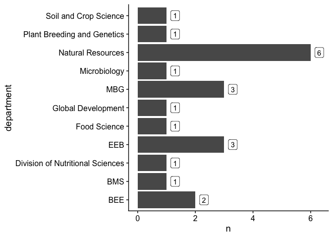
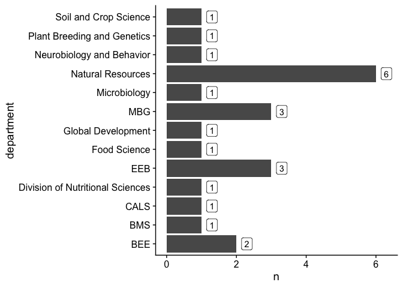
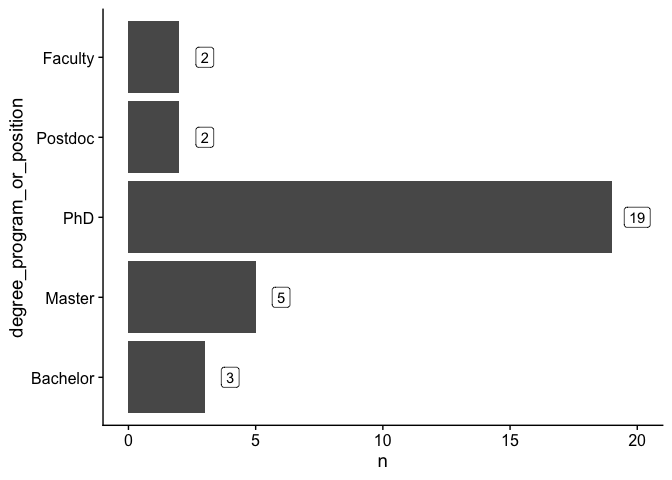
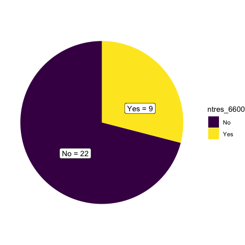
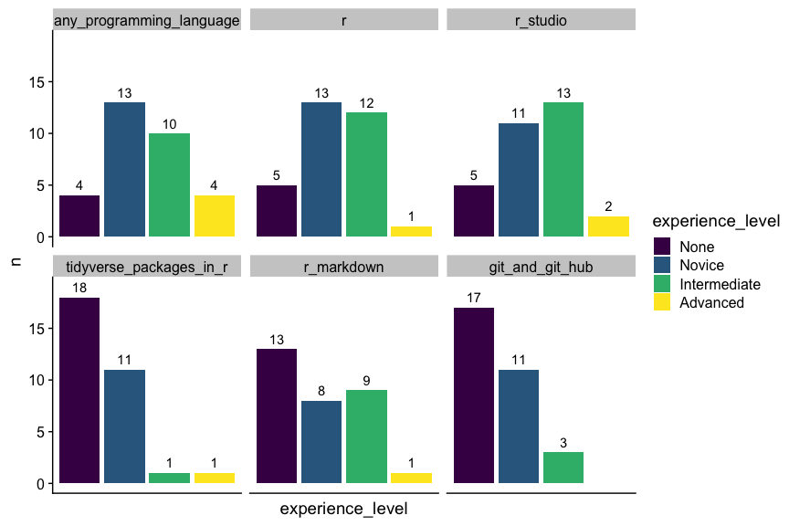
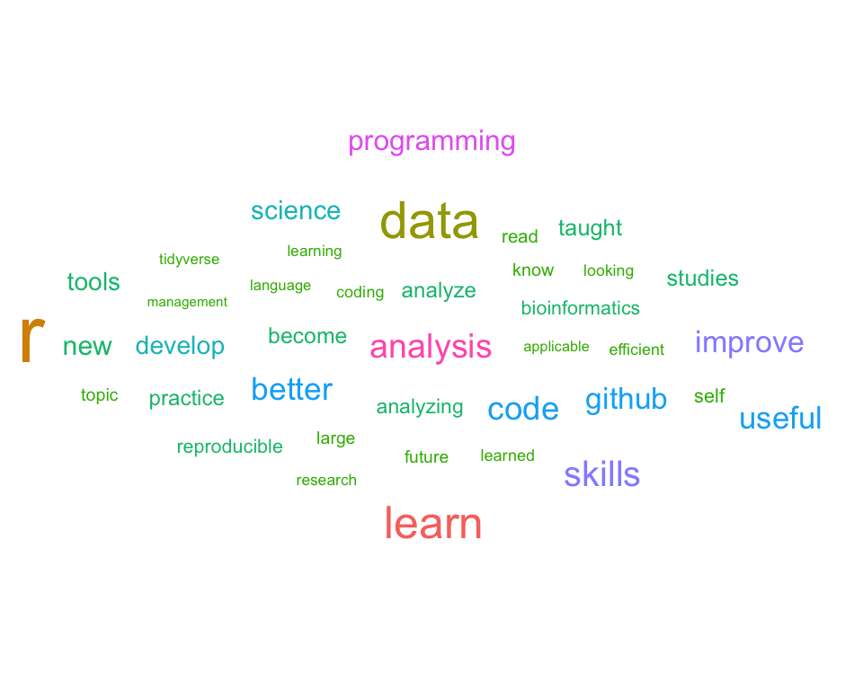

Pre-course survey results
================

-   [Read in the data from Google Sheet](#read-in-the-data-from-google-sheet)
-   [Show first few rows of raw data](#show-first-few-rows-of-raw-data)
-   [Data tidying and wrangling](#data-tidying-and-wrangling)
-   [Class stats](#class-stats)
    -   [Department](#department)
    -   [Degree program / position](#degree-program-position)
    -   [Year in degree program / position](#year-in-degree-program-position)
    -   [NTRES 6600](#ntres-6600)
-   [General experience level](#general-experience-level)
-   [R experience level](#r-experience-level)
-   [Motivation](#motivation)

Read in the data from Google Sheet
----------------------------------

``` r
survey_url <- "https://docs.google.com/spreadsheets/d/1grWdJmZ2y1F9t8r4W_jtxcKVXu59JO9yeT5fmKMpY8k/edit#gid=1474005795"
survey_raw <- read_sheet(survey_url) %>% select(-(1:2))
```

    ## Using an auto-discovered, cached token.
    ## To suppress this message, modify your code or options to clearly consent to the use of a cached token.
    ## See gargle's "Non-interactive auth" vignette for more details:
    ## https://gargle.r-lib.org/articles/non-interactive-auth.html
    ## The googlesheets4 package is using a cached token for nicolas931010@gmail.com.

Show first few rows of raw data
-------------------------------

``` r
survey_raw %>% head(n=2) %>% kable()
```

| Department (optional) | Degree program or position | Year in your program/position | Did you take the NTRES 6600 Research Data Management Seminar this winter? | Please describe your experience level with \[Any programming language\] | Please describe your experience level with \[R\] | Please describe your experience level with \[RStudio\] | Please describe your experience level with \[tidyverse packages in R\] | Please describe your experience level with \[R Markdown\] | Please describe your experience level with \[Git and GitHub\] | How would you describe your experience level with performing the following tasks in R: \[Data wrangling\] | How would you describe your experience level with performing the following tasks in R: \[Data visualization\] | How would you describe your experience level with performing the following tasks in R: \[Data analysis\] | How would you describe your experience level with performing the following tasks in R: \[Programming\] | Why do you want to take this class?                                                                                                   | In addition to the topics listed in the syllabus, are there any other topics you would like to see covered in this class? (We can't guarantee to accommodate all of your requests, but will try our best when planning the course) | Any other comments or suggestions? |
|:----------------------|:---------------------------|:------------------------------|:--------------------------------------------------------------------------|:------------------------------------------------------------------------|:-------------------------------------------------|:-------------------------------------------------------|:-----------------------------------------------------------------------|:----------------------------------------------------------|:--------------------------------------------------------------|:----------------------------------------------------------------------------------------------------------|:--------------------------------------------------------------------------------------------------------------|:---------------------------------------------------------------------------------------------------------|:-------------------------------------------------------------------------------------------------------|:--------------------------------------------------------------------------------------------------------------------------------------|:-----------------------------------------------------------------------------------------------------------------------------------------------------------------------------------------------------------------------------------|:-----------------------------------|
| NA                    | PhD                        | 1                             | No                                                                        | Novice                                                                  | Novice                                           | Novice                                                 | None                                                                   | None                                                      | None                                                          | Novice                                                                                                    | Novice                                                                                                        | Novice                                                                                                   | Novice                                                                                                 | Single cell genomics data analysis                                                                                                    | NA                                                                                                                                                                                                                                 | NA                                 |
| Microbiology          | PhD                        | 1                             | Yes                                                                       | Intermediate                                                            | Novice                                           | Novice                                                 | Novice                                                                 | Novice                                                    | Novice                                                        | Novice                                                                                                    | Novice                                                                                                        | Novice                                                                                                   | Novice                                                                                                 | To improve my data analysis skills, learn to use GitHub, and improve my general programming skills (learn a new programming language) | NA                                                                                                                                                                                                                                 | NA                                 |

Data tidying and wrangling
--------------------------

``` r
## clean column names, parce certain columns, factor relevel the degree program column, and clean the department column
survey <- survey_raw %>% 
  clean_names() %>%
  rename(department=department_optional, 
         year_in_your_program_or_position = year_in_your_program_position, 
         ntres_6600=did_you_take_the_ntres_6600_research_data_management_seminar_this_winter) %>%
  mutate(year_in_your_program_or_position=as.character(year_in_your_program_or_position)) %>%
  mutate(degree_program_or_position=fct_relevel(degree_program_or_position, levels = c("Bachelor", "Master", "PhD", "Postdoc", "Faculty"))) %>%
  mutate(department=ifelse(department %in% c("DNR", "NR"), "Natural Resources", department)) %>%
  mutate(department=ifelse(department %in% c("Department of Ecology and Evolutionary Biology"), "EEB", department)) %>%
  mutate(department=ifelse(department %in% c("Molecular Biology and Genetics", "Molecular biology and genetics (MBG)"), "MBG", department)) %>%
  mutate(department=ifelse(department %in% c("Biological and Environmental Engineering"), "BEE", department))

## show the first few rows
survey %>% head(n=2) %>% kable()
```

| department   | degree\_program\_or\_position | year\_in\_your\_program\_or\_position | ntres\_6600 | please\_describe\_your\_experience\_level\_with\_any\_programming\_language | please\_describe\_your\_experience\_level\_with\_r | please\_describe\_your\_experience\_level\_with\_r\_studio | please\_describe\_your\_experience\_level\_with\_tidyverse\_packages\_in\_r | please\_describe\_your\_experience\_level\_with\_r\_markdown | please\_describe\_your\_experience\_level\_with\_git\_and\_git\_hub | how\_would\_you\_describe\_your\_experience\_level\_with\_performing\_the\_following\_tasks\_in\_r\_data\_wrangling | how\_would\_you\_describe\_your\_experience\_level\_with\_performing\_the\_following\_tasks\_in\_r\_data\_visualization | how\_would\_you\_describe\_your\_experience\_level\_with\_performing\_the\_following\_tasks\_in\_r\_data\_analysis | how\_would\_you\_describe\_your\_experience\_level\_with\_performing\_the\_following\_tasks\_in\_r\_programming | why\_do\_you\_want\_to\_take\_this\_class                                                                                             | in\_addition\_to\_the\_topics\_listed\_in\_the\_syllabus\_are\_there\_any\_other\_topics\_you\_would\_like\_to\_see\_covered\_in\_this\_class\_we\_cant\_guarantee\_to\_accommodate\_all\_of\_your\_requests\_but\_will\_try\_our\_best\_when\_planning\_the\_course | any\_other\_comments\_or\_suggestions |
|:-------------|:------------------------------|:--------------------------------------|:------------|:----------------------------------------------------------------------------|:---------------------------------------------------|:-----------------------------------------------------------|:----------------------------------------------------------------------------|:-------------------------------------------------------------|:--------------------------------------------------------------------|:--------------------------------------------------------------------------------------------------------------------|:------------------------------------------------------------------------------------------------------------------------|:-------------------------------------------------------------------------------------------------------------------|:----------------------------------------------------------------------------------------------------------------|:--------------------------------------------------------------------------------------------------------------------------------------|:---------------------------------------------------------------------------------------------------------------------------------------------------------------------------------------------------------------------------------------------------------------------|:--------------------------------------|
| NA           | PhD                           | 1                                     | No          | Novice                                                                      | Novice                                             | Novice                                                     | None                                                                        | None                                                         | None                                                                | Novice                                                                                                              | Novice                                                                                                                  | Novice                                                                                                             | Novice                                                                                                          | Single cell genomics data analysis                                                                                                    | NA                                                                                                                                                                                                                                                                   | NA                                    |
| Microbiology | PhD                           | 1                                     | Yes         | Intermediate                                                                | Novice                                             | Novice                                                     | Novice                                                                      | Novice                                                       | Novice                                                              | Novice                                                                                                              | Novice                                                                                                                  | Novice                                                                                                             | Novice                                                                                                          | To improve my data analysis skills, learn to use GitHub, and improve my general programming skills (learn a new programming language) | NA                                                                                                                                                                                                                                                                   | NA                                    |

``` r
## pivot longer with regard to experience level columns, add a column to differentiate general vs. r experience, shorten some strings, and factor relevel the experience level column
survey_longer <- pivot_longer(survey, cols = 5:14, names_to = "experience",  values_to = "experience_level") %>%
  mutate(experience_type=ifelse(str_detect(experience, "please_describe_your_experience_level_with_"), "general_experience", "r_experience")) %>%
  mutate(experience=str_remove(experience, "please_describe_your_experience_level_with_")) %>%
  mutate(experience=str_remove(experience, "how_would_you_describe_your_experience_level_with_performing_the_following_tasks_in_r_")) %>%
  mutate(experience_level=fct_relevel(experience_level, levels = c("None", "Novice", "Intermediate", "Advanced")))

## show the first few rows
survey_longer %>% head(n=2) %>% kable()
```

| department | degree\_program\_or\_position | year\_in\_your\_program\_or\_position | ntres\_6600 | why\_do\_you\_want\_to\_take\_this\_class | in\_addition\_to\_the\_topics\_listed\_in\_the\_syllabus\_are\_there\_any\_other\_topics\_you\_would\_like\_to\_see\_covered\_in\_this\_class\_we\_cant\_guarantee\_to\_accommodate\_all\_of\_your\_requests\_but\_will\_try\_our\_best\_when\_planning\_the\_course | any\_other\_comments\_or\_suggestions | experience                 | experience\_level | experience\_type    |
|:-----------|:------------------------------|:--------------------------------------|:------------|:------------------------------------------|:---------------------------------------------------------------------------------------------------------------------------------------------------------------------------------------------------------------------------------------------------------------------|:--------------------------------------|:---------------------------|:------------------|:--------------------|
| NA         | PhD                           | 1                                     | No          | Single cell genomics data analysis        | NA                                                                                                                                                                                                                                                                   | NA                                    | any\_programming\_language | Novice            | general\_experience |
| NA         | PhD                           | 1                                     | No          | Single cell genomics data analysis        | NA                                                                                                                                                                                                                                                                   | NA                                    | r                          | Novice            | general\_experience |

Class stats
-----------

#### Department

``` r
count(survey, department) %>% filter(!is.na(department)) %>% 
  ggplot(aes(x=department, y=n, label=n)) +
  geom_col() +
  geom_label(aes(y=n+0.3)) +
  coord_flip() +
  theme_cowplot()
```



#### Degree program / position

``` r
count(survey, degree_program_or_position) %>%
  ggplot(aes(x=degree_program_or_position, y=n, label=n)) +
  geom_col() +
  geom_label(aes(y=n+1)) +
  coord_flip() +
  theme_cowplot()
```



#### Year in degree program / position

``` r
count(survey, degree_program_or_position, year_in_your_program_or_position) %>%
  rename(year=year_in_your_program_or_position) %>%
  ggplot(aes(x=year, y=n, label=n)) +
  geom_col(aes(fill=year)) +
  geom_text(aes(y=n+0.5)) +
  ylim(c(0,6)) +
  facet_wrap(~degree_program_or_position, nrow = 1) +
  theme_cowplot()
```



#### NTRES 6600

``` r
count(survey, ntres_6600) %>%
ggplot(aes(x="", y=n, label=paste(ntres_6600, "=", n))) +
  geom_bar(width = 1, aes(fill=ntres_6600), stat = "identity") +
  geom_label(aes(y=n-3)) +
  coord_polar("y", start=0) +
  theme_void()
```


General experience level
------------------------

``` r
## write a function to automate this kind of plot
bar_plot_experience_level <- function(x){
  x %>%
    count(experience_level, experience) %>%
    ggplot(aes(x=experience_level, y=n, fill=experience_level)) +
    geom_col(position="dodge") +
    geom_text(position="dodge", aes(label=n, y=n+1)) +
    facet_grid(~experience) +
    theme_cowplot() +
    theme(axis.text.x = element_blank(),
          axis.ticks.x = element_blank())
}
filter(survey_longer, experience_type=="general_experience") %>%
  bar_plot_experience_level()
```



R experience level
------------------

``` r
## Reuse the previous function
filter(survey_longer, experience_type=="r_experience") %>%
  bar_plot_experience_level()
```



Motivation
----------

``` r
set.seed(42)
survey$why_do_you_want_to_take_this_class %>%
  str_split(pattern = "[^a-zA-Z]") %>%
  as_vector() %>%
  str_to_lower() %>%
  tibble(word=.) %>%
  count(word) %>%
  filter(! word %in% c("", "s", "ve", "can", "also", "want", "use", "even", "like", "get", "using", stopwords(language = "english")), n>1) %>%
  ggplot(aes(label=word, size=log(n), color=as.character(n))) +
  geom_text_wordcloud_area(shape = "diamond", eccentricity=0.6) +
  scale_size_area(max_size = 24) +
  theme_minimal()
```


